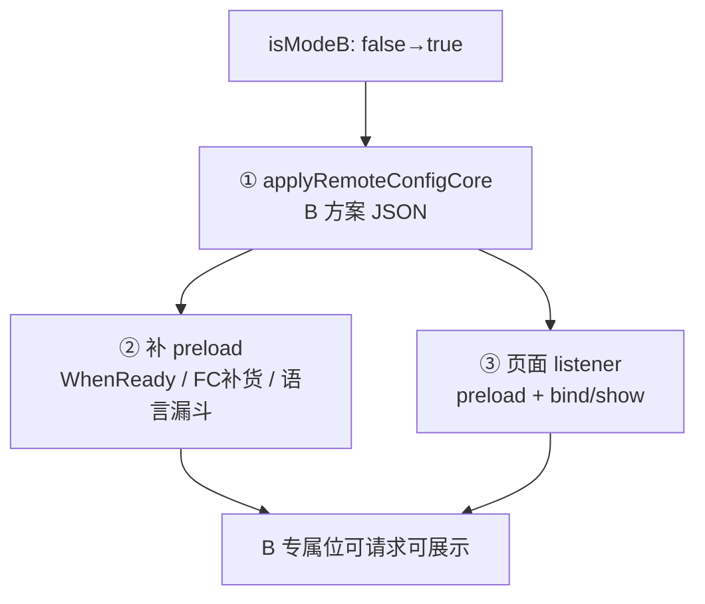

# A/B 面配置（Mode2 完整栈）

将 **PDF 金样定稿** 的 AB 面体系接入任意 Android 项目：**判面**（Mode2 + 归因）与 **按面配置**（广告 JSON，通知可选）分离，冷启双轨并行。

| 项目 | 路径 | 说明 |
|------|------|------|
| **Nitro PDF（现行金样）** | `/Users/MacLuo/Desktop/D/working/shenzhen/tools/browser/pdf` | `PdfAppAdsBootstrap`、`AbSettlementCoordinator` |
| videodownload v1.2.0（对照） | `.../videodownload` | 10 广告位、通知 V3、热启 fast path 接线示例 |

| 金样类（PDF） | 职责 |
|---------------|------|
| `AbSettlementCoordinator` | FC 轨 ∥ AB 轨；FC 3 次重试；B 面远程补拉 |
| `AttributionManager` | 阶段1 6s + 阶段2 阶梯 |
| `Mode2Utils` | 判面 + MMKV 锁定 |
| `ReferrerSideParser` | refer → 买量/organic |
| `PdfAppAdsBootstrap` | commit、`canShowAd`、监听（新项目可命名 `AppAdsBootstrap`） |
| `AppRemoteConfig` | FC fetch 明细（可选独立类） |
| `DebugAbOverride` | Debug 强制 A/B（可选） |

- **详解**：[reference.md](reference.md)
- **验收**：[checklist.md](checklist.md)
- **流程图**：[流程图.md](流程图.md)
- **产品说明**：[产品阅读.md](产品阅读.md)

## 三块配置（勿混）

| 块 | 决定什么 | 数据来源 |
|----|----------|----------|
| **① Mode2 判面** | 自然 A/B、强制 A/B | Firebase **数值 key** + refer + GP；**不在 assets** |
| **② 广告 JSON** | 广告位 id/开关 | Application **先** assets → FC 后远程 `ad_config_a/b` 覆盖 |
| **③ 通知 JSON** | 通知 V3 | **可选**；videodownload 有；PDF 金样未接 |

## 产品规则（判面）

1. 总开关 `enable_mode2_with_video`：**=1** 强制 B；**=0** 强制 A（自然 B 已锁定则保持 B）
2. 总开关**未配置**或**非 0 非 1**（如 22）→ 走代码子项，不强制
3. 子项 key **未配置** → 视为开启；**=0** → 跳过该项
4. 有子项参与且**任一失败** → A；**全部通过** → B；两子项均 =0 → 默认 A
5. **自然 B 永久锁定**，禁止 B→A（含总开关改 0）
6. 归因阶段1 不确定 → 先 commit A → **阶段2** 15min 内仅 **A→B**
7. **中途升 B 不是可选优化，是必接能力**：首次 commit 为 A 或进页早于 commit 时，须在 **15min 内 A→B** 后让用户仍能请求/展示 B 专属广告（见 [中途升 B（必接）](#中途升-b必接)）

**PDF 现行代码子项（实际启用）**：Install Referrer 买量 + Google Play 安装；模拟器/IP/强制 A 时段等保留代码但默认未启用。

## 中途升 B（必接）

> **一句话**：判面可在 **同一次启动、用户仍在页面上** 时从 A 升到 B；**仅改 `isModeB` 不够**，必须同时 **换 B 广告 JSON → 补 preload → 当前页重绑/展示**。

### 何时会「中途升 B」

| 触发 | 代码锚点 | 用户仍在 |
|------|----------|----------|
| 阶段1 不确定先 commit A，阶段2 拉到买量 refer | `applyModeUpdateAfterExtended` | 语言页 / Splash 后任意页 |
| FC 总开关晚到且 =1 | `naturalModeBIfMasterSwitchOverridesCommitted` | 同上 |
| 首次 commit 即为 B，但进页 **早于** commit | `commitAbFace` → `notifyModeBUpgraded` | 语言页 / 主页 |

**不是**「一次判 A 本次启动永远没 B 广告」——15min 内升到 B 且 JSON 生效后，**本次进程**应能展示 B 位。

### 三层必做（缺一不可）



| 层 | Bootstrap / Coordinator | 业务页 |
|----|-------------------------|--------|
| **① 换配置** | `applyRemoteConfigCore` → `applyByMode(B)`；`onFirebaseFetchCompleted` | — |
| **② 补请求** | `notifyModeBUpgraded` → `schedulePreloadAfterLoadingOnBootstrapComplete`；`applyRemoteConfigCore` → `schedulePreloadAfterRemoteConfigRefresh`；`preloadLanguageFunnelAfterModeBCommit` | — |
| **③ 刷新 UI** | `notifyModeBUpgraded` / `notifyAdRemoteConfigRefreshed` | 各含 B 广告页注册 listener → **preload + re-bind/show** |

详见 [reference.md#中途升-b](reference.md#中途升-b)。

### 业务页最低要求

凡 **B 专属广告**（语言原生/插屏、Banner、底栏插屏、大原生等）所在 **Activity/Fragment**，须至少：

```kotlin
// initView / onViewCreated 注册；onDestroy/onDestroyView 移除
PdfAppAdsBootstrap.addOnModeBUpgradedListener { refreshBAds() }
PdfAppAdsBootstrap.addOnAdRemoteConfigRefreshedListener { refreshBAds() }

private fun refreshBAds() {
    // 1. 若 currentIsModeB() && canShowAd → preloadAd
    // 2. 再 bindNativeAd / showBanner / 刷新列表原生行（勿只 preload 不 bind）
}
```

**金样参考**：`MainActivity`（Banner）、`LanguageActivity`（preload+bind）、`BookmarksFragment` / `ToolsFragment` / `ConvertFinishActivity`（大原生）。

**禁止**：只在 `onCreate` 读一次 `isModeB` 且无 listener —— commit 晚于进页时 B 用户整页无广告。

## 接入前：扫描目标项目

| 检查项 | 关键词 | 分支 |
|--------|--------|------|
| 已有 AB 体系 | `AbSideManager` / `Mode2Utils` / `isModeB` | 见 [迁移](#迁移已有-ab-逻辑) |
| Bootstrap | `AppAdsBootstrap` / `PdfAppAdsBootstrap` | 无 → 全新接入 |
| 归因 | `AttributionManager` / Install Referrer | 无 → 从金样复制 |
| 广告 RC | `AdRemoteConfigBridge.applyByMode` | 无 → 接 [admob广告](../admob广告/SKILL.md) |
| Firebase | `FirebaseApp` / Remote Config 依赖 | 缺则先接 Firebase |
| MMKV | `MMKV.initialize` | 缺则接入 |

## 全新接入工作流

### Step 0：Firebase 控制台 Key

| Key | 类型 | 语义 |
|-----|------|------|
| `enable_mode2_with_video` | Long | 总开关 0/1；未配或非 0/1 → 代码子项 |
| `enable_installation_source_condition` | Long | refer 检查；未配=开 |
| `enable_installed_from_google_play_condition` | Long | GP 检查；未配=开 |
| `ad_config_a` / `ad_config_b` | String JSON | 广告方案（判面后 apply） |
| `notification_config` | String JSON | 通知（**可选**，无通知模块可跳过） |
| `referrer_timeout_ms` | Long | 阶段1 超时，默认 6000 |

Mode2 key **不要**写进 `setDefaultsAsync`（与通知 key 分开）。

### Step 1：复制核心类（改包名）

从 PDF 金样复制上表类；`PdfAppAdsBootstrap` 可重命名为项目内 `AppAdsBootstrap`。

MMKV Key 见 [reference.md#mmkv-keys](reference.md#mmkv-keys)。

### Step 2：广告桥接（通知可选）

| 类 | 时机 |
|----|------|
| `AdRemoteConfigBridge.applyDefaultLocalAssetsA` | **Application**，FC **之前** |
| `AdRemoteConfigBridge.applyByMode` | FC 结束 + commit 时 |
| `NotificationRemoteConfig*` | **可选**（videodownload 有） |

生效顺序：**先 assets 内存 → 再 Firebase getString 覆盖**（非仅超时才 assets）。  
**B 面**：不读本地 assets，仅远程 `ad_config_b`；远程未到时 PDF 金样会 **B 面补拉**（见 reference）。

### Step 3：Application 编排（PDF 现行：双协程并行）

```kotlin
// onCreate
MMKV.initialize(this)
FirebaseApp.initializeApp(this)

// 协程 A：AB 双轨 settlement（不嵌套在 MonetizationKit.init 回调内）
applicationScope.launch(Dispatchers.IO) {
    AppAdsBootstrap.run(context)
}

// 协程 B：广告预热（与 AB 并行）
applicationScope.launch(Dispatchers.IO) {
    MonetizationKit.prepareBeforeConsent(context)
    AdRemoteConfigBridge.applyDefaultLocalAssetsA(context)
    MonetizationKit.init(context) { /* isInit 就绪 */ }
}
```

见 [templates/bootstrap-snippet.kt.template](templates/bootstrap-snippet.kt.template)。

`AppAdsBootstrap.run` 内部 → `AbSettlementCoordinator.startSettlement`（FC + 归因并行）。

**热启动**（可选）：`run(context, hotResumeFastPath = true)` 跳过重复 settlement；videodownload 在 `StartActivity` 接线，PDF 金样 Application 始终冷启路径。

### Step 4：业务读面别 + **中途升 B 接线（必做）**

- 面别：`AppAdsBootstrap.isModeB` / `currentIsModeB()` / `canShowAd(sense)`
- **B 专属广告位按项目登记**（PDF 5 位：语言原生/插屏、首页 Banner、底栏插屏、共享大原生；videodownload 10 位更多）
- 开屏**非** B 专属；与 commit **竞态**（commit 前多 A JSON）
- **Bootstrap 监听（必接）**：
  - `addOnModeBUpgradedListener` — A→B 或 commit 即为 B
  - `addOnAdRemoteConfigRefreshedListener` — FC/commit 后 B JSON 刷新
  - `addOnModeSideChangedListener` — 含 B→A 降级场景（自然 B 锁定时少见）
- **Coordinator 补货（必接，见 [admob广告](../admob广告/SKILL.md)）**：
  - `notifyModeBUpgraded` 内 → `schedulePreloadAfterLoadingOnBootstrapComplete`
  - `applyRemoteConfigCore`（B 且已 commit）→ `schedulePreloadAfterRemoteConfigRefresh`
  - `commitAbFace` → `preloadLanguageFunnelAfterModeBCommit` + `schedulePreloadAfterLoadingWhenReady`
- **每个 B 广告页**：listener 内 **preload + re-bind/show**（见 [中途升 B（必接）](#中途升-b必接)）

### Step 5：验证

完成 [checklist.md](checklist.md)。

## FC 与归因：独立并行 + 定面前耦合

| 过程 | 关系 |
|------|------|
| FC fetch | 单次 **8s** 超时；PDF 金样 **最多 3 次**重试（间隔 0/2s/5s） |
| 阶段1 6s | 与 FC **并行** |
| **Mode2 + commit** | 须 **阶段1 onReady** 且 **fcReady（≤30s）** → **耦合点** |
| 阶段2 | commit **之后**，与 FC **无** await |
| B 面 commit 后 | 若远程 B JSON 未生效 → **后台补拉最多 3 次**（3s/10s/30s） |

详见 [reference.md#fc-与归因](reference.md#fc-与归因)。

## 迁移已有 AB 逻辑

| 旧模式 | 处理 |
|--------|------|
| `!exists(key) return true` 强制 B | **删除**，改 V3.1.0 子项语义 |
| 单轨 `initMode2` 阻塞等 FC | 改双轨 `AbSettlementCoordinator` |
| `AbSideManager` 简单 A/B | 映射到 `AppAdsBootstrap` + Mode2 |
| 无阶段2 | 补 `AttributionManager` 阶梯与 `applyModeUpdateAfterExtended` |
| FC 只拉 1 次 | 建议对齐 PDF：3 次重试 + B 面补拉 |
| **无中途升 B 处理** | **必补**：Bootstrap 双 listener + Coordinator FC 补货 + 各 B 广告页 refresh |
| 页面只读一次 `isModeB` | 改 listener + preload + bind |

## 关键约定

1. **assets ≠ 判面**：本地 JSON 只兜底广告，不决定 Mode2
2. **缓存 RC** = Firebase SDK 上次 activate 磁盘值，**非** App SP/MMKV
3. **中途升 B 必接**：`isModeB` 变更 → JSON + preload + 页面 listener，**禁止**假设 commit 一定早于所有广告页
4. 注释使用**简体中文**
5. 禁止在 `canShowAd` 外私加 BuildConfig 广告兜底
6. Firebase 广告 key 名因项目而异（skill 默认 `ad_config_a/b`；接项目时读 `AdRemoteConfigBridge` 常量）

## 附加资源

- [reference.md](reference.md) — FC 重试、B 补拉、阶段2、场景表
- [templates/](templates/) — Bootstrap / Coordinator / **中途升 B listener** 片段
- [admob广告](../admob广告/SKILL.md) — 广告模块与 `canShowAd` 闸门
