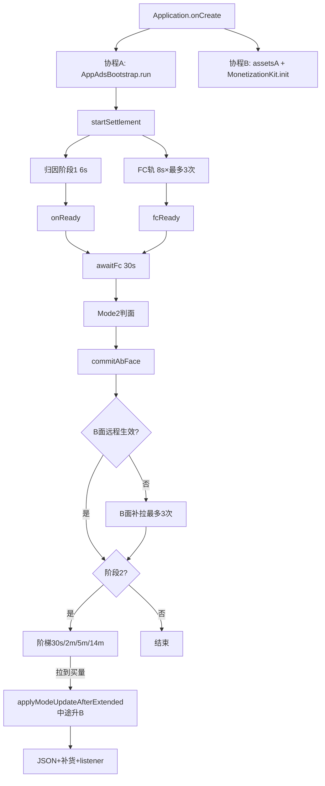
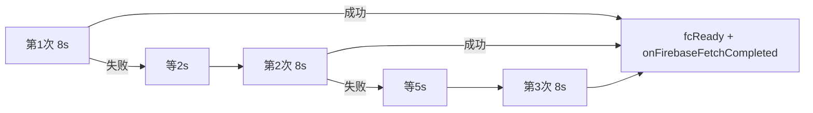
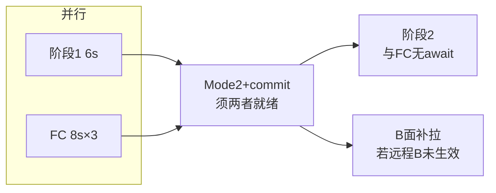
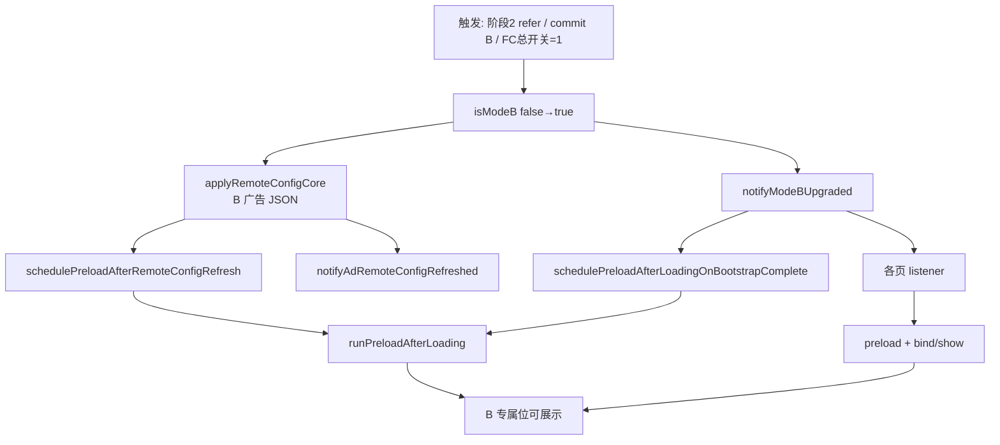
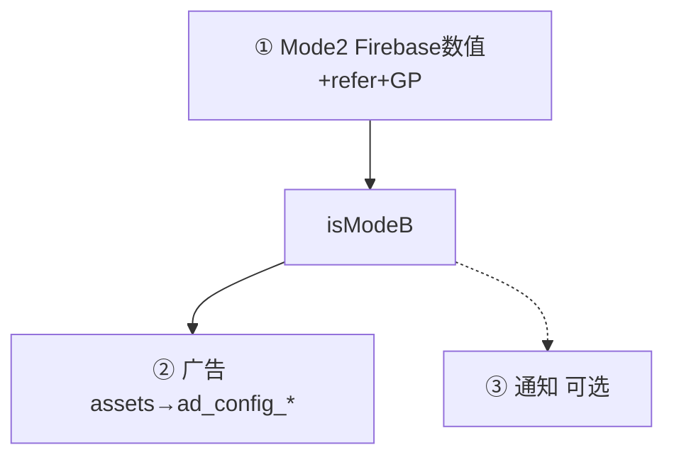

# A/B 面配置流程图

> 现行金样：`tools/browser/pdf` · 对照：`videodownload v1.2.0`

## 冷启双轨（PDF：Application 两协程）



## FC 重试（PDF 金样）



## FC 超时 vs 归因超时



## 中途升 B（必接）



**禁止**：仅改 `isModeB`、无 Coordinator 补货、无页面 listener。

## 配置三层



## 热启动 fast path（可选）

```
StartActivity / Splash 判定热启
  → AppAdsBootstrap.run(hotResumeFastPath=true)
  → 跳过 settlement，沿用本进程 isModeB
```

PDF 金样 Application 未接线；videodownload 在 StartActivity 已接。
