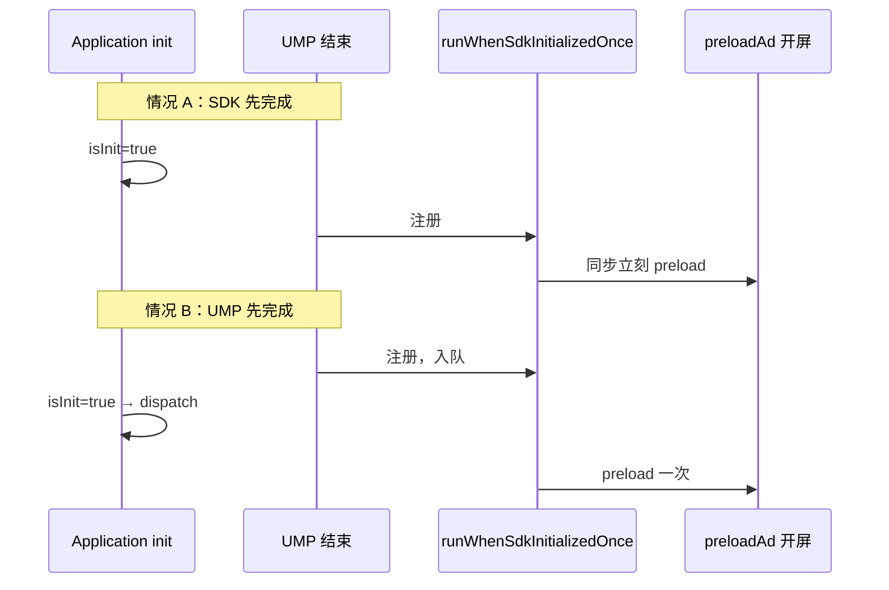

# SDK 初始化回调与请求时机（PDF 金样 · 2026-06）

> **一句话**：Application 异步 `MonetizationKit.init` 与 Splash UMP **并行**；业务页在 **UMP 已结束** 后注册 `runWhenSdkInitializedOnce`，在 **首次 `isInit=true`** 且闸门通过时 **只请求一次**；勿在 Splash 再调 `MonetizationKit.init`，勿用 `init { }` 入参当全局监听。

**金样代码**：

| 层级 | 路径 |
|------|------|
| 一次性 SDK 就绪 API | `AdBridge/.../MonetizationKit.runWhenSdkInitializedOnce` |
| 开屏请求编排 | `app/.../splash/SplashLaunchPipeline.scheduleSplashPreloadOnceWhenSdkReady` |
| Application 单点 init | `app/.../MyApplication.launchAdsWarmup` |

---

## 0. 接入门禁：开屏调用点须用户确认

按本 Skill 接入开屏时，AI **必须先**在全工程检索 `LOADING_SPLASH` / `preloadAd` / `loadAd` / `obtainForShow` 等，输出 [SKILL.md §开屏调用点清点门禁](SKILL.md#开屏调用点清点门禁接入前强制--须用户确认) 表格。

- **preload / load 多于 1 处**：必须逐条说明文件、函数、是否会重复请求  
- **用户回复「确认调用点」前**：禁止改 Splash / Coordinator / 模板落地  
- PDF 金样目标：**网络 preload 仅** `SplashLaunchPipeline.scheduleSplashPreloadOnceWhenSdkReady` 一处  

---

## 1. 为什么需要这层

| 问题 | 原因 |
|------|------|
| UMP 后立刻 preload 漏请求 | `enableFor` 要求 `isInit && isUmpResolved`；UMP 常比 `MobileAds.initialize` 回调**先**结束 |
| 在 Splash 再调 `MonetizationKit.init` | 可能与 Application **竞态** duplicate initialize；且 `init { }` 入参在重复 `init()` 时会**再次**执行 |
| 固定 await 2.5s（videodownload） | 能修竞态但拖慢启动；PDF 金样改用 **状态 + 一次性回调** |

---

## 2. 三个 API 的分工（勿混用）

| API | 谁调用 | 触发几次 | 用途 |
|-----|--------|----------|------|
| `MonetizationKit.init(context) { }` | **仅 Application** | 入参 lambda：`MobileAds` 首次成功 **1 次**；若已 `isInit` 则**每次 init() 再调 1 次** | SDK 单点 initialize、置 `isInit` |
| `MonetizationKit.runWhenSdkInitializedOnce { }` | **Splash / 需等 SDK 的页面** | 每个注册的 block **只执行 1 次**；重复 `init()` **不会**再广播 | UMP 后发开屏 preload 等 |
| `MonetizationKit.isInit` | 任意只读 | 进程内首次 initialize 成功后恒 true | 闸门、`runWhen…` 注册时判断 |

```kotlin
// ✅ Application（IO 协程，与 Splash 并行）
MonetizationKit.init(applicationContext) {
    AdRequestLog.i("【SDK初始化】Application init 回调完成")
}

// ✅ Splash：UMP 结束后
MonetizationKit.runWhenSdkInitializedOnce {
    requestSplashPreloadIfNeeded() // 内部 canShowAd + splashPreloadRequested
}

// ❌ Splash 禁止
MonetizationKit.init(activity) { preloadAd(...) }
```

---

## 3. `runWhenSdkInitializedOnce` 语义

```kotlin
fun runWhenSdkInitializedOnce(block: () -> Unit)
```

| 注册时刻 `isInit` | 行为 |
|-------------------|------|
| **已为 true** | **同步立刻**执行 `block`（SDK 先于 UMP 完成时） |
| **仍为 false** | `block` 入队；**仅**在 `MobileAds.initialize` **首次**成功、`isInit=true` 后 `dispatch` **一次** |

**与 `init { initialized() }` 的区别**：

- 已注册的 `runWhenSdkInitializedOnce` **不会**因 Application 再次调用 `init()` 而重复 dispatch
- `init` 的入参 lambda 在 `isInit==true` 时**每次 init() 都会同步再跑**（当前工程仅 Application 调 1 次，风险低）

---

## 4. 开屏标准编排（复制到新项目）

### 4.1 注册点：**UMP 结束之后**

```kotlin
// runPipeline 内，awaitConsent / markUmpResolved 之后
splashRequestStarted = true // 放行闸可开始（与 preload 是否成功无关）
scheduleSplashPreloadOnceWhenSdkReady()
```

**不在 UMP 前注册**：此时 `isUmpResolved=false`，即使 `isInit=true` 也会被 `enableFor` 拦住。

### 4.2 监听 + 本地防重

```kotlin
private var splashPreloadRequested = false

private fun scheduleSplashPreloadOnceWhenSdkReady() {
    MonetizationKit.runWhenSdkInitializedOnce {
        requestSplashPreloadIfNeeded()
    }
}

private fun requestSplashPreloadIfNeeded() {
    if (splashPreloadRequested) return
    if (!hostCanShowAd(AdSense.LOADING_SPLASH)) {
        log("开屏单次请求跳过：闸门未过")
        return
    }
    splashPreloadRequested = true
    activity.preloadAd(AdSense.LOADING_SPLASH, "UMP后开屏单次请求")
}
```

### 4.3 执行 preload 的充分条件

| 条件 | 说明 |
|------|------|
| UMP 已结束 | 注册监听前已 `markUmpResolved` |
| SDK 已 init | `runWhenSdkInitializedOnce` 触发时 |
| `canShowAd` / `enableFor` 通过 | 非订阅、RC、ad_id、日限额、AB 等 |
| `splashPreloadRequested==false` | 本页只请求 1 次 |

**注意**：preload **不依赖** Loading 动画是否结束；动画/10s 闸只管 **展示/跳页**（见 [splash-loading.md](splash-loading.md)）。

### 4.4 Loader 第二层去重

即使误调两次 `preloadAd`，`SplashAdLoader` 仍会 skip：

- `isCacheLoading` → 「预加载任务进行中」
- `shouldSkipSplashPreload` → 「SDK层已有开屏缓存」

---

## 5. 两种竞态时序



---

## 6. 其它广告位是否也要 `runWhenSdkInitializedOnce`？

| 场景 | 建议 |
|------|------|
| **开屏**（UMP 后立刻要请求） | **必须**用本模式（或等价：UMP 后注册 + 等 isInit） |
| UMP 后 `AdPreloadCoordinator.preloadAfterUmpConsent` | 同样受 `enableFor` 约束；若 init 晚于 UMP，Coordinator 内 preload 也会被 skip。**开屏已单独补发**；其它位可在 Coordinator 内对关键位补同样模式（按需） |
| 进主页后的 preload | 通常 init 早已完成，直接 `preloadAd` 即可 |
| Banner 现场 load | `onResume` 时 init 一般已 true |

---

## 7. 接入检查

```bash
# Splash 使用 runWhenSdkInitializedOnce，禁止 UMP 后立即 preload 开屏（旧写法）
rg "runWhenSdkInitializedOnce|scheduleSplashPreloadOnceWhenSdkReady" app/**/splash/
rg "requestSplashOnceAfterUmp" app/**/splash/   # 应无匹配（已更名）

# Splash 禁止再 init SDK
rg "MonetizationKit\.init" app/**/splash/       # 应无匹配

# Application 仅一处 init
rg "MonetizationKit\.init" --glob "*.kt"
```

**Logcat（冷启）**：

1. `【SDK初始化】AdMob MobileAds.initialize 完成 isInit=true`（1 条）
2. UMP 相关日志 → `开屏单次请求开始`（0 或 1 条；init 极慢且闸门不过可为 0）
3. `【预加载开始】…UMP后开屏单次请求`（至多 1 条 requestStart）

---

## 8. 关联文档

- [splash-loading.md](splash-loading.md) — 放行闸、obtainForShow
- [reference.md#sdk-单点初始化](reference.md#sdk-单点初始化) — MobileAds 单点 initialize
- [templates/sdk-init-callback-snippet.kt.template](templates/sdk-init-callback-snippet.kt.template) — 可复制片段
- [templates/splash-snippet.kt.template](templates/splash-snippet.kt.template) — 完整 Splash 管线
