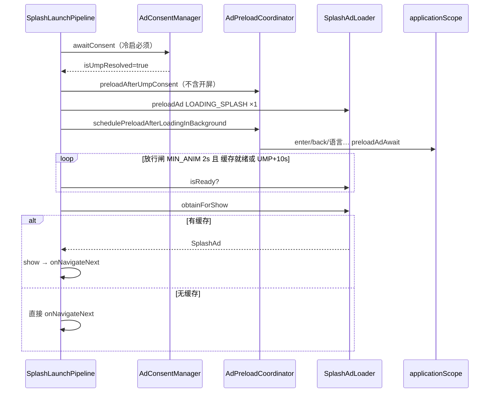

# 开屏 Loading 策略（PDF 金样 · 2026-06）

> **一句话**：UMP 结束后 **只发起 1 次**开屏 `preloadAd`；Loading 动画放行后 **只读本地缓存**——有则 `show`，无则跳下一页；**禁止**在 Splash 协程里 `await loadAd` 或串行 `preloadAdAwait` 其它位挡开屏。

**金样代码**：`pdf/app/.../splash/SplashLaunchPipeline.kt`  
**Loader API**：`SplashAdLoader.isReady` / `SplashAdLoader.obtainForShow`

---

## 1. 时序（必须按此实现）



---

## 2. 三步规则

| 步骤 | 做什么 | 禁止 |
|------|--------|------|
| **① UMP 后请求** | `activity.preloadAd(LOADING_SPLASH, "UMP后开屏单次请求")` 一次 | 同会话再 `loadAd` / 再 preload 开屏 / `preloadAdAwait` 开屏 |
| **② 等 Loading 结束** | ≥2s 动画；缓存就绪可提前放行；UMP 后最长等 10s | Splash 协程 await 其它位 preload 链 |
| **③ 展示** | `SplashAdLoader.obtainForShow()` 有货才 show | 无缓存现场 `loadAd`；无货仍阻塞用户 |

---

## 3. 常量（与金样一致）

| 常量 | 值 | 含义 |
|------|-----|------|
| `MIN_ANIM_MS` | 2000 | Loading 动画最短时长 |
| `MAX_AFTER_UMP_MS` | 10000 | UMP 结束后开屏等待窗口上限 |
| `GATE_POLL_MS` | 40 | 放行闸轮询间隔 |

---

## 4. 核心 API

| API | 用途 | 是否发网络请求 |
|-----|------|----------------|
| `preloadAd(LOADING_SPLASH)` | UMP 后唯一开屏请求入口 | ✅ 一次（Loader 内去重） |
| `SplashAdLoader.isReady(sense)` | 放行闸：Loader 队列或 SDK 主 Map 有货 | ❌ |
| `SplashAdLoader.obtainForShow(activity, sense, scene)` | 展示前取缓存包装为 `SplashAd` | ❌ |
| `loadAd(LOADING_SPLASH)` | **开屏管线禁用**；仅非 Splash 特殊场景 | ✅ |

`obtainForShow` 逻辑：先 `splashPollMatchingCache` → 再 `AdmobCacheManager.isSplashAdAvailable` 包装；均无则 `showSkippedNoCache` 并返回 null。

---

## 5. AdPreloadCoordinator 分工

| 方法 | 是否含开屏 | 说明 |
|------|-----------|------|
| `preloadAfterUmpConsent` | ❌ **不含** | 语言/enter/back；fire-and-forget |
| `schedulePreloadAfterLoadingInBackground` | ❌ **不含** | 后台 `preloadAdAwait` 其它位 |
| `SplashLaunchPipeline.requestSplashOnceAfterUmp` | ✅ **唯一** | 开屏单次请求 |

---

## 6. 与旧 Skill / videodownload 差异

| 项 | 旧 Skill / 常见误接 | 现行 PDF |
|----|-------------------|----------|
| UMP 后开屏 | `loadAd` await 10s | `preloadAd` ×1，不 await |
| 展示 | `splashAd = loadAd` 返回值 | `obtainForShow` 只读缓存 |
| 无缓存 | 有时仍等 load 超时 | 直接跳页 |
| 后台预加载 | Splash 内 `await preloadAfterLoading` | `applicationScope` 并行 |
| 开屏补货 | Loading 后 `preloadAdAwait(开屏)` | 去掉；曝光后走 `AdReplenishCoordinator` |

videodownload 仍用 `preloadAd + loadAd await`；**新接入按 PDF 金样**，勿混 videodownload 开屏写法。

---

## 7. 接入审查（必跑）

```bash
# Splash 内不应出现 loadAd / preloadAdAwait / await preloadAfterLoading
rg "loadAd\(|preloadAdAwait|preloadAfterLoading\(" app/**/splash/

# 开屏 preload 只在 SplashLaunchPipeline（或等价）
rg "LOADING_SPLASH" app/**/splash/
rg "LOADING_SPLASH" app/**/ads/AdPreloadCoordinator.kt
# Coordinator 内不应再有 LOADING_SPLASH
```

**Logcat 期望（冷启 B 面）**：

1. `开屏单次请求开始`
2. `【预加载开始】…UMP后开屏单次请求`（约 1 次 requestStart）
3. 缓存就绪 → `开屏展示：命中本地缓存`；否则 → `开屏无本地缓存，跳过展示`
4. **不应**出现 `Loading开屏` 的 `loadAd` 日志

---

## 8. 关联文件

- [SKILL.md](SKILL.md) — 总览
- [templates/splash-snippet.kt.template](templates/splash-snippet.kt.template) — 管线片段
- [checklist.md](checklist.md) — 开屏验收勾选项
- [reference.md](reference.md) — API 详解
