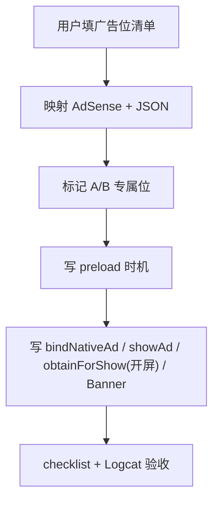
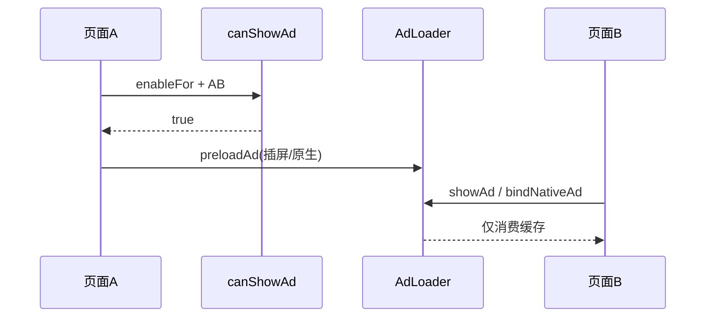
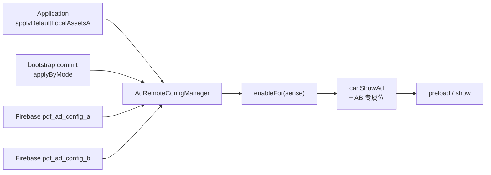
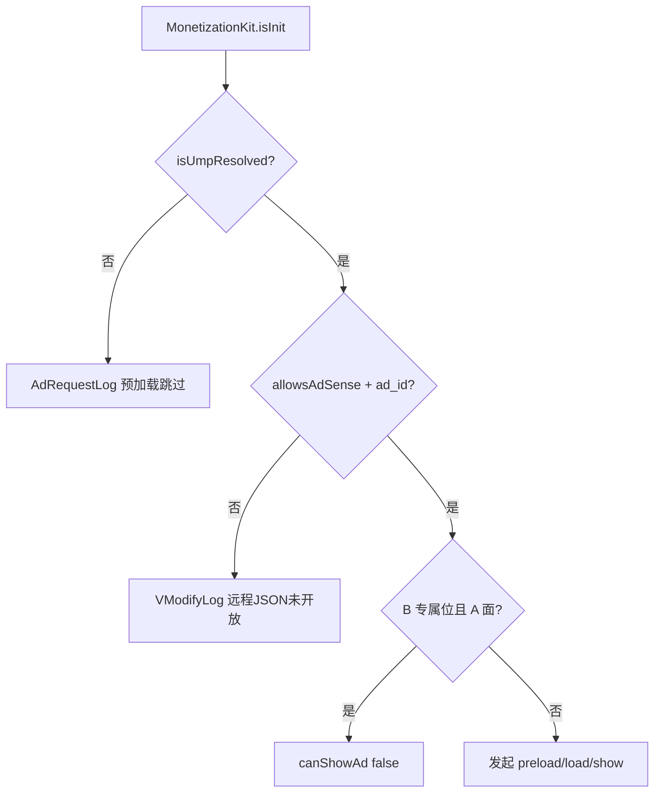
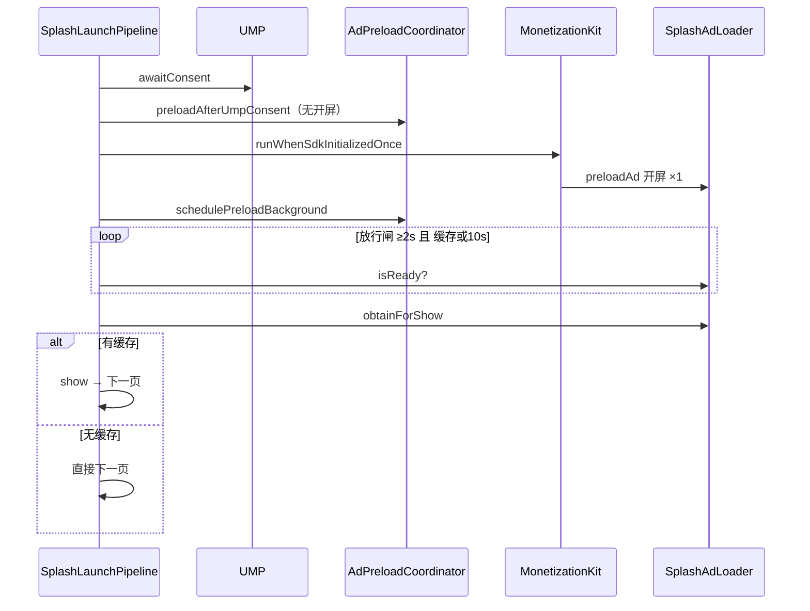
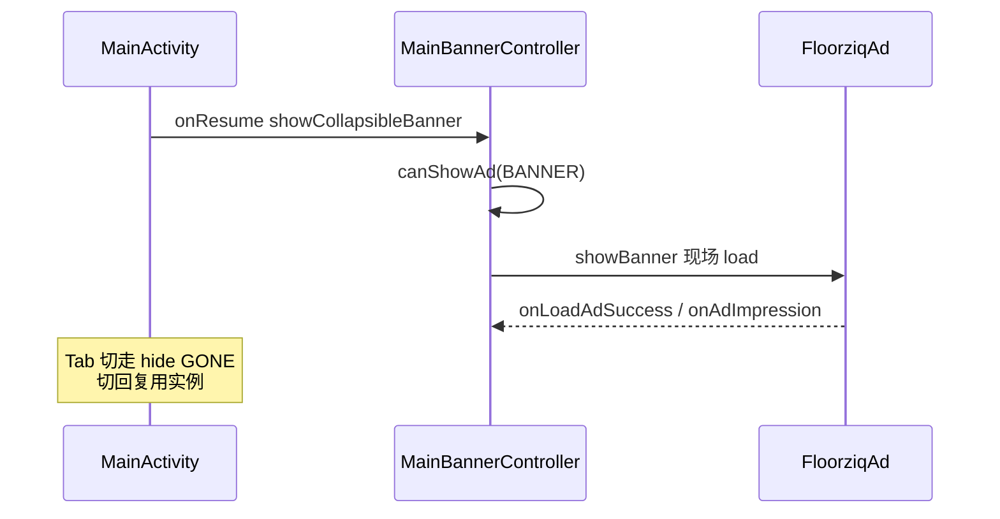

# AdMob 广告流程

## 用户指定位置 → 落地

## 插屏 / 原生

## 配置生效（PDF）

## 双闸门 + 展示链

## 开屏 Loading（PDF 金样）

详见 [splash-loading.md](splash-loading.md)、[sdk-init-callback.md](sdk-init-callback.md)。

## Banner（PDF 主页）

