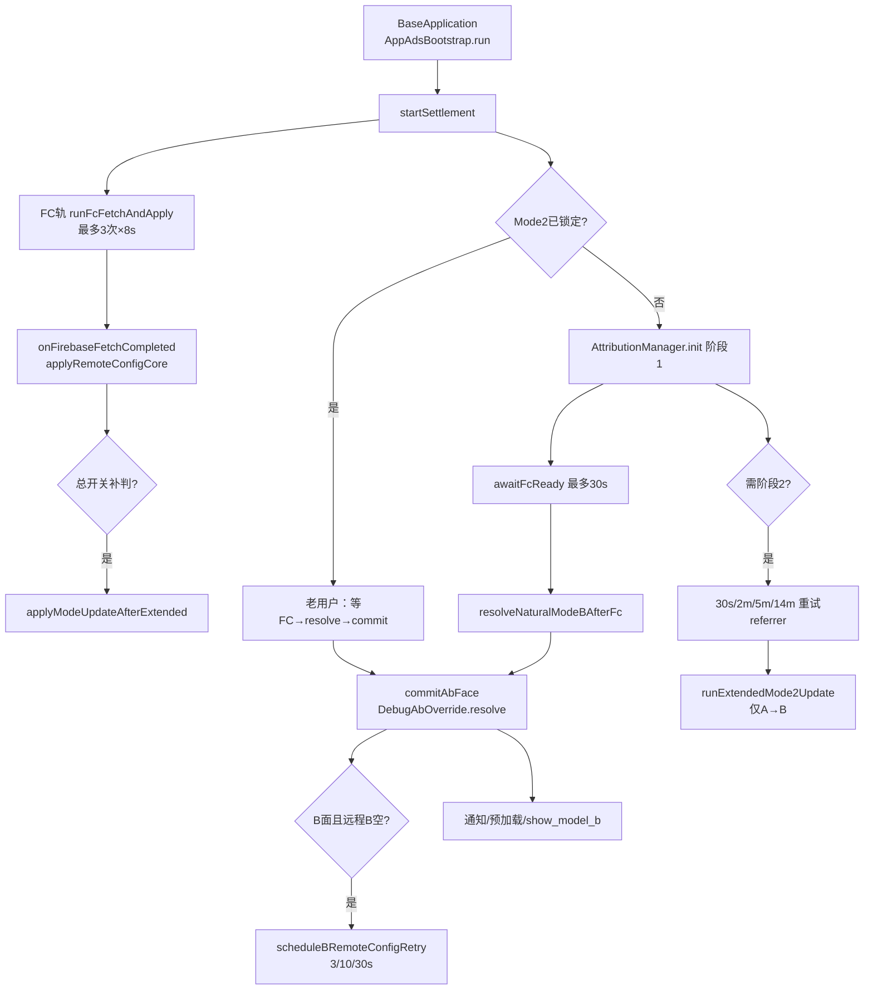

<!-- cursor-feature-interpret
generated: 2026-6-16 19:01:00
topic: 查看ab面功能
filename: AB面功能_2026-6-16_19-1.md
anchors: AbSettlementCoordinator.kt, AppAdsBootstrap.kt, Mode2Utils.kt, AttributionManager.kt, AdRemoteConfigBridge.kt, DebugAbOverride.kt
rule: .cursor/rules/cursor-function_description.mdc
role: backup（镜像备份，主交付在对话正文）
-->

# AB 面（A/B Side）功能解读 — videodownload v1.2.0

## 2.0 目录

**一句话**：冷启动 **AB 轨**（归因 + Mode2 自然判面）与 **FC 轨**（Firebase Remote Config 拉取）并行；首次 `commitAbFace` 后对外公布 A/B，驱动广告 JSON、通知 V3 与 B 专属广告位；15 分钟内归因阶段2 可 A→B 升面，自然 B 锁定后不可降 A。

### 快速阅读（按角色）

| 角色 | 建议跳转 |
|------|----------|
| 产品 | [2.1 作用](#21-功能身份与作用) → [2.3.1 RC专表](#231-远程配置专表) → [2.4 流程图](#24-流程图) |
| 开发 | [2.2 时序](#22-实现步骤与时序) → [2.11 分阶段](#211-分阶段详细说明) → [2.12 广告位专表](#212-广告位专表) |
| 测试 | [2.5 场景矩阵](#25-全场景矩阵) → [2.7 逐场景](#27-全场景逐项说明) → [2.10 自检](#210-输出前自检) |

### 全文目录

- [1. 解读范围](#1-解读范围)
- [2.1～2.12](#21-功能身份与作用)
- [2.9 续作](#29-异步续作与结论修订)
- [3. 双视角](#3-双视角)

### 场景速查

| 分类 | 跳转 |
|------|------|
| 正常 | [S01 买量升B](#s01买量referrerb且gp通过升b) · [S02 organic保持A](#s02自然量organic保持a) · [S03 老用户快路径](#s03老用户mode2已锁定) |
| RC | [S04 总开关=1强制B](#s04总开关1强制b) · [S05 总开关=0](#s05总开关0强制a) · [S06 子项未配默认开](#s06子项key未配置视为开启) |
| 续作 | [S07 阶段2升B](#s07阶段2拉到refer升b) · [S08 B锁定不降A](#s08自然b锁定拒绝降a) |
| 超时 | [S09 FC单次8s超时](#s09-fc单次fetch-8s超时) · [S10 等FC30s](#s10-等fc-30s超时) · [S11 归因6s](#s11-归因阶段1超时) |
| B远程 | [S15 B面远程补拉](#s15-b面commit后远程b补拉) |
| 竞态 | [S13 commit前](#s13-commit前对外恒a) · [S14 commit后与开屏](#s14-commit时刻与开屏配置) |

---

## 1. 解读范围

| 项 | 内容 |
|----|------|
| 功能名称 | A/B 面判定、对外公布与广告/通知方案切换 |
| 代码锚点 | `AbSettlementCoordinator.kt`、`AppAdsBootstrap.kt`、`Mode2Utils.kt`、`AttributionManager.kt`、`ReferrerSideParser.kt`、`AdRemoteConfigBridge.kt`、`DebugAbOverride.kt`、`AppRemoteConfig.kt` |
| 边界 | **含**：双轨结算、Mode2、归因阶段1/2、commit、RC apply、B 远程补拉、`canShowAd`、通知 V3。**不含**：UMP、单广告位 Loader 实现、语言/引导页业务 |
| 关联子功能 | `BaseApplication` 双协程预热、UMP、`StartActivity` 开屏、`AdPreloadCoordinator` |

### 阶段清点

| 序号 | 阶段/子轨 | 代码锚点 | 阻塞用户 | 可修订结论 |
|------|-----------|----------|----------|------------|
| P0 | Application 启动结算 | `AppAdsBootstrap.run` | 否 | 否 |
| P1 | FC 轨 fetch（3 次重试） | `runFcFetchAndApply` | 否 | apply RC |
| P2 | 老用户 Mode2 快路径 | `isMode2Resolved` | 否 | 读锁定 |
| P3 | 归因阶段1 | `AttributionManager.init` | 否 | 占位/extended |
| P4 | 等 FC 就绪 | `awaitFcReadyForMode2` | 否（挡 Mode2） | — |
| P5 | Mode2 自然判面 | `resolveNaturalModeBAfterFc` | 否 | 首次锁定 |
| P6 | 首次 commit | `commitAbFace` | 否 | 公布 isModeB |
| P7 | B 面远程补拉 | `scheduleBRemoteConfigRetryIfNeeded` | 否 | B JSON |
| P8 | 归因阶段2 阶梯 | `runExtendedReferrerPhaseIfNeeded` | 否 | A→B |
| P9 | 阶段2 Mode2 修订 | `runExtendedMode2UpdateIfNeeded` | 否 | 仅 A→B |
| P10 | FC 完成后补判 | `onFirebaseFetchCompleted` | 否 | 总开关补升 B |

---

## 2.1 功能身份与作用

| 项 | 内容 |
|----|------|
| 业务作用 | **A 面**：审核/自然用户体验，广告位少（开屏 + 搜索插屏等）；**B 面**：买量用户，更多原生/插屏、通知 V3 定时/Idle、完整 B 方案 JSON |
| 用户可感知 | A：语言/引导/主页广告受限；B：更多广告与通知能力 |
| 后台职责 | `AppAdsBootstrap.isModeB`、`configAppliedThisProcess`；MMKV `KEY_MODE2_RESOLVED` / `KEY_NATURAL_MODE_B`；Firebase `ad_config_a` / `ad_config_b` |
| 上游 | `BaseApplication.onCreate` → `AppAdsBootstrap.run`（与 `launchAdsWarmup` 并行） |
| 下游 | `canShowAd`、`AdPreloadCoordinator`（B 面预加载）、`VsaveV3FeatureKit.onAdsBootstrapComplete`、`show_model_b` 埋点 |
| 是否阻塞启动页 | **不专门等待** commit；开屏位**非 B 专属**，看 `enableFor`；B 专属位看 `canShowAd` → commit 前 `currentIsModeB()` **恒 false** |

### 对外面别 vs 自然面别

| 概念 | 含义 |
|------|------|
| **naturalModeB** | Mode2 + 归因算出的「自然 B」 |
| **isModeB** | 对外公布面别 = `DebugAbOverride.resolveModeB(natural)` |
| **currentIsModeB()** | 未 commit 前恒 **false**（对外暂定 A） |

---

## 2.2 实现步骤与时序

### 超时点清单

| 超时点 | 阈值 | 超时后 | 说明 |
|--------|------|--------|------|
| FC 单次 fetch | 8000ms | 计入失败，可重试 | 最多 3 次，间隔 0/2s/5s |
| 等 FC 就绪（Mode2） | 30000ms | 强制 `fcReady=true`，用 RC 缓存判面 | 不阻塞启动页 UI |
| 归因阶段1 | `referrerTimeoutMs`（JSON 默认 **6000**） | 可能进阶段2 | `AdRemoteConfigManager.limit` |
| 归因终局 | **15min** | 不再修订面别 | `isAbRevisionAllowed` |
| B 面远程补拉 | 3/10/30s 间隔 + 单次 8s | 仍用 A assets 兜底 | commit 为 B 后 |

### 冷启动双轨（并行）

```
AppAdsBootstrap.run → AbSettlementCoordinator.startSettlement
  ├─ FC 轨：runFcFetchAndApply（3 次重试）→ onFirebaseFetchCompleted → applyRemoteConfigCore
  └─ AB 轨：
        老用户：awaitFcReady → resolveNaturalModeBAfterFc → commitAbFace
        新用户：AttributionManager.init → awaitFcReady → resolveNaturalModeBAfterFc → commitAbFace
        → 若需 extended：阶段2 阶梯 30s/2m/5m/14m
commitAbFace → scheduleBRemoteConfigRetryIfNeeded（B 且远程 B 未生效）
```

### 热启动

`AppAdsBootstrap.run(hotResumeFastPath=true)` → **跳过** settlement，沿用本进程已 commit 的 `isModeB`。

---

## 2.3 分支与判断逻辑

### Mode2 判面优先级（`evaluateMode2` / `resolveNaturalModeBAfterFc`）

| 优先级 | 条件 | 结果 |
|--------|------|------|
| 1 | RC `enable_mode2_with_video` **存在且=1** | 强制 **B**（写锁定） |
| 2 | RC **存在且=0** | 强制 **A**（自然 B 已锁定则保持 B） |
| 3 | 已 `isMode2Resolved()` | 读锁定 `naturalModeB` |
| 4 | 代码子项检查 | Referrer→B + GP 安装等；**任一失败→A**；全过→B；无子项→**默认 A** |

### Referrer 规则（`ReferrerSideParser`）

- 买量/raw 判 B → Referrer 检查通过
- 空 / organic / 未结算 → A

### 子项 RC key（不存在视为 **开启**）

| key | 业务 |
|-----|------|
| `enable_installation_source_condition` | Install Referrer 买量检查 |
| `enable_installed_from_google_play_condition` | 是否 GP 安装 |

（模拟器/IP/中国区等子项在代码中**已注释**，当前不参与判面。）

### `canShowAd` 双条件

```kotlin
MonetizationKit.enableFor(sense) && (非B专属 || currentIsModeB())
```

**B 专属位**（videodownload）：语言原生/插屏、主页原生、底栏插屏、搜索原生、引导大原生、引导插屏。  
**非 B 专属**：冷/热开屏、搜索插屏。

---

### 2.3.1 远程配置专表

**表 A：Mode2 / 广告 RC key**

| RC key | 业务含义 | ①未配置 | ②=0 | ③=1 | 其它值 |
|--------|----------|---------|-----|-----|--------|
| `enable_mode2_with_video` | B 面总开关 | 走代码判面 | 强制 A | 强制 B | 走代码判面 |
| `enable_installation_source_condition` | Referrer 子项 | **视为开启** | 跳过检查 | 参与检查 | 非1→跳过 |
| `enable_installed_from_google_play_condition` | GP 安装子项 | **视为开启** | 跳过 | 参与 | 非1→跳过 |
| `ad_config_a` | A 面广告 JSON | 用 assets A | — | — | parse 失败保留本地 |
| `ad_config_b` | B 面广告 JSON | B 面不读本地 B assets | — | — | 远程空则 A 兜底 |

**表 B：FC 拉取**

| 阶段 | 锚点 | 超时 | 失败后 |
|------|------|------|--------|
| 冷启 FC | `runFcFetchAndApply` | 8s×最多3次 | 用缓存 RC，`fetchOk=false` 仍 `fcReady=true` |
| 等 FC | `awaitFcReadyForMode2` | 30s | 强制继续 Mode2 |
| B 补拉 | `scheduleBRemoteConfigRetryIfNeeded` | 8s×3轮 | 沿用 A 默认 |

**表 C：commit 时刻 vs 开屏**

| 时机 | effectiveModeB | 开屏/预加载 |
|------|----------------|-------------|
| commit 前 | false | 开屏可用 A 方案；B 专属 preload 跳过 |
| commit 后 B | true | apply `ad_config_b`；B 专属可展示 |

---

<a id="sec-24"></a>
### 2.4 流程图



---

<a id="sec-25"></a>
### 2.5 全场景矩阵

| 编号 | 分类 | 场景 | 结果 | 用户感知 |
|------|------|------|------|----------|
| S01 | 正常 | 买量 Referrer=B 且 GP 通过升 B | natural B，commit B | B 面广告/通知 |
| S02 | 正常 | 自然量 organic 保持 A | natural A | A 面体验 |
| S03 | 正常 | 老用户 Mode2 已锁定 | 快路径读 MMKV | 稳定面别 |
| S04 | RC | 总开关=1 强制 B | 写锁定 B | 全员 B 方案 |
| S05 | RC | 总开关=0 强制 A | A（锁定 B 例外） | 审核态 |
| S06 | RC | 子项 key 未配置 | 视为开启参与检查 | 依 refer/GP |
| S07 | 续作 | 阶段2 拉到 refer 升 B | `applyModeUpdateAfterExtended` | 事后更多广告 |
| S08 | 续作 | 自然 B 锁定拒绝降 A | 阶段2/总开关=0 也不降 | 保持 B |
| S09 | 超时 | FC 单次 fetch 8s 超时 | 重试或终局用缓存 | 无感 |
| S10 | 超时 | 等 FC 30s | 强制 fcReady | Mode2 用缓存 |
| S11 | 超时 | 归因阶段1 6s 超时 | extended 阶梯 | 先 organic 占位 |
| S12 | Debug | FORCE_B / 弹窗强制 | `resolveModeB` 覆盖 | 测试 B |
| S13 | 竞态 | commit 前对外恒 A | `currentIsModeB=false` | B 专属不展示 |
| S14 | 竞态 | commit 时刻与开屏 | load 瞬间 RC 配置 | 见 §1.6.5 |
| S15 | B远程 | B commit 后远程 B 空 | 补拉 3 次 | 暂用 A 默认 ad_id |
| S16 | 热启动 | hotResumeFastPath | 跳过 settlement | 沿用进程 isModeB |
| S17 | 埋点 | 首次判 B | `show_model_b` 一次 | 无感 |
| S18 | 边界 | 重复 commit | `configAppliedThisProcess` 防重 | — |

**场景计数**：共 18 场

---

## 2.11 分阶段详细说明（摘要）

#### P1：FC 轨

- 与 AB **并行**；单次 8s 超时；失败间隔 2s/5s 再试；最多 3 次。
- 完成 → `fcReady=true` → `onFirebaseFetchCompleted` → 按 **当前** commit 状态 apply（未 commit 时 effectiveModeB=false）。

#### P5：Mode2 自然判面

- **须** FC 激活后执行（`resolveNaturalModeBAfterFc`），避免总开关未拉到误锁 A。
- 代码路径：Referrer + GP（子项可 RC 关闭）。

#### P6：commitAbFace

1. `finalModeB = DebugAbOverride.resolveModeB(naturalModeB)`
2. `configAppliedThisProcess=true`
3. `applyRemoteConfigCore`（广告 + 通知）
4. 埋点、`VsaveV3FeatureKit`、A→B 监听
5. `scheduleBRemoteConfigRetryIfNeeded`

#### P8：阶段2 修订

- 仅当 `AttributionManager.needsExtendedReferrerRetry`
- 阶梯：30s / 2min / 5min / 14min；15min 终局
- `updateLockedNaturalModeBIfChanged`：**不可 B→A**

#### P7：B 面远程补拉

- 条件：`isModeB && !isRemoteBConfigApplied()`
- B 面 **不读本地 B assets**，仅远程 `ad_config_b`；失败则 A 默认兜底

---

<a id="sec-212"></a>
### 2.12 广告位与 AB 关系专表

| AdSense | B 专属 | commit 前 | commit 后 B |
|---------|--------|------------|-------------|
| LOADING/HOT 开屏 | 否 | enableFor | enableFor |
| SEARCH 插屏 | 否 | enableFor | enableFor |
| LANGUAGE 原生/插屏 | **是** | 不展示 | 可展示 |
| HOME 原生 | **是** | 不展示 | 可展示 |
| BOTTOM_NAV 插屏 | **是** | 不展示 | 可展示 |
| SEARCH 原生 | **是** | 不展示 | 可展示 |
| GUIDE 大原生/插屏 | **是** | 不展示 | 可展示 |

预加载：`AdPreloadCoordinator` 多处检查 `AppAdsBootstrap.isModeB`。

---

## 2.9 异步续作与结论修订

| 续作 | 触发 | 修订规则 | 用户感知 |
|------|------|----------|----------|
| 归因阶段2 | 阶段1 超时/空/失败 | 可能 A→B | 延迟升 B |
| FC 后总开关=1 | `onFirebaseFetchCompleted` | 已 commit A 可补升 B | 广告方案切换 |
| B 远程补拉 | commit B 后远程空 | 补 apply B JSON | B 广告位陆续生效 |

**不阻塞** UMP、启动页放行闸。

---

## 3. 双视角

**产品**：A/B 不是「两个 App」，而是同一 App 的两套广告与通知策略。买量用户应尽量进 B；自然/审核流量保持 A。commit 前进语言/引导页时 B 专属广告**不会展示**（对外暂定 A），但语言页正常说明 AB 在进引导前通常已 commit。

**开发**：双轨解耦是核心；Mode2 必须等 FC；B 面无本地 JSON 依赖远程 `ad_config_b` + 补拉。与 PDF 金样对齐项：FC 3 次重试、B 远程补拉、Application 并行 bootstrap。

**测试**：Debug `DebugAbOverride` / StartActivity AB 弹窗；Logcat `【AB结算】`/`【Mode2判定】`/`【Firebase RC】`；验证 S01/S02/S07/S13；Firebase 配总开关与子项；B 面验证 `ad_config_b` 非空。

---

<a id="sec-210"></a>
### 2.10 输出前自检

- [x] 双轨 AB/FC + 阶段清点 P0–P10
- [x] RC 表 A/B/C（总开关、子项、ad_config）
- [x] 超时：FC 8s×3、等 FC 30s、referrer 6s、15min 终局
- [x] 阶段2 阶梯与 A→B only
- [x] B 远程补拉与 assets 策略
- [x] canShowAd / B 专属位表
- [x] 与启动页/UMP 竞态说明
- [x] 不含「开屏必定 A 方案」误导表述

---

*基于 videodownload v1.2.0 当前代码（含方案 A 对齐：FC 重试、B 补拉、Application 双协程）。*
