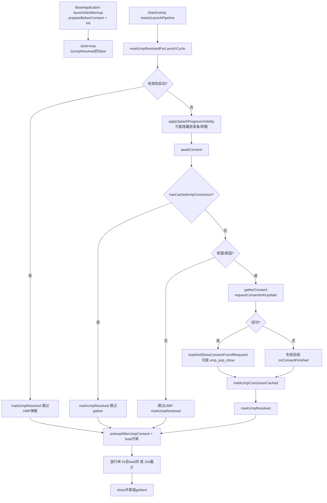

<!-- cursor-feature-interpret
generated: 2026-6-16 18:59:00
topic: 查看ump功能
filename: UMP功能_2026-6-16_18-59.md
anchors: AdConsentManager.kt, EuRegionHelper.kt, MonetizationKit.kt, StartActivity.kt, BaseApplication.kt
rule: .cursor/rules/cursor-function_description.mdc
role: backup（镜像备份，主交付在对话正文）
-->

# UMP（User Messaging Platform）功能解读

## 2.0 目录

**一句话**：冷启动在欧盟/英国且无 UMP 缓存时走 Google UMP gather；流程结束（含非欧盟跳过、缓存快路径、同意/拒绝、SDK 失败回调）后打开 `isUmpResolved` 闸门，才允许 `enableFor` 通过并发起广告请求；与 AB bootstrap 并行，启动页不等待 AB commit。

### 快速阅读（按角色）

| 角色 | 建议跳转 |
|------|----------|
| 产品 | [2.1 作用](#21-功能身份与作用) → [2.3 分支](#23-分支与判断逻辑) → [2.4 流程图](#24-流程图) |
| 开发 | [2.2 时序](#22-实现步骤与时序) → [2.11 分阶段](#211-分阶段详细说明) → [2.6 走读](#26-关键实现走读) |
| 测试 | [2.5 场景矩阵](#25-全场景矩阵) → [2.7 逐场景](#27-全场景逐项说明) → [2.10 自检](#210-输出前自检) |

### 全文目录

- [1. 解读范围](#1-解读范围)
- [2.0 目录](#20-目录)
- [2.1 功能身份与作用](#21-功能身份与作用)
- [2.2 实现步骤与时序](#22-实现步骤与时序)
- [2.3 分支与判断逻辑](#23-分支与判断逻辑)
- [2.4 流程图](#24-流程图)
- [2.5 全场景矩阵](#25-全场景矩阵)
- [2.6 关键实现走读](#26-关键实现走读)
- [2.7 全场景逐项说明](#27-全场景逐项说明)
- [2.8 递归子功能](#28-递归子功能)
- [2.11 分阶段详细说明](#211-分阶段详细说明)
- [2.9 异步续作与并行](#29-异步续作与并行)
- [3. 双视角](#3-双视角)
- [2.10 输出前自检](#210-输出前自检)

### 场景速查

| 分类 | 跳转 |
|------|------|
| 正常 | [S01 欧盟首次同意](#s01欧盟首次弹窗同意) · [S03 二次冷启有缓存](#s03二次冷启有缓存) · [S04 非欧盟跳过](#s04非欧盟跳过) |
| UMP UI | [S02 欧盟拒绝仍结束](#s02欧盟弹窗拒绝仍结束流程) · [S07 SDK update 失败](#s07-requestconsentinfoupdate-失败) |
| 热启动 | [S06 热启动跳过UMP](#s06热启动跳过ump) |
| 闸门/竞态 | [S09 isInit未就绪](#s09-ump已resolve但isinitfalse) · [S10 与AB并行](#s10-ump与ab-commit竞态) |
| 埋点 | [S13 ump_pop_show](#s13-ump_pop_show-埋点) · [S16 隐私选项未接线](#s16-设置页隐私选项未接线) |

---

## 1. 解读范围

| 项 | 内容 |
|----|------|
| 功能名称 | UMP 隐私同意流 + 广告请求闸门（`isUmpResolved`） |
| 代码锚点 | `AdBridge/.../AdConsentManager.kt`、`EuRegionHelper.kt`、`MonetizationKit.kt`、`StartActivity.awaitConsent`、`BaseApplication.launchAdsWarmup` |
| 边界 | **含**：地区预筛、缓存、gather、闸门、启动页 UMP UI、埋点。**不含**：AB 面判面、单广告位 load/show 细节、设置页「隐私选项」入口（API 已封装未接线） |
| 关联子功能 | Application 广告预热、`AppAdsBootstrap`（并行）、`AdLoader.resolveDisabledReason`、`AdPreloadCoordinator.preloadAfterUmpConsent` |

### 阶段清点

| 序号 | 阶段/子轨 | 代码锚点 | 阻塞用户 | §2.11 |
|------|-----------|----------|----------|-------|
| P0 | Application 广告预热 | `BaseApplication.launchAdsWarmup` | 否 | P0 |
| P1 | 启动管线重置 / 热启动跳过 | `resetUmpResolvedForLaunchCycle` / 热启 `markUmpResolved` | 否 | P1 |
| P2 | 启动页 UMP UI | `applySplashProgressVisibilityForUmpPhase` / `runUmpWaitUiLoop` | 是（转圈） | P2 |
| P3 | 缓存快路径 | `hasCachedUmpConclusion` | 否 | P3 |
| P4 | 非欧盟跳过 | `EuRegionHelper.shouldInitializeUmp` | 否 | P4 |
| P5 | 欧盟 gather | `gatherConsent` | 是（弹窗或等 SDK） | P5 |
| P6 | 闸门打开 | `MonetizationKit.markUmpResolved` | — | P6 |
| P7 | UMP 后广告阶段 | `preloadAfterUmpConsent` + `loadSplashIfEnabled` + 放行闸 | 是 | P7 |

---

## 2.1 功能身份与作用

| 项 | 内容 |
|----|------|
| 业务作用 | GDPR/欧盟隐私合规：在欧盟/英国首次（或无缓存）时收集广告同意；**流程结束**后才允许 App 侧走 `enableFor` 发广告请求 |
| 用户可感知 | 欧盟/英国**首次**冷启且需 gather：底部进度条可能隐藏，中央 `isiSplashUmpWait` 转圈；可能弹 Google 同意窗；完成后恢复进度条并进入开屏阶段 |
| 后台职责 | `MonetizationKit.isUmpResolved`；SharedPreferences `ump_consent_cache.flow_completed_once` + SDK `ConsentStatus` 持久化 |
| 上游 | `StartActivity.restartLaunchPipeline` → `awaitConsent` |
| 下游 | `MonetizationKit.enableFor` → `AdLoader`；UMP 后 `AdPreloadCoordinator.preloadAfterUmpConsent` |
| 是否阻塞关键路径 | **是**（冷启）：`awaitConsent` **无应用层超时**，须等 UMP 结束才进入开屏 load |
| 与 AB 面 | **无串行依赖**；UMP 与 `AppAdsBootstrap.run` 并行；B 专属位另看 `canShowAd` |

### 地区预筛（客户端优先）

`EuRegionHelper` 读**系统设置地区码**（非 IP），匹配欧盟 27 国 + 英国 `GB`：
- 在范围内 → 可能走 UMP gather（仍须无缓存）
- 非范围或地区码为空 → **不初始化 UMP**，直接 `markUmpResolved`

---

## 2.2 实现步骤与时序

### 超时点清单

| 超时点 | 阈值 | 超时后 | 说明 |
|--------|------|--------|------|
| UMP gather | **无应用层超时** | 依赖 SDK 成功/失败回调 | 失败回调仍 `onConsentFinished` |
| 等 SDK init | 2500ms | 日志后继续 | `StartActivity.awaitSdkInitIfNeeded` |
| 开屏 load | 10000ms | `splashAd=null` | UMP **之后** |
| UMP 后放行闸 | 10000ms | 放弃本次开屏展示 | `MAX_AFTER_UMP_MS` |
| 最短 Loading | 2000ms | 与 load 完成 AND 才放行（截止前） | `MIN_ANIM_MS` |

### 冷启动主路径

| 步骤 | 锚点 | 业务含义 | 串行/并行 |
|------|------|----------|-----------|
| T0 | `BaseApplication.launchAdsWarmup` | `prepareBeforeConsent` + A assets + `init` → `isInit=true` | 与 AB 并行 |
| T1 | `StartActivity.restartLaunchPipeline` | `resetUmpResolvedForLaunchCycle`；`loading_start` | 串行 |
| T2 | `applySplashProgressVisibilityForUmpPhase` | 预测 gather → 隐藏进度条/显示转圈 | 串行 |
| T3 | `awaitConsent` → `AdConsentManager.requestGatherConsentAndInitAds` | 缓存 / 非欧盟 / gather | **阻塞** |
| T4 | `markUmpResolved` | 打开广告请求闸门 | 串行 |
| T5 | `preloadAfterUmpConsent` + `loadSplashIfEnabled` | UMP 后才 preload/load | 串行 |
| T6 | `awaitReleaseGate` | 2s + load 完或 10s 截止 | 串行 |
| T7 | `showSplashOrGoNext` | 展示或跳页 | 串行 |

### 热启动路径

`isEffectiveHotStart()==true` → `restartLaunchPipeline` 内立即 `MonetizationKit.markUmpResolved()`，**跳过** `awaitConsent` 弹窗。

---

## 2.3 分支与判断逻辑

### 缓存判定（`hasCachedUmpConclusion`）

| 条件（业务） | 代码 | 结果 |
|--------------|------|------|
| 本地已走过 UMP 流程 | `ump_consent_cache.flow_completed_once=true` | 有缓存，跳过 gather |
| SDK 已有结论 | `consentStatus` = OBTAINED 或 NOT_REQUIRED | 有缓存，跳过 gather |
| 其它 | UNKNOWN / REQUIRED 等 | 无缓存，继续地区判断 |

### 是否会实际 gather（`willRunUmpGather`）

`!hasCachedUmpConclusion && EuRegionHelper.shouldInitializeUmp` → 启动页展示 UMP 转圈、可能隐藏底部进度条。

### 闸门（`MonetizationKit.enableFor`）

须同时满足：`isInit && !isSubs && isUmpResolved && allowsAdSense && ad_id…`

**关键**：闸门看 **`isUmpResolved`**，**不看** `ConsentInformation.canRequestAds`；产品注释：**同意或拒绝均视为 UMP 流程结束**，均 `markUmpResolved`。

### Debug 配置

`BaseApplication`（DEBUG）注入 `AdConsentManager.debugConfig.testDeviceHashedIds`。**未**配置 `DEBUG_GEOGRAPHY_EEA`（与 PDF 金样 skill 轻量差异点）。

---

### 2.4 流程图

---

### 2.5 全场景矩阵

| 编号 | 分类 | 场景 | 触发条件 | 路径 | 用户感知 | 闸门 |
|------|------|------|----------|------|----------|------|
| S01 | 正常 | 欧盟首次弹窗同意 | 无缓存 + EEA + 表单可用 | gather → form → cache → resolve | 转圈→弹窗→进度条→开屏 | 开 |
| S02 | 正常 | 欧盟弹窗拒绝仍结束流程 | 用户点拒绝 | 同 gather 结束 | 同 S01；SDK 可能限填充 | **仍开** |
| S03 | 正常 | 二次冷启有缓存 | `flow_completed_once` 或 OBTAINED | 跳过 gather | 无转圈，直接开屏阶段 | 开 |
| S04 | 正常 | 非欧盟跳过 | 地区不在 EEA_OR_GB | 不 gather，直接 resolve | 无转圈无弹窗 | 开 |
| S05 | 正常 | SDK NOT_REQUIRED | status=NOT_REQUIRED | 视为有缓存 | 无 gather | 开 |
| S06 | 热启动 | 热启动跳过UMP | `isEffectiveHotStart` | 立即 markUmpResolved | 无 UMP 等待 | 开 |
| S07 | 异常 | requestConsentInfoUpdate 失败 | 网络/配置错误 | 失败回调仍 onConsentFinished → cache → resolve | 转圈结束 | 开 |
| S08 | 边界 | 系统地区码为空 | `country==（空）` | 非欧盟分支 | 同 S04 | 开 |
| S09 | 竞态 | UMP已resolve但isInit=false | Application init 慢 | enableFor=false | 暂不可请求广告 | 关（init） |
| S10 | 竞态 | UMP与AB commit | UMP 慢/快任意 | 开屏 load 不 await commit | 配置时刻依赖竞态 | UMP 开 |
| S11 | 超时 | 开屏load 10s | UMP 已结束 | splashAd=null | 无开屏 | UMP 仍开 |
| S12 | 超时 | UMP后放行闸10s | 开屏阶段过久 | 放弃展示 | 多等最多 10s | UMP 仍开 |
| S13 | 埋点 | ump_pop_show | `isConsentFormAvailable=true` 时上报 | gather 成功分支 | — | — |
| S14 | 埋点 | 无表单资源 | form 不可用 | 不上报 ump_pop_show | 可能无弹窗 | — |
| S15 | Debug | 测试设备 hashed id | DEBUG + debugConfig | 联调 UMP | Logcat 弹窗预期 | — |
| S16 | 未接线 | 设置页隐私选项 | — | `showPrivacyOptionsForm` 无调用方 | 用户无法在设置改偏好 | — |
| S17 | UI | 长时UMP等待 | gather 很慢 | ProgressDriver 第二段假进度（UI） | 转圈；**不**强制跳过 UMP | — |
| S18 | 埋点 | loading_start早于UMP | 任意冷启 | pipeline 开头上报 | 漏斗含 UMP 时长 | — |

**场景计数**：共 18 场

---

## 2.6 关键实现走读

| 模块 | 职责 |
|------|------|
| `AdConsentManager.requestGatherConsentAndInitAds` | 冷启唯一 gather 入口；三岔：缓存 / 非欧盟 / gather |
| `AdConsentManager.gatherConsent` | `requestConsentInfoUpdate` → 可选 `loadAndShowConsentFormIfRequired` |
| `EuRegionHelper` | 系统地区码 ∈ EEA+GB 才 `shouldInitializeUmp` |
| `MonetizationKit.isUmpResolved` | 全局广告请求闸门（与 `isInit` 并列） |
| `AdLoader.resolveDisabledReason` | 未 resolve 时返回「UMP 流程未完成」 |
| `StartActivity.awaitConsent` | suspend 挂起至 UMP 回调；热启不进入 |

---

### 2.7 全场景逐项说明

#### S01：欧盟首次弹窗同意

无缓存且 `shouldInitializeUmp=true` → `gatherConsent` → SDK 弹窗 → 用户同意 → 写 `flow_completed_once` → `markUmpResolved` → 进入开屏 load。`canRequestAds` 可能为 true（仅日志，非闸门）。

#### S04：非欧盟跳过

`EuRegionHelper.shouldInitializeUmp=false` → 不调用 gather → `finishUmpFlow` → `markUmpResolved`。**不**写 `flow_completed_once`（除非走 gather 路径）；下次冷启仍先查 SDK status。

#### S06：热启动跳过UMP

`restartLaunchPipeline`：`MonetizationKit.markUmpResolved()`，`awaitConsent` 直接 return。用户不见 UMP 弹窗。

#### S07：requestConsentInfoUpdate 失败

`gatherConsent` 失败回调仍调用 `onConsentFinished()` → 外层写 cache + `markUmpResolved`。**不**因网络失败永久卡在启动页。

#### S13：ump_pop_show 埋点

仅当 `requestConsentInfoUpdate` **成功**且 `isConsentFormAvailable=true` 时 `KiteAnalytics.emit(ump_pop_show)`。无表单资源时不报。

---

## 2.8 递归子功能

| 子功能 | 关系 |
|--------|------|
| 启动页放行闸 | UMP 完成后才进入开屏 load 阶段；UMP 阶段 `consentResolved=false` 不放行 |
| AB / FC | 并行；不影响 `isUmpResolved` |
| AdPreloadCoordinator | **须在** UMP resolve + `isInit` 后由 StartActivity 显式调用 `preloadAfterUmpConsent` |

---

### 2.11 分阶段详细说明

#### P0：Application 广告预热

1. **身份**：提前准备广告引擎，**不**打开 UMP 闸门。
2. **启动**：`BaseApplication.onCreate` → `launchAdsWarmup`。
3. **步骤**：`prepareBeforeConsent` → `applyDefaultLocalAssetsA` → `MonetizationKit.init` → `isInit=true`。
4. **用户感知**：无感。

#### P2：启动页 UMP UI

1. **启动**：`willRunUmpGather(context)==true` 时。
2. **UI**：`isiSplashProgress` GONE；`isiSplashUmpWait` VISIBLE（`runUmpWaitUiLoop` 轮询）。
3. **假进度**：UMP 阶段 `ProgressDriver` 的 progress 保持 0；`UMP_PENDING_MAX_MS(180s)` 仅 UI 第二段上限，**不**截断 UMP。

#### P5：欧盟 gather

1. `requestConsentInfoUpdate(activity, params, onSuccess, onFailure)`
2. 成功 → 若 `isConsentFormAvailable` → `ump_pop_show` → `loadAndShowConsentFormIfRequired`
3. 失败 → 仍 `onConsentFinished()`
4. 完成后 `markUmpConclusionCached`（仅 gather 路径写入本地标记）

#### P6：闸门

- `markUmpResolved()` → `isUmpResolved=true`
- 之后 `enableFor` 才通过 UMP 检查
- **同意/拒绝/跳过/失败回调**均可到达此步（产品策略：流程结束即可请求，具体填充由 SDK/AdMob 决定）

---

## 2.9 异步续作与并行

| 维度 | UMP | AB 面 |
|------|-----|-------|
| 启动时机 | `StartActivity.awaitConsent` | `AppAdsBootstrap.run`（Application + 启动页补调） |
| 互相等待 | **否** | **否** |
| 影响广告 | `isUmpResolved` | `canShowAd` / 远程 JSON |

---

## 3. 双视角

**产品**：欧盟/英国新用户首次冷启可能长时间停在转圈 + 弹窗；这是合规必要路径。非欧盟用户无 UMP。热启动不应再弹 UMP。用户拒绝广告同意仍会继续进 App，但填充可能受限（SDK 层）。

**开发**：`isUmpResolved` 与 `canRequestAds` 分离是刻意设计。Debug 只注入 test device id，未强制 EEA geography。`showPrivacyOptionsForm` 已封装待设置页接线。

**测试**：必测 S01/S04/S06/S07；欧盟用 Debug 设备 id + 系统地区改 DE/FR；验证 Logcat `UMP合规` / `【UMP闸门】`；验证 UMP 未完成时 `AdLoader` skip 原因含「UMP 流程未完成」。

---

### 2.10 输出前自检

- [x] §2.0 目录 + 场景速查
- [x] 阶段清点 P0–P7 + §2.11
- [x] UMP 无应用层超时 + SDK 失败兜底（S07）
- [x] 闸门 vs canRequestAds 区分
- [x] 热启动 / 缓存 / 非欧盟 三分支
- [x] 与 AB 并行（S10）
- [x] 启动页 UI（转圈/进度条）与放行闸关系
- [x] Debug 差异（无 DEBUG_GEOGRAPHY_EEA）已标注

---

*基于 `videodownload` v1.2.0 当前代码；锚点类以 AdBridge 与 StartActivity 为准。*
