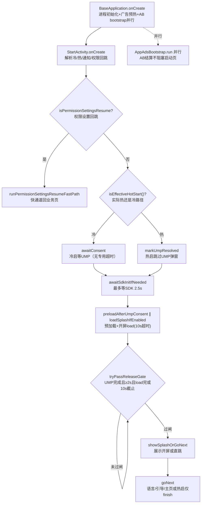
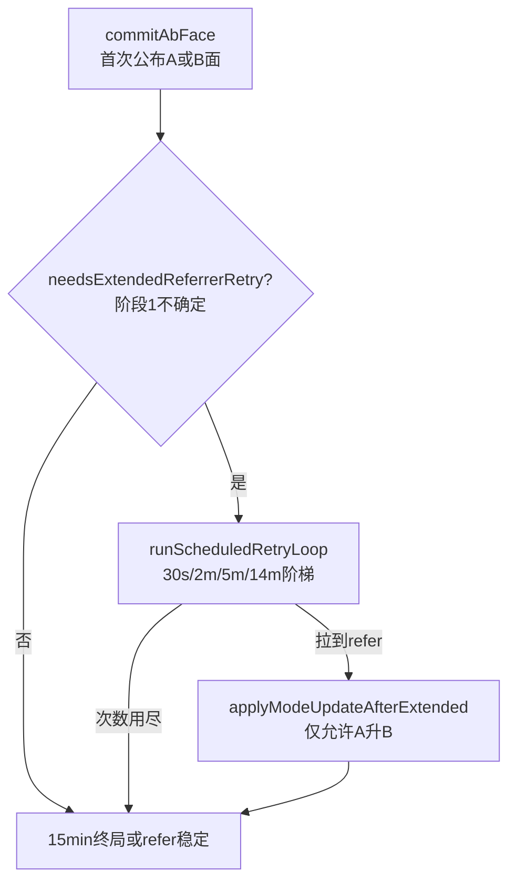

<!-- cursor-feature-interpret
generated: 2026-6-17 10:14:00
topic: 查看启动功能
filename: 启动功能_2026-6-17_10-14.md
anchors: StartActivity.kt, BaseApplication.kt, AppAdsBootstrap.kt, AppHotStartObserver.kt, AbSettlementCoordinator.kt
rule: .cursor/rules/cursor-function_description.mdc
role: backup（镜像备份，主交付在对话正文）
-->

## 2.0 目录

**一句话**：App 冷/热启动由 `StartActivity`（启动页）承接 UMP 合规 → 开屏 load → 放行闸 → 语言/引导/主页分流；`BaseApplication` 并行预热广告 SDK 与 AB 面结算，**不阻塞**启动页放行。

### 快速阅读（按角色）

| 角色 | 建议跳转 |
|------|----------|
| 产品 | [2.1 作用](#21-功能身份与作用) → [2.4 流程图](#24-流程图) → [2.7 重点场景](#27-全场景逐项说明) |
| 开发 | [2.2 时序](#22-实现步骤与时序) → [2.11 分阶段](#211-分阶段详细说明与它有关必写) → [2.12 广告位专表](#212-广告位专表涉广告时必填) → [2.6 走读](#26-关键实现走读) |
| 测试 | [2.5 场景矩阵](#25-全场景矩阵) → [2.7 逐场景](#27-全场景逐项说明) → [2.12 广告位专表](#212-广告位专表涉广告时必填) → [2.10 自检](#210-输出前自检) |

### 全文目录

- [1. 解读范围](#1-解读范围)
- [2.0 目录](#20-目录)
- [2.1 功能身份与作用](#21-功能身份与作用)
- [2.2 实现步骤与时序](#22-实现步骤与时序)
- [2.3 分支与判断逻辑](#23-分支与判断逻辑)
- [2.4 流程图](#24-流程图)
- [2.5 全场景矩阵](#25-全场景矩阵)
- [2.6 关键实现走读](#26-关键实现走读)
- [2.7 全场景逐项说明](#27-全场景逐项说明)
- [2.8 递归子功能](#28-递归子功能)
- [2.11 分阶段详细说明](#211-分阶段详细说明与它有关必写)
- [2.12 广告位专表](#212-广告位专表涉广告时必填)
- [2.9 异步续作](#29-异步续作与结论修订)
- [3. 双视角](#3-双视角)
- [2.10 输出前自检](#210-输出前自检)

### 场景速查

| 分类 | 跳转 |
|------|------|
| 正常 | [S01](#s01冷启非欧盟跳过ump开屏成功) · [S03](#s03冷启已配语言未引导) · [S09](#s09真热启动跳过ump) |
| 超时 | [S06](#s06开屏load-10s超时) · [S18](#s18开屏阶段放行闸10s截止) · [S21](#s21等fc-30s超时判面) |
| 边界 | [S11](#s11通知入口进程冷启) · [S13](#s13权限设置回跳快通道) · [S15](#s15ab-commit前开屏load) |
| 竞态 | [S15](#s15ab-commit前开屏load) · [S16](#s16ab-commit后开屏load) |
| 续作 | [S22](#s22阶段2归因a升b) |

---

## 1. 解读范围

| 项 | 内容 |
|----|------|
| 功能名称 | **应用启动功能**（冷启动 / 热启动 / 通知入口 / 权限回跳） |
| 代码锚点 | `StartActivity.kt`、`BaseApplication.kt`、`AppAdsBootstrap.kt`、`AppHotStartObserver.kt`、`ProgressDriver.kt`、`AdPreloadCoordinator.preloadAfterUmpConsent`、`AbSettlementCoordinator.startSettlement` |
| 边界 | **包含**：Launcher 入口 → Loading 页 → UMP → 开屏 → 下一页路由；Application 并行预热；热启动叠栈；通知入口；埋点。**不包含**：语言页/引导页/主页内部逻辑细节、插屏展示编排（仅写 UMP 后预加载触发点） |
| 关联子功能 | UMP（`AdConsentManager`）、广告 SDK（`MonetizationKit`）、AB 面结算（`AbSettlementCoordinator` + `AttributionManager`）、热启动监听（`AppHotStartObserver`）、会话来源（`SessionEntryTracker`）、V3 通知（`VsaveV3FeatureKit`） |

### 阶段清点（解读前）

| 序号 | 阶段/子轨名称 | 代码锚点 | 是否阻塞用户 | 是否可能修订结论 | §2.11 专节 |
|------|--------------|----------|-------------|-----------------|-----------|
| P0 | Application 冷启初始化 | `BaseApplication.onCreate` | 否（后台） | 否 | P0 |
| P1 | 启动页入口与路径判定 | `StartActivity.onCreate` / `isEffectiveHotStart` | 是 | 否 | P1 |
| P2 | UMP 合规阶段 | `awaitConsent` / `AdConsentManager` | **是（冷启欧盟）** | 否 | P2 |
| P3 | 开屏 load + UMP 后预加载 | `loadSplashIfEnabled` / `AdPreloadCoordinator` | 部分（load 最多 10s） | 否 | P3 |
| P4 | 放行闸 | `awaitReleaseGate` / `tryPassReleaseGate` | 是 | 否 | P4 |
| P5 | 展示开屏 / 导航下一页 | `showSplashOrGoNext` / `goNext` | 是 | 否 | P5 |
| P6 | AB 结算（并行） | `AppAdsBootstrap.run` → `AbSettlementCoordinator` | **否** | **是（阶段2）** | P6 |
| P7 | 热启动叠栈 | `AppHotStartObserver` | 是（叠 Loading） | 否 | P7 |

### 超时点清单

| 超时点（代码锚点） | 阈值 ms | 超时后行为 | 阻塞用户路径 | §2.4 边 | §2.5 场景 |
|-------------------|---------|-----------|-------------|---------|----------|
| UMP gather | **无专用超时** | 须等 SDK 回调 | 是（欧盟无缓存） | 有 | S02/S19 |
| `awaitSdkInitIfNeeded` | **2500** | 继续，可能跳过部分广告 | 部分 | 有 | S20 |
| 开屏 `loadAd` | **10000** | `splashAd=null`，仍可能放行 | 最多再等放行闸 | 有 | S06 |
| 开屏阶段放行闸 | **UMP 后 +10000** | 放弃本次展示，不 destroy 缓存 | 须同时满足 MIN_ANIM 2s | 有 | S18 |
| 最小动画 `MIN_ANIM_MS` | **2000** | 未到则继续等 | 是 | 有 | S07 |
| FC fetch | **8000×最多3次** | `fetchOk=false`，用缓存 RC | 否 | 有 | S17 |
| 等 FC 判面 | **30000** | 强制 `fcReady`，用缓存判 Mode2 | 否 | 有 | S21 |
| 热开屏 UI hold | **220** | 无广告时略等再 finish/跳转 | 是（热路径） | 有 | S09 |

### 广告位清点（启动相关）

| AdSense | adType | A/B | 预加载锚点 | 展示锚点 | 策略 |
|---------|--------|-----|-----------|---------|------|
| LOADING_SPLASH | 开屏 | 共用 | UMP 后 `preloadAfterUmpConsent` | `StartActivity.loadSplashIfEnabled` 冷启首次 | **现场 load** |
| HOT_LOADING_SPLASH | 开屏 | 共用 | 同上 | 热启 / 冷启第二次 | **现场 load** |

---

## 2.1 功能身份与作用

| 项 | 内容 |
|----|------|
| 业务作用 | 用户点图标或从通知回到 App 时，统一走 Loading 页：完成隐私合规（UMP）、尝试展示开屏广告、再进入语言选择 / 新手引导 / 主页 |
| 用户可感知 | 看到启动 Logo + 进度条（或欧盟 UMP 转圈）；可能看到全屏开屏广告；之后进入语言/引导/主页 |
| 后台职责 | 并行跑 AB 面判定、Firebase 拉取、广告 SDK 初始化、后续广告位预加载 |
| 上游 | 系统 Launcher、`AppHotStartObserver` 热启、`buildNotificationEntryIntent` 通知点击 |
| 下游 | `LanguageActivity` / `GuideActivity` / `MainActivity`；`AdPreloadCoordinator` 预加载 |
| 是否阻塞 | **启动页不等 AB commit**；但冷启**会等 UMP**（欧盟无缓存时）；开屏 load 与放行闸有 10s/2s 约束 |

---

## 2.2 实现步骤与时序

### 主路径（用户当下感知）

| 步骤 | 代码锚点 | 业务含义 | 串/并 | 线程 | 前置 | 完成后 |
|------|---------|---------|------|------|------|--------|
| T0 | `BaseApplication.onCreate` | 进程初始化：MMKV、Firebase、热启监听、广告预热、AB bootstrap | 并行后台 | IO/Main | 进程创建 | SDK 预热中 |
| T1 | `StartActivity.onCreate` | 解析热启/通知/权限回跳 Intent | 串行 | Main | LAUNCHER | 决定冷/热路径 |
| T2 | `restartLaunchPipeline` | 重置 UMP/开屏状态，上报 loading 开始 | 串行 | Main | T1 | 协程启动 |
| T3 | `awaitConsent` | 冷启等 UMP；热启跳过 | 串行 | Main+协程 | T2 | `consentResolved` |
| T4 | `awaitSdkInitIfNeeded` | 兜底等 `MonetizationKit.isInit` ≤2.5s | 串行 | 协程 | T3 | SDK 就绪或超时继续 |
| T5 | `preloadAfterUmpConsent` | UMP 后与开屏 load **并行**预加载下游广告位 | **并行** | Main | T4 | 后台请求广告 |
| T6 | `loadSplashIfEnabled` | 现场 load 开屏（10s 超时） | 串行 | 协程 | T4 | `adLoadFinished=true` |
| T7 | `awaitReleaseGate` | 轮询放行：UMP 完成 + MIN_ANIM 2s + load 完成或 10s 截止 | 串行 | 协程 | T3–T6 | 可跳转 |
| T8 | `showSplashOrGoNext` | 有货则 show 开屏，否则直跳 | 串行 | Main | T7 | 广告关或未展示 |
| T9 | `goNext` | 语言→引导→主页；热启有栈则仅 finish | 串行 | Main | T8 | 进入业务页 |

### 续作路径（不阻塞 Loading 放行）

| 步骤 | 代码锚点 | 业务含义 | 用户感知 |
|------|---------|---------|---------|
| R1 | `AbSettlementCoordinator.startSettlement` | 冷启并行 FC 轨 + 归因轨 | 无感 |
| R2 | `commitAbFace` | 首次公布 A/B 面，切换广告 JSON | 无感（可能影响**之后**广告） |
| R3 | `AttributionManager` 阶段2 | 15min 内阶梯重试 refer，可 A→B | 无感，广告方案可能事后升级 |

---

## 2.3 分支与判断逻辑

| 条件（业务） | 代码等价 | 结果 | 用户感知 |
|-------------|---------|------|---------|
| 是否热启动 Intent | `isHotStartIntent` | 真热启跳过 UMP 弹窗 | 热启无 UMP |
| 通知点进且栈内无业务页 | `isNotificationEntry() && !hasOtherBusinessActivitiesInStack` | **按冷启**走 UMP+冷开屏 | 像首次打开 |
| 通知点进且栈内有主页等 | 同上为 false | **按热启** | 叠 Loading + 热开屏 |
| 权限设置回跳 | `isPermissionSettingsResume` | 快通道直跳业务页，无 Loading | 几乎无 Loading |
| 欧盟且无 UMP 缓存 | `willRunUmpGather` | 展示转圈、隐藏底进度条 | GDPR 弹窗/流程 |
| 非欧盟或无缓存需求 | `!willRunUmpGather` | 跳过 gather | 直接进度条 |
| 开屏位未启用 | `!MonetizationKit.enableFor(sense)` | 不 load，`adLoadFinished=true` | 更快跳转 |
| 语言未配置 | `!languageConfigured()` | → `LanguageActivity` | 语言页 |
| 引导未完成 | `!guideCompleted()` | → `GuideActivity` | 引导页 |
| 否则 | — | → `MainActivity` | 主页 |
| 热启且栈内有其它页 | `isEffectiveHotStart() && hasOthers` | 仅 `finish()` Start | 回到原页面 |

---

## 2.4 流程图

### 流程图名词说明

| 代码锚点 | 是什么（业务） | 谁调用/何时 |
|---------|---------------|------------|
| `BaseApplication.onCreate` | 进程级初始化与并行预热 | 系统创建 Application |
| `StartActivity` | Launcher 启动页 | 冷启 / 热启叠栈 |
| `isEffectiveHotStart()` | 实际走热路径还是冷路径 | 通知入口会特殊判定 |
| `AdConsentManager` | Google UMP 隐私同意流 | 冷启 `awaitConsent` |
| `loadSplashIfEnabled` | 现场请求开屏广告 | UMP 结束后 |
| `tryPassReleaseGate` | 放行闸：能否离开 Loading | 轮询 40ms |
| `goNext` | 路由到语言/引导/主页 | 开屏关或未展示 |
| `AppAdsBootstrap.run` | AB 面结算入口 | Application / StartActivity 后台 |
| `AppHotStartObserver` | 后台回前台叠热启动页 | ProcessLifecycle onStart |



---

## 2.5 全场景矩阵

逐条说明见 [§2.7](#27-全场景逐项说明)

| 编号 | 分类 | 场景名称 | 触发条件 | 输入/数据 | 超时 | 路径 | 结果 | 用户感知 | 后台 | 续作 |
|------|------|---------|---------|----------|------|------|------|---------|------|------|
| S01 | 正常 | 冷启非欧盟跳过UMP开屏成功 | 首次安装、非欧盟 | 无语言、无引导 | UMP跳过 | consent→load→gate→show→goNext | 进语言页 | Loading+开屏 | AB并行 | 可能commit B |
| S02 | 正常 | 冷启欧盟UMP gather后开屏 | 欧盟无UMP缓存 | 同S01 | **UMP无超时** | gather→load→… | 同S01 | UMP弹窗/转圈 | 同S01 | 同S01 |
| S03 | 正常 | 冷启已配语言未引导 | MMKV有语言 | guide=false | — | goNext→Guide | 引导页 | 可能开屏 | 预加载引导位(B) | — |
| S04 | 正常 | 冷启全完成进主页 | 语言+引导均完成 | — | — | goNext→Main | 主页 | 可能开屏 | 预加载主页位 | — |
| S05 | 正常 | 开屏位未启用 | enableFor=false | — | load跳过 | adLoadFinished立即true | 无开屏 | 更快 | — | — |
| S06 | 超时 | 开屏load 10s超时 | 弱网/无填充 | sense启用 | **10000** | loadAd→null | 无展示直跳 | 多等至gate | — | — |
| S07 | 边界 | MIN_ANIM未满2s | 极快UMP+无开屏 | — | **2000** | gate继续等 | 延迟跳转 | 进度条未满2s | — | — |
| S08 | 边界 | 开屏load完但gate等MIN_ANIM | load<2s完成 | 有/无ad | 2s | 等elapsed≥2s | 之后show或跳 | 最短2s Loading | — | — |
| S09 | 正常 | 真热启动跳过UMP | 后台≥1s回前台 | 栈内有Main | — | markUmpResolved→热开屏 | 关广告后finish或回Main | 叠Loading | 跳settlement | — |
| S10 | 正常 | 热启栈内有业务页 | 同S09 | hasOthers=true | — | goNext仅finish | 回下层页 | 像盖一层膜 | suppressHotStart 3s | — |
| S11 | 边界 | 通知入口进程冷启 | 点通知、栈空 | NOTIFICATION_ENTRY | 冷路径 | 同S01/S02 | 同冷启 | 完整Loading | Session来源写入 | — |
| S12 | 正常 | 通知入口热启叠栈 | 点通知、栈有Main | hot+notification | — | 热路径 | finish回Main | 热开屏 | 3s防重复叠栈 | — |
| S13 | 边界 | 权限设置回跳快通道 | V3权限引导回跳 | resumeClass有值 | **无Loading** | fastPath→业务页 | 跳过UMP/开屏 | 几乎无感 | — | — |
| S14 | 异常 | 外跳广告返回补救 | 点广告去浏览器返回 | pendingExternalAdReturn | — | onResume→requestHotStart | 再叠热启 | 再次Loading | — | — |
| S15 | 竞态 | AB commit前开屏load | load时configApplied=false | A默认JSON | — | loadAd读当时RC | 多用A方案开屏 | 正常Loading | AB仍算 | commit后配置变 |
| S16 | 竞态 | AB commit后开屏load | UMP慢+AB快 | B已commit | — | loadAd读B JSON | 可能B开屏 | 正常 | isModeB=true | — |
| S17 | 远程配置 | FC fetch 8s超时 | 弱网 | 用缓存RC | **8000×3** | onFirebaseFetchCompleted | 广告RC用缓存 | 无感 | fetchOk=false | — |
| S18 | 超时 | 开屏阶段放行闸10s截止 | load慢+有货 | pastSplashDeadline | **UMP后+10s** | splashAd置null | 放弃展示 | 最多约10s广告阶段 | 缓存不destroy | — |
| S19 | 弱网 | UMP gather极慢 | 欧盟首次 | — | 无上限 | 一直等consent | 长时间Loading | 转圈 | AB并行 | — |
| S20 | 超时 | SDK init 2.5s未就绪 | Application init慢 | !isInit | **2500** | 继续，预加载可能跳过 | 可能无预加载 | 略影响后续广告 | 日志告警 | — |
| S21 | 超时 | 等FC 30s超时判面 | AB轨先完成 | fcReady false | **30000** | 强制fcReady用缓存Mode2 | commit仍执行 | 无感 | 用缓存key | 阶段2可能升B |
| S22 | 续作 | 阶段2归因A→B | 阶段1 refer空/超时 | 15min内拉到买量 | 阶梯30s/2m/5m/14m | applyModeUpdateAfterExtended | 广告切B方案 | 无感 | 补预加载 | — |
| S23 | 无数据 | 第二次冷启开屏位 | 同进程再次Start | coldSplashPathTaken | — | HOT_LOADING_SPLASH优先 | 热开屏位 | 开屏 | — | — |
| S24 | 异常 | goNext热路径无热开屏位 | enableFor(HOT)=false | 热启 | — | delay 220ms→goNext | 快速回栈 | 极短闪屏 | — | — |
| S25 | Debug | DebugAbOverride强制面 | DEBUG覆盖 | override B/A | — | commitAbFace用debug | 面别被覆盖 | 同正常 | 日志 | — |

**场景计数**：共 25 场；正常 8 / 弱网 2 / 超时 6 / 异常 2 / 边界 5 / 竞态 2 / 续作 1 / 远程配置 1

---

## 2.6 关键实现走读

```
【摘录】StartActivity.kt → tryPassReleaseGate / awaitReleaseGate
【解读】
- consentResolved 为 false 时永不放行（UMP 阶段无上限等待）
- UMP 结束后：须 elapsed≥MIN_ANIM_MS(2s) 且 adLoadFinished
- 若开屏阶段超过 MAX_AFTER_UMP_MS(10s)：splashAd 置 null 放弃展示，但仍需满足 2s 最小动画
- load 超时由 loadAd 内部处理，返回 null 后 adLoadFinished=true
【读完后应知道】放行闸 = UMP完成 + 2s动画 + (load完成 或 10s截止放弃展示)
```

```
【摘录】StartActivity.kt → isEffectiveHotStart
【解读】
- 普通热启 Intent → 热路径
- 通知入口：若任务栈无其它业务 Activity → 视为进程冷启，走完整 UMP+冷开屏
【读完后应知道】「点通知」不等于「热启动」，要看栈里有没有 Main 等页面
```

```
【摘录】BaseApplication.kt → launchAdsWarmup + AppAdsBootstrap.run
【解读】
- prepareBeforeConsent + applyDefaultLocalAssetsA + MonetizationKit.init 与 AB settlement 并行
- 广告请求仍须 StartActivity 内 UMP resolved
【读完后应知道】SDK 可先 init，但 load/show 闸门在启动页
```

---

## 2.7 全场景逐项说明

**[← 回目录](#20-目录)** · **[← 场景矩阵](#25-全场景矩阵)**

#### S01：冷启非欧盟跳过UMP开屏成功 [正常]

- **触发**：首次安装、非欧盟地区、Launcher 启动
- **路径**：`awaitConsent`（缓存/非欧盟跳过）→ `loadSplashIfEnabled(LOADING_SPLASH)` → gate → show → `LanguageActivity`
- **用户看到**：Loading 进度条 → 可能开屏 → 语言页
- **差异**：相对 S02 无 UMP 转圈

#### S02：冷启欧盟UMP gather [正常/弱网]

- **触发**：`willRunUmpGather=true`
- **路径**：`AdConsentManager.requestGatherConsentAndInitAds` 挂起至回调；期间 `runUmpWaitUiLoop` 展示转圈
- **超时**：**无专用超时**，须用户完成或 SDK 结束
- **用户看到**：底部进度条隐藏，UMP 等待 UI 可见

#### S03/S04：路由语言/引导/主页 [正常]

- **判定**：`languageConfigured()` / `guideCompleted()` MMKV
- **goNext**：未配语言→Language；已语言未引导→Guide；否则 Main
- **热启差异**：S04 若 `hasOthers` 仅 finish 不重复进 Main

#### S06：开屏load 10s超时 [超时]

- **路径**：`loadAd(sense, SPLASH_LOAD_TIMEOUT_MS)` 返回 null → `adLoadFinished=true` → gate 通过后 `goNext` 无 show
- **后台**：Loader 内缓存策略不 destroy（注释明确放弃展示不 destroy）

#### S07/S08：MIN_ANIM 2s [边界]

- **路径**：即使 load 瞬间完成，也须 `now - startElapsed >= 2000` 才过闸
- **开屏成功**：`completeImmediately()` 拉满进度条，仍可能等满 2s（除非已过 gate 条件）

#### S09/S10：真热启动 [正常]

- **路径**：`MonetizationKit.markUmpResolved()` → `HOT_LOADING_SPLASH` → 无广告 delay 220ms
- **S10**：栈内已有 Main/Web → `goNext` 只 finish Start，用户回到原页

#### S11/S12：通知入口 [边界]

- **S11**：`buildNotificationEntryIntent` + 栈空 → `isEffectiveHotStart=false` → 完整冷启
- **S12**：栈有业务页 → 热路径；`markNotificationEntryLaunch` 3s 内防 `AppHotStartObserver` 重复叠栈

#### S13：权限设置回跳 [边界]

- **路径**：`runPermissionSettingsResumeFastPath` 直接 `startActivity(resumeClass)`，不走 pipeline

#### S15/S16：AB与开屏竞态 [竞态]

- **S15**：`loadSplashIfEnabled` **不 await** `configAppliedThisProcess`；调用瞬间 `AdRemoteConfigManager` 多为 A assets/缓存
- **S16**：若 UMP 较慢而 AB 已 `commitAbFace` 为 B，则 load 可能用 B 方案 JSON——**并非必定 A**

#### S17/S21：FC超时 [远程配置/超时]

- **S17**：单次 fetch 8s 超时仍 `onFirebaseFetchCompleted`，用缓存
- **S21**：AB 轨 `awaitFcReadyForMode2` 30s 后强制继续 Mode2，不永久卡住 commit

#### S22：阶段2 A→B [续作]

- **路径**：`AttributionManager` 阶梯重试 → `applyModeUpdateAfterExtended` → 刷新广告 RC + 补预加载
- **限制**：B 面已锁定不可降 A；15min 后 `isAbRevisionAllowed=false`

（S05/S14/S18/S19/S20/S23/S24/S25 与矩阵表一致，路径见 §2.5「走的路径」列。）

---

## 2.8 递归子功能

### UMP 隐私合规（AdConsentManager）

- **作用**：欧盟/英国首次冷启展示 Google UMP；有缓存或非目标地区则跳过
- **分支**：`hasCachedUmpConclusion` → 跳过；`willRunUmpGather` → gather；否则直接结束
- **与广告**：同意/拒绝均结束流程；`MonetizationKit.isUmpResolved` 由启动页控制

### 热启动监听（AppHotStartObserver）

- **作用**：用户从后台回前台（≥1s）在栈顶叠 `StartActivity`，不清任务
- **不触发**：开屏全屏广告导致的 onStop、通知入口 3s 保护、权限回跳、debounce 800ms
- **外跳广告**：`notifyAdClickedExternal` → 返回时 `requestHotStartFromAdReturn`

### AB 面引导（AppAdsBootstrap + AbSettlementCoordinator）

- **作用**：冷启判定自然 A/B，commit 后切换广告/通知方案
- **与启动页关系**：**并行、不阻塞**放行闸；`canShowAd` 在展示时才双条件判定

---

## 2.11 分阶段详细说明

#### P0：Application 冷启初始化（BaseApplication.onCreate）

**1. 阶段身份**：进程级基础设施与并行预热  
**2. 启动时机**：系统创建 Application，早于任何 Activity  
**3. 启动条件**：进程首次创建  
**4. 不启动条件**：无（每次冷进程）  
**5. 执行步骤**：MMKV → Firebase → `AppHotStartObserver.install` → `launchAdsWarmup`（prepareBeforeConsent、A面assets、MonetizationKit.init）→ `AppAdsBootstrap.run` → idle 后下载引擎  
**6. 超时与重试**：init 无硬超时；StartActivity 内另等 2.5s  
**7. 成功时**：SDK isInit、默认 A 面广告 JSON 生效  
**8. 失败时**：catch 打日志，启动页仍尝试继续  
**9. 衔接**：→ StartActivity；→ AbSettlementCoordinator  
**10. 用户感知**：无直接感知  

#### P1：启动页入口与路径判定（StartActivity）

**3. 启动条件**：LAUNCHER / 热启叠栈 / 通知 Intent  
**4. 不启动条件**：权限快通道时 pipeline 不跑  
**5. 关键布尔**：`isEffectiveHotStart()`、`isNotificationEntry()`、`isPermissionSettingsResume`  
**10. 用户感知**：决定后续是完整 Loading 还是闪回  

#### P2：UMP 合规阶段（awaitConsent）

**6. 超时**：**无**；欧盟无缓存须等 SDK  
**8. 失败/取消**：Activity 销毁则协程取消，不 goNext  
**10. 用户感知**：**阻塞**冷启主路径（热启跳过）  

#### P3：开屏 load + 预加载（loadSplashIfEnabled / AdPreloadCoordinator）

**5. 步骤**：UMP 后 `beginAdPhase` → 并行 preload 语言/引导/主页/热开屏位 → `loadAd` 10s  
**6. 超时**：load 10s → null  
**7. 成功**：`splashAd!=null`，进度条瞬间满  
**10. 用户感知**：等待开屏素材，最多约 10s（另受 gate 约束）  

#### P4：放行闸（awaitReleaseGate）

见 §2.6 摘录  
**10. 用户感知**：Loading 最短约 2s；开屏阶段最长约 UMP+10s+2s  

#### P5：展示与导航（showSplashOrGoNext / goNext）

**7. 成功 show**：`AppHotStartObserver.onSplashOpenAdShowing` → 关广告 → 120ms → goNext  
**8. 无广告**：热启 delay 220ms  

#### P6：AB 结算并行轨（AbSettlementCoordinator）

**2. 启动时机**：Application.onCreate 与 StartActivity.kickOffBackgroundWarmupIfNeeded  
**6. 超时**：FC 8s×3；等 FC 30s；阶段2 15min  
**8. 超时后**：用缓存 RC 仍 commit；阶段2 可升 B  
**10. 用户感知**：**不阻塞**启动页；可能事后改变广告配置  

#### P7：热启动叠栈（AppHotStartObserver）

**3. 条件**：`wasInBackground` + gap≥1s + 非 suppress + 非通知保护  
**5. 步骤**：finish 旧 Start/AdActivity → 叠 StartActivity(EXTRA_HOT_START)  

---

## 2.12 广告位专表

#### AdSense.LOADING_SPLASH（冷开屏）

**类型策略**：开屏｜**现场 load** + UMP 后可选 preload

| 维度 | 内容 |
|------|------|
| **预加载时机** | UMP 后 `AdPreloadCoordinator.preloadAfterUmpConsent`，仅冷启且 enableFor |
| **展示时机** | 冷启且进程内首次开屏路径 `resolveSplashSense` 返回 LOADING_SPLASH；gate 通过后 `show` |
| **展示成功** | 全屏 show → 关广告 → goNext；曝光埋点走 AdTracker |
| **展示失败** | enableFor false→跳过；load 10s null→直跳；gate 10s 截止→放弃展示不 destroy；非前台由 SDK/Monitor 拦截 |

展示失败自检：闸门/配额/超时/SDK失败/非前台均可能；无缓存对开屏指 load 失败。

#### AdSense.HOT_LOADING_SPLASH（热开屏）

| 维度 | 内容 |
|------|------|
| **预加载时机** | UMP 后 preload（冷热均可能） |
| **展示时机** | `isEffectiveHotStart()` 或冷启第二次开屏 |
| **展示成功** | 同冷开屏；热启常配合 finish 回栈 |
| **展示失败** | enableFor false→delay 220ms goNext；load 超时同冷开屏 |

---

## 2.9 异步续作与结论修订

### 2.9.1 首次结论 vs 修订

| 维度 | 首次结论 | 续作 | 修订条件 | 锚点 | 用户感知 |
|------|---------|------|---------|------|---------|
| AB 面 | commit 时 naturalModeB | 阶段2 refer | 15min 内 refer 变化 | `applyModeUpdateAfterExtended` | 无感，广告可能升 B |
| 广告 RC | FC 完成 apply | B 面补拉 | B commit 但 remote B 空 | `scheduleBRemoteConfigRetryIfNeeded` | 无感 |

### 2.9.3 续作流程图（AB 阶段2）



**与启动页**：启动页 **不等待** 阶段2；用户可能在 Loading 期间已按阶段1 结论 commit。

---

## 3. 双视角

| 用户看到的 | 后台发生的 |
|-----------|-----------|
| 点图标 → Logo/进度条（或 UMP 转圈） | Application 并行 init SDK、拉 Firebase、算 AB 面 |
| 可能全屏开屏广告 | load 用**当时**内存广告 JSON；与 commit 时刻可能竞态 |
| 2s+ 后进入语言/引导/主页 | UMP 后预加载下一页广告位 |
| 从后台回 App 又看到 Loading | AppHotStartObserver 叠 Start，不一定清栈 |
| 点通知有时像冷启有时像热启 | 看任务栈是否已有业务 Activity |

---

## 2.10 输出前自检

```
- [x] 已执行 §1.6 全场景枚举
- [x] 涉 RC：FC fetch/等 FC 已写（启动并行轨）
- [x] §2.5 ≥ 分支数，附场景计数
- [x] §2.7 覆盖主要 Sxx（其余见矩阵）
- [x] §1.5 扫描：阶段2、fcReady、preload、load 超时
- [x] §1.10 阶段清点 → §2.11 专节
- [x] §2.9 续作对照+图
- [x] §2.2 主路径 vs 续作路径
- [x] 超时点清单与 §2.4 边
- [x] §1.6.5 竞态 S15/S16
- [x] §2.12 冷/热开屏四维
- [x] 流程图名词说明+双语节点
- [x] 无「开屏必定 A」误导表述
```
