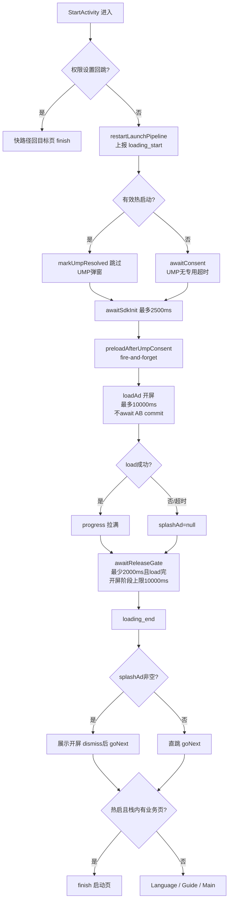

<!-- cursor-feature-interpret
generated: 2026-6-16 18:56:00
topic: 查看启动页功能 @ cursor-function_description.mdc
filename: 启动页功能_2026-6-16_18-56.md
anchors: StartActivity.kt, ProgressDriver.kt, BaseApplication.kt, AdPreloadCoordinator.kt
rule: .cursor/rules/cursor-function_description.mdc
role: backup（镜像备份，主交付在对话正文）
-->

## 2.0 目录

**一句话**：启动页负责冷/热启动时的 UMP 同意、开屏 load/展示、放行闸与跳转语言/引导/主页，并与 Application 侧 AB/广告预热并行、不阻塞等待 AB commit。

### 快速阅读（按角色）

| 角色 | 建议跳转 |
|------|----------|
| 产品 | [2.1 作用](#21-功能身份与作用) → [2.3 分支](#23-分支与判断逻辑) → [2.4 流程图](#24-流程图) → [2.7 重点场景](#27-全场景逐项说明) |
| 开发 | [2.2 时序](#22-实现步骤与时序) → [2.11 分阶段](#211-分阶段详细说明与它有关必写) → [2.12 广告位专表](#212-广告位专表涉广告时必填) → [2.6 走读](#26-关键实现走读) |
| 测试 | [2.5 场景矩阵](#25-全场景矩阵) → [2.7 逐场景](#27-全场景逐项说明) → [2.12 广告位专表](#212-广告位专表涉广告时必填) → [2.10 自检](#210-输出前自检) |

### 全文目录

- [1. 解读范围](#1-解读范围)
- [2.0 目录](#20-目录)
- [2.1 功能身份与作用](#21-功能身份与作用)
- [2.2 实现步骤与时序](#22-实现步骤与时序)
- [2.3 分支与判断逻辑](#23-分支与判断逻辑)
- [2.4 流程图](#24-流程图)
- [2.5 全场景矩阵](#25-全场景矩阵)
- [2.6 关键实现走读](#26-关键实现走读)
- [2.7 全场景逐项说明](#27-全场景逐项说明)
- [2.8 递归子功能](#28-递归子功能)
- [2.11 分阶段详细说明](#211-分阶段详细说明与它有关必写)
- [2.12 广告位专表](#212-广告位专表涉广告时必填)
- [2.9 异步续作](#29-异步续作与结论修订)
- [3. 双视角](#3-双视角)
- [2.10 输出前自检](#210-输出前自检)

### 场景速查

| 分类 | 跳转 |
|------|------|
| 正常 | [S01 冷启完整路径](#s01冷启完整路径) · [S02 热启回栈内业务页](#s02热启栈内已有业务页) · [S03 开屏展示成功](#s03开屏load成功并展示) |
| UMP | [S04 欧盟需gather](#s04欧盟需gather弹ump) · [S05 非欧盟跳过UMP](#s05非欧盟跳过ump) |
| 超时 | [S06 开屏load超时10s](#s06开屏load超时10s) · [S07 放行闸开屏阶段10s截止](#s07放行闸开屏阶段10s截止) · [S08 SDK init等待2.5s](#s08-sdk-init等待超时25s) |
| 路由 | [S09 去语言页](#s09-去语言页) · [S10 去引导页](#s10-去引导页) · [S11 去主页](#s11-去主页) |
| 特殊入口 | [S12 通知冷启](#s12-通知入口进程冷启) · [S13 权限设置回跳](#s13-权限设置回跳快路径) |
| 竞态 | [S14 AB未commit时load开屏](#s14-ab未commit时load开屏) · [S15 AB已commit为B时load](#s15-ab已commit为b时load开屏) |
| 弱网/无填充 | [S16 开屏无填充](#s16-开屏无填充load失败) · [S17 开屏位未启用](#s17-开屏位未启用) |

---

## 1. 解读范围

| 项 | 内容 |
|----|------|
| 功能名称 | 启动页（冷 / 热启动 Loading + UMP + 开屏 + 跳转） |
| 代码锚点 | `app/.../ui/start/StartActivity.kt`、`ProgressDriver.kt`、`BaseApplication.launchAdsWarmup`、`AdPreloadCoordinator.preloadAfterUmpConsent` / `schedulePreloadAfterLoadingWhenReady` |
| 边界 | 含启动页内 UMP、开屏、放行闸、下一页路由；含与 Application 并行预热；**不含**语言页/引导页/主页内展示逻辑 |
| 关联子功能 | AB 结算（并行）、Firebase RC、UMP、`AppHotStartObserver`、通知入口、`LoadingTelemetry` |

### 阶段清点（解读前）

| 序号 | 阶段/子轨名称 | 代码锚点 | 是否阻塞用户 | 是否可能修订结论 | §2.11 专节 |
|------|--------------|----------|-------------|-----------------|------------|
| P0 | 入口解析（冷/热/通知） | `parseHotStartExtra` / `isEffectiveHotStart` | 否 | 否 | P0 |
| P1 | 权限设置回跳快路径 | `runPermissionSettingsResumeFastPath` | 是（极短） | 否 | P1 |
| P2 | Loading 主流程启动 | `restartLaunchPipeline` | 是 | 否 | P2 |
| P3 | UMP 同意（冷启） | `awaitConsent` | **是** | 否 | P3 |
| P4 | SDK init 兜底等待 | `awaitSdkInitIfNeeded` | 是（≤2500ms） | 否 | P4 |
| P5 | UMP 后预加载 + 开屏 load | `preloadAfterUmpConsent` + `loadSplashIfEnabled` | 是 | 否 | P5 |
| P6 | 放行闸 | `awaitReleaseGate` | 是 | 否 | P6 |
| P7 | 开屏展示或直跳 | `showSplashOrGoNext` | 是 | 否 | P7 |
| P8 | 下一页路由 | `goNext` | 是 | 否 | P8 |
| 并行 | AB / 广告预热 | `BaseApplication` + `kickOffBackgroundWarmupIfNeeded` | 否 | 是（开屏配置时刻） | 并行轨 |

---

## 2.1 功能身份与作用

| 项 | 内容 |
|----|------|
| 业务作用 | 应用启动时的统一「Loading 门厅」：合规（UMP）、品牌开屏变现、按安装进度跳转首屏 |
| 用户可感知效果 | Logo + 进度条（或 UMP 转圈）→ 可能全屏开屏 → 进入语言/引导/主页 |
| 后台职责 | 上报 `loading_start/end`、`app_launch`；触发 UMP 后预加载；不在这里 commit AB |
| 上游 | Launcher / 通知点击 / 热启动 `AppHotStartObserver` → `StartActivity` |
| 下游 | `LanguageActivity` / `GuideActivity` / `MainActivity`；热启可能仅 `finish` |
| 是否阻塞关键路径 | **是**：冷启须等 UMP（无专用超时）+ 放行闸；**不**阻塞等待 AB `commitAbFace` |

---

## 2.2 实现步骤与时序

### 主路径（冷启动，阻塞用户）

| 步骤 | 代码锚点 | 业务含义 | 串行/并行 | 前置 | 完成后 |
|------|----------|----------|-----------|------|--------|
| T0 | `onCreate` → `initData` | 解析热启/通知标记 | 串行 | Activity 创建 | 进入 pipeline |
| T1 | `restartLaunchPipeline` | 重置状态、上报 loading_start | 串行 | T0 | pipeline 运行 |
| T1p | `kickOffBackgroundWarmupIfNeeded` | 补跑 AB bootstrap | **并行** | T1 | 不阻塞 T2 |
| T2 | `awaitConsent` | 欧盟等弹 UMP | 串行 | 非有效热启 | `consentResolved` 仍 false→true |
| T3 | `awaitSdkInitIfNeeded` | 等广告 SDK init | 串行 | T2 后 | 最多等 2500ms |
| T4 | `preloadAfterUmpConsent` | UMP 后 fire-and-forget 预加载 | 串行起点，预加载并行 | T3，`isInit` | 不阻塞 T5 |
| T5 | `loadSplashIfEnabled` | 现场 load 开屏 ≤10s | 串行 | T4 | `adLoadFinished=true` |
| T6 | `awaitReleaseGate` | 放行闸（≥2s 且 load 完；开屏阶段 ≤10s） | 串行 | T5 | 可进展示 |
| T7 | `LoadingTelemetry.reportLoadingEnd` | loading_end + 耗时 | 串行 | T6 | 埋点完成 |
| T8 | `showSplashOrGoNext` | 展示开屏或直跳 | 串行 | T7 | dismiss/无广告 |
| T9 | `goNext` | 路由下一 Activity | 串行 | T8 | finish Start |

### 续作路径（非阻塞，可能改开屏配置来源）

| 步骤 | 代码锚点 | 业务含义 | 用户感知 |
|------|----------|----------|----------|
| R1 | `BaseApplication.launchAdsWarmup` | prepare + A 面 assets + SDK init | 无感 |
| R2 | `AppAdsBootstrap.run` | AB/FC 并行结算 | 无感；**可能**在 T5 前/后 commit |
| R3 | `AdPreloadCoordinator.schedulePreloadAfterLoadingWhenReady` | Loading 结束后台预加载（应用级协程） | 无感 |

---

## 2.3 分支与判断逻辑

| 条件（业务语言） | 代码等价 | 结果 | 用户感知 |
|----------------|----------|------|----------|
| 从通知权限设置返回 | `isPermissionSettingsResume` | 快路径回跳目标页 | 几乎不见 Loading |
| 有效热启动 | `isEffectiveHotStart()==true` | 跳过 UMP 弹窗 | 无 UMP 等待 |
| 通知点击但栈内无其它业务页 | `isNotificationEntry && !hasOtherBusinessActivities` | **按冷启**走 UMP+冷开屏 | 与安装后首次类似 |
| 开屏位未启用 | `!enableFor(sense)` | 不 load，`splashAd=null` | 无开屏，直跳 |
| 冷启进程首次开屏 | `!coldSplashPathTakenThisProcess` | 用 `LOADING_SPLASH` | 冷开屏 |
| 同进程再次冷启路径 | 已 taken | 优先 `HOT_LOADING_SPLASH` | 热开屏位 |
| 语言未配置 | `KEY_LANGUAGE_CODE` 空 | → LanguageActivity | 语言页 |
| 引导未完成 | `KEY_GUIDE_COMPLETED=false` | → GuideActivity | 引导页 |
| 否则 | — | → MainActivity | 主页 |
| 热启且栈内有业务页 | `hasOtherBusinessActivities` | 仅 finish | 回到原页面 |

### 2.3.1 远程配置专表（开屏相关）

**表 B：远程拉取与 cache（AB/FC 轨，启动页不 await）**

| 阶段 | 代码锚点 | 业务含义 | 超时 ms | 超时/失败后 | 用户感知 |
|------|----------|----------|---------|-------------|----------|
| FC fetch | `AbSettlementCoordinator.runFcFetchAndApply` | 拉 Firebase 广告/通知配置 | 单次 8000，最多 3 次 | 用 RC 缓存继续 | 否 |
| 等 FC 判面 | `awaitFcReadyForMode2` | AB 轨等 FC 可读 | 30000 | 强制 fcReady，用缓存判面 | 否 |
| 开屏 load | `loadSplashIfEnabled` | 读**当时** `AdRemoteConfigManager` | 10000 | `splashAd=null` | 无开屏直跳 |

**表 C：RC 与开屏配置时刻**

| 时机 | RC/AB 状态 | 开屏用哪套 JSON | 续作 |
|------|------------|-----------------|------|
| load 前 AB 未 commit | A 默认 + FC 缓存 | 多为 A 方案 | commit 后不影响本次 load |
| load 前已 commit 为 B | B 面 apply 完成 | 可能 B 方案开屏位 | — |

> 与启动页：**不专门等待** AB `commitAbFace`；开屏 `loadAd` 使用调用瞬间已生效配置——commit 前多为 A，commit 后可能 B；**并非每次必定 A**。

---

### 2.4 流程图

**流程图名词说明**

| 代码锚点 | 中文业务含义 |
|----------|--------------|
| `restartLaunchPipeline` | 重置并启动 Loading 主流程 |
| `awaitConsent` | 冷启等待 UMP 用户同意（无专用超时） |
| `loadSplashIfEnabled` | UMP 后现场请求开屏（最多 10s） |
| `tryPassReleaseGate` | 放行闸：至少 2s 且 load 完成；开屏阶段最多再等 10s |
| `goNext` | 按 MMKV 跳转语言/引导/主页 |

---

### 2.5 全场景矩阵

逐条说明见 [§2.7](#27-全场景逐项说明) | 场景速查见 [§2.0](#20-目录)

| 编号 | 分类 | 场景名称 | 触发条件 | 超时 | 路径摘要 | 用户感知 | 后续 |
|------|------|----------|----------|------|----------|----------|------|
| S01 | 正常 | 冷启完整路径 | 新安装、欧盟、开屏启用 | UMP 无上限；load 10s；闸 10s | T1→T9 全链路 | Loading→可能开屏→语言页 | Language |
| S02 | 正常 | 热启栈内已有业务页 | `EXTRA_HOT_START` + 栈内有 Main 等 | load 10s | 热开屏或直跳后 finish | 短暂 Loading | 回原页 |
| S03 | 正常 | 开屏 load 成功并展示 | fill 成功 | load ≤10s | load→闸→show→goNext | 全屏开屏 | 下一页 |
| S04 | UMP | 欧盟需 gather 弹 UMP | `willRunUmpGather` | **无专用超时** | 隐藏进度条/转圈等 UMP | 长时间等待可能 | T4 后继续 |
| S05 | UMP | 非欧盟跳过 UMP | 不需 gather | — | `awaitConsent` 快速返回 | 无 UMP 弹窗 | 直接开屏阶段 |
| S06 | 超时 | 开屏 load 超时 10s | 弱网 | 10000ms | `splashAd=null` | 无开屏 | 直跳 |
| S07 | 超时 | 放行闸开屏阶段 10s 截止 | UMP 后已 10s | 10000ms | 放弃**本次**展示，不 destroy 缓存 | 可能仍等满 2s 总时长 | 直跳 |
| S08 | 超时 | SDK init 等待超时 2.5s | Application init 慢 | 2500ms | 日志后继续，可能 enable 失败 | 可能无广告 | 依 enableFor |
| S09 | 路由 | 去语言页 | `KEY_LANGUAGE_CODE` 空 | — | goNext→Language | 语言选择 | — |
| S10 | 路由 | 去引导页 | 语言有值、引导未完成 | — | goNext→Guide | 引导教程 | — |
| S11 | 路由 | 去主页 | 引导已完成 | — | goNext→Main | 主页 | — |
| S12 | 特殊 | 通知入口进程冷启 | 通知点击、无其它业务页 | 同冷启 | **非**热路径 | 同安装冷启 | 依 MMKV |
| S13 | 特殊 | 权限设置回跳快路径 | `VsaveV3FeatureKit` 回跳标记 | — | 跳过 pipeline | 不见 Loading | 回权限来源页 |
| S14 | 竞态 | AB 未 commit 时 load 开屏 | UMP 快、AB 慢 | — | load 用 A 默认/FC 缓存 | 正常开屏或 A 方案 | AB 后台继续 |
| S15 | 竞态 | AB 已 commit 为 B 时 load | UMP 慢、AB 先完成 | — | load 可能用 B JSON | B 面开屏配置 | — |
| S16 | 弱网 | 开屏无填充 load 失败 | no fill | 10000ms | `splashAd=null` | 无开屏 | 直跳 |
| S17 | 无数据 | 开屏位未启用 | `enableFor=false` | — | 跳过 load | 无开屏 | 直跳 |
| S18 | 边界 | 最短停留 2s | 开屏 instant load | MIN_ANIM_MS 2000 | 闸须 elapsed≥2s | 至少 2s Loading | — |
| S19 | 异常 | 外跳广告返回 | `onResume` 检测 | — | `requestHotStartFromAdReturn` | 可能再叠热启 | 热启 pipeline |
| S20 | 埋点 | loading_start 早于 UMP | 任意冷启 | — | T1 即上报 | 无感 | 漏斗 loading 段含 UMP 等待 |

**场景计数**：共 20 场，正常 3 / UMP 2 / 超时 3 / 路由 3 / 特殊 2 / 竞态 2 / 弱网 1 / 无数据 1 / 边界 1 / 埋点 1 / 异常 1

---

## 2.6 关键实现走读

| 模块 | 要点 |
|------|------|
| `StartActivity.restartLaunchPipeline` | 重置 `splashAd/consentResolved/adLoadFinished`；热启 `markUmpResolved`；启动 `runLaunchPipeline` |
| `tryPassReleaseGate` | UMP 未完成不放行；开屏阶段 10s 截止清空 `splashAd`；须 `elapsed≥MIN_ANIM_MS(2000)` 且 `adLoadFinished` |
| `ProgressDriver` | UMP 前 progress=0；`beginAdPhase` 后 10s 内 0→900→950；load 成功 `completeImmediately` 拉满 |
| `resolveSplashSense` | 冷启首次 `LOADING_SPLASH`；同进程再进优先 `HOT_LOADING_SPLASH` |
| `BaseApplication` | `launchAdsWarmup` 与 `AppAdsBootstrap.run` **双协程并行** |
| `LoadingTelemetry` | `loading_start` 在 pipeline 开头；`loading_end` 在闸通过后、开屏展示前 |

---

### 2.7 全场景逐项说明

#### S01：冷启完整路径

新用户安装后首次打开：见 §2.2 T0–T9。`loading_start` 在 UMP 之前上报。放行后若 `splashAd` 非空则展示开屏，关闭后 `goNext` → 通常 `LanguageActivity`（语言未配）。

#### S04：欧盟需 gather 弹 UMP

`AdConsentManager.willRunUmpGather` 为 true 时：`isiSplashProgress` 可能 GONE，显示 `isiSplashUmpWait` 转圈。`awaitConsent` **无专用超时**，用户不操作则一直停在启动页。UMP 回调后进入开屏 load 阶段。

#### S06：开屏 load 超时 10s

`loadAd(sense, SPLASH_LOAD_TIMEOUT_MS=10000)` 超时返回 null，`adLoadFinished=true`，`splashAd=null`。放行闸仍可能等待至满足 2s 与 load 完成条件。用户无开屏，直接进入 `goNext`。

#### S07：放行闸开屏阶段 10s 截止

`releaseDeadlineElapsedRealtime = adPhaseStartElapsed + MAX_AFTER_UMP_MS(10000)`。超时后若仍有 `splashAd`，日志「放弃本次展示（不 destroy 缓存）」并置 null。用户本次不见开屏，缓存保留供后续使用。

#### S14：AB 未 commit 时 load 开屏

`loadSplashIfEnabled` **不 await** `configAppliedThisProcess`。此时 `AdRemoteConfigManager` 多为 Application 先行 A 面 assets + FC 缓存。开屏请求仍可能发出（若 enableFor 通过），**不是**「必定无广告」。

#### S20：loading_start 早于 UMP

`LoadingTelemetry.reportLoadingStart()` 在 `restartLaunchPipeline` 内、`awaitConsent` 之前调用。数据分析时 `loading_start→loading_end` 间隔包含 UMP 等待，与「纯动画时长」产品语义可能不一致。

（S02、S03、S05、S08–S13、S15–S19 与 §2.5 表一致，测试可按矩阵条件复现。）

---

## 2.8 递归子功能

| 子功能 | 关系 | 展开位置 |
|--------|------|----------|
| AB 面结算 | 并行，不阻塞放行闸 | 另文 `AbSettlementCoordinator` |
| UMP 同意 | 冷启串行阻塞 | `AdConsentManager` |
| 热启动观测 | 叠栈 / 抑制重复 | `AppHotStartObserver` |
| Loading 结束后台预加载 | 应用级，不绑 Start lifecycle | `AdPreloadCoordinator.schedulePreloadAfterLoadingWhenReady` |

---

### 2.11 分阶段详细说明（与它有关必写）

#### P0：入口解析（冷/热/通知）

1. **身份**：决定走冷路径还是热路径、是否通知入口。
2. **启动**：`onCreate` / `onNewIntent` → `parseHotStartExtra`。
3. **条件**：`EXTRA_HOT_START` 或 `EXTRA_NOTIFICATION_ENTRY` → `isHotStartIntent`。
4. **有效热启**：`isEffectiveHotStart()` = 热启标记且（非通知 **或** 栈内已有其它业务 Activity）。
5. **用户感知**：决定后续是否弹 UMP、用哪种开屏 sense。

#### P2：Loading 主流程启动

1. **身份**：重置状态并启动协程 `runLaunchPipeline`。
2. **启动**：`initData` → `restartLaunchPipeline`（非权限回跳）。
3. **并行**：`kickOffBackgroundWarmupIfNeeded` 补 AB bootstrap。
4. **埋点**：`reportAppLaunchIfNeeded`、`LoadingTelemetry.reportLoadingStart()`。
5. **用户感知**：见进度条或 UMP UI。

#### P3：UMP 同意

1. **身份**：GDPR/英国等地区广告同意弹窗。
2. **启动**：冷启且非有效热启 → `awaitConsent`。
3. **不启动**：有效热启（已 `markUmpResolved`）。
4. **超时**：**无**；一直等 SDK 回调。
5. **成功**：进入 T4；`consentResolved` 在 T4 起点设为 true（实际在 `runConsentThenSplashAndPreload` 内）。
6. **用户感知**：**阻塞**整个启动链。

#### P5：UMP 后预加载 + 开屏 load

1. **预加载** `preloadAfterUmpConsent`（须 `MonetizationKit.isInit`）：
   - 语言未配 → 语言插屏 + 语言原生
   - 语言已配、引导未完成、B 面 → **引导大原生 + 引导插屏**
   - 语言已配、引导已完成 → 主页原生
   - 热/冷开屏位（enable 时）preload
2. **开屏 load**：`loadAd`，最多 10000ms，**现场 load**，不消费 preload 缓存。
3. **不 await** AB commit。
4. **失败**：`splashAd=null`，用户无开屏。

#### P6：放行闸

1. **条件**：`consentResolved` 必须为 true。
2. **开屏阶段截止**：UMP 结束后 10s，放弃本次 `splashAd` 展示。
3. **放行**：`elapsed ≥ 2000ms` 且 `adLoadFinished`。
4. **用户感知**：最短约 2s Loading（UMP 时间另计）。

#### P8：下一页路由

`goNext`：destroy 开屏实体 → 热启且栈内有业务页则 finish → 否则按 MMKV 启动 Language / Guide / Main。

#### 并行轨：Application 预热 + AB

`BaseApplication.onCreate`：`launchAdsWarmup`（prepare + A assets + init）与 `AppAdsBootstrap.run` 并行。启动页内可再次 `kickOffBackgroundWarmupIfNeeded`。**不阻塞** `awaitReleaseGate`。

---

### 2.12 广告位专表（涉广告时必填）

| AdSense | 类型策略 | 预加载时机（启动链） | 展示时机 | 展示成功 | 展示失败 / 跳过 |
|---------|----------|---------------------|----------|----------|-----------------|
| LOADING_SPLASH | 开屏·现场 load | UMP 后 preload + 同次 loadAd | 放行闸后 show | onImpression → ad_show | load 超时/闸截止/enable false → 直跳 |
| HOT_LOADING_SPLASH | 热开屏·现场 load | 同上（热路径 sense） | 同上 | 同上 | 同上 |
| LANGUAGE_* | 仅 preload | UMP 后（语言未配） | **不在启动页** | — | Loader skip 不阻塞跳页 |
| GUIDE_LARGE_NATIVE / GUIDE_INTERSTITIAL | 仅 preload | UMP 后（B 面且引导未完成）；Loading 结束后台亦可能补 | **不在启动页** | — | — |
| HOME_NATIVE | 仅 preload | UMP 后（引导已完成） | **不在启动页** | — | — |

**闸门**：开屏看 `MonetizationKit.enableFor`；**非** B 专属位，**不看** `AppAdsBootstrap.canShowAd`。

---

## 2.9 异步续作与结论修订

| 续作 | 触发 | 是否改启动页结论 | 用户感知 |
|------|------|------------------|----------|
| AB commit + FC apply | Application / 后台 bootstrap | **可能**改变后续页面广告配置；**不改变**本次已完成的 load 结果 | 无感 |
| Loading 结束后台预加载 | bootstrap + SDK 就绪后 | 否 | 无感 |
| 外跳广告回前台热启补救 | `onResume` | 可能再跑一遍热启 pipeline | 可能再看热开屏 |

启动页本身**无**阶段2 修订；AB 阶段2 归因不影响 `goNext` 路由。

---

## 3. 双视角

**产品**：启动页 = 合规 + 变现 + 分流。冷启最慢路径 = UMP（无上限）+ 至少约 2s Loading + 可能开屏。热启回已有页面时应「闪一下就走」。通知冷启无业务页时等同新用户冷启。

**开发**：核心状态机 `consentResolved / adLoadFinished / splashAd` + `tryPassReleaseGate`。假进度与放行闸解耦（UMP 阶段 progress 可为 0）。AB/FC 与开屏 load **竞态**见 §2.3.1。

**测试**：必测矩阵 S01–S13 + 开屏超时 S06/S07 + AB 竞态 S14/S15。验证 `loading_end` 在闸后、开屏 show 前。验证热启 `hasOthers` 仅 finish。

---

### 2.10 输出前自检

- [x] §2.0 目录与场景速查
- [x] 阶段清点 + §2.11 专节（P0–P8 + 并行轨）
- [x] 超时清单：UMP 无专用超时、SDK 2500ms、开屏 load 10000ms、闸 10000ms、最短 2000ms
- [x] §1.6.5 竞态：commit 前/后开屏各 1 场景（S14/S15）
- [x] 广告 preload vs show 分离（§2.12）
- [x] loading_start 早于 UMP 已标注（S20）
- [x] 禁止「开屏必定 A」表述

---

*文档生成自 `videodownload` 当前代码；若 `StartActivity` / `BaseApplication` 有变更请重新解读。*
