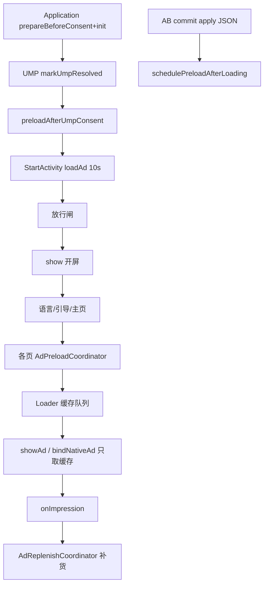

<!-- cursor-feature-interpret
generated: 2026-6-16 19:11:00
topic: 查看广告功能
filename: 广告功能_2026-6-16_19-11.md
anchors: MonetizationKit.kt, AdPreloadCoordinator.kt, ActivityAdExt.kt, AdLoader.kt, AdReplenishCoordinator.kt, AppAdsBootstrap.kt
rule: .cursor/rules/cursor-function_description.mdc (含§1.11/§2.12)
role: backup（镜像备份，主交付在对话正文）
-->

# 广告功能解读 — videodownload v1.2.0

## 2.0 目录

**一句话**：10 个 `AdSense` 经 **四层闸门**（SDK init、UMP、远程 JSON、AB 面别）后，**开屏现场 load**、**插屏/原生只消费缓存**；预加载由 `AdPreloadCoordinator` 统一编排，展示消耗后 `AdReplenishCoordinator` 补货。

### 快速阅读

| 角色 | 跳转 |
|------|------|
| 产品 | [2.1 作用](#21-功能身份与作用) → [§2.12 逐位专表](#212-广告位专表) |
| 开发 | [2.2 时序](#22-实现步骤与时序) → [2.3 闸门](#23-分支与判断逻辑) → [2.11 分阶段](#211-分阶段详细说明) |
| 测试 | [2.5 场景矩阵](#25-全场景矩阵) → [2.7 逐场景](#27-全场景逐项说明) |

### 广告位清点（10 位）

| # | AdSense | 类型 | A/B | 预加载主锚点 | 展示主锚点 |
|---|---------|------|-----|--------------|------------|
| 1 | LOADING_SPLASH | 开屏 | A/B | UMP 后 + bootstrap 后 | StartActivity load+show |
| 4 | HOT_LOADING_SPLASH | 开屏 | A/B | 同上 | 热启 StartActivity |
| 2 | LANGUAGE_NATIVE | 原生 | **仅 B** | UMP 后 / 语言页 / bootstrap 后 | LanguageActivity bind |
| 3 | LANGUAGE_INTERSTITIAL | 插屏 | **仅 B** | 同上 | 语言确认 showAd |
| 5 | HOME_NATIVE | 原生 | **仅 B** | 引导 Done / 主页 entry | HomeFragment bind |
| 6 | BOTTOM_NAV_INTERSTITIAL | 插屏 | **仅 B** | 主页 entry / 底栏切换 | MainActivity showAd |
| 7 | SEARCH_NATIVE | 原生 | **仅 B** | 主页 entry / 进搜索页 | SearchCarrier bind |
| 8 | SEARCH_INTERSTITIAL | 插屏 | **A/B** | 主页 entry / 底栏切换 | 搜索提交 showAd |
| 9 | GUIDE_LARGE_NATIVE | 大原生 | **仅 B** | UMP 后 / 引导第 1 页 | GuideActivity 翻页展示 |
| 10 | GUIDE_INTERSTITIAL | 插屏 | **仅 B** | 同上 | 引导 Done showAd |

---

## 1. 解读范围

| 项 | 内容 |
|----|------|
| 功能名称 | 全应用广告变现（预加载、展示、补货、远程配置、AB 闸门） |
| 代码锚点 | `MonetizationKit`、`AdRemoteConfigManager`、`AdLoader`/`InterAdLoader`/`NativeAdLoader`/`SplashAdLoader`、`ActivityAdExt`、`AdPreloadCoordinator`、`AdReplenishCoordinator`、`AppAdsBootstrap.canShowAd` |
| 边界 | **含**：10 广告位、预加载编排、展示路径、补货、日配额、A/B JSON。**不含**：UMP 弹窗细节（另文）、AB 判面（另文）、AdMob SDK 底层 |
| 关联 | UMP 闸门、AB commit、`StartActivity` 开屏链、Firebase `ad_config_a/b` |

### 阶段清点

| 序号 | 阶段 | 锚点 | 阻塞用户 |
|------|------|------|----------|
| P0 | Application 引擎预热 | `MonetizationKit.prepareBeforeConsent` / `init` | 否 |
| P1 | UMP 闸门 | `isUmpResolved` | 冷启阻塞广告请求 |
| P2 | AB commit + apply JSON | `AppAdsBootstrap.commitAbFace` | 否 |
| P3 | UMP 后即时预加载 | `preloadAfterUmpConsent` | 否 |
| P4 | Bootstrap 后后台预加载 | `schedulePreloadAfterLoadingOnBootstrapComplete` | 否 |
| P5 | 各页预加载 | `AdPreloadCoordinator.*` | 否 |
| P6 | 展示 | loadAd / showAd / bindNativeAd | 视位 |
| P7 | 曝光补货 | `AdReplenishCoordinator` | 否 |

---

## 2.1 功能身份与作用

| 项 | 内容 |
|----|------|
| A 面方案 | assets `ad_remote_config_default_a.json`：**开屏 1/4 + 搜索插屏 8** |
| B 面方案 | 远程 `ad_config_b`：**10 位全开**（无本地 B assets） |
| 加载策略 | **开屏**：现场 `loadAd(timeout)`；**插屏/原生展示**：只 `takeCachedAd`，无缓存不现场 load |
| 补货 | 全屏 onImpression / 原生曝光 → `preloadAdAwait`「展示消耗后预加载」 |
| Premium | `MonetizationKit.isSubs=true` → 全部短路 |

---

## 2.2 实现步骤与时序

### 超时点清单

| 超时点 | 阈值 | 超时后 |
|--------|------|--------|
| 冷开屏 load | **10000ms** | `splashAd=null`，直跳下一页 |
| 引导大原生 load（无缓存兜底） | slot `request_timeout_ms` 或 fallback | 该页原生 GONE |
| bootstrap 等待（后台预加载） | **30000ms** | 放弃 B 位预加载 |
| SDK init 等待（启动页） | **2500ms** | 继续流程，enableFor 可能 false |
| 插屏/原生 preload load | slot 默认 8000ms | 无缓存，展示时 skip |
| 应用日曝光/点击上限 | JSON 默认 30/10 | `canRequest()` false |

### 预加载编排总览

```
UMP 同意 → preloadAfterUmpConsent（启动页，fire-and-forget）
AB commit → schedulePreloadAfterLoadingOnBootstrapComplete（应用级协程，await bootstrap+isInit）
FC 刷新 B → schedulePreloadAfterRemoteConfigRefresh
各页：语言页 / 引导第1页 / 引导Done / 主页 entry / 搜索页 / 底栏切换
```

---

## 2.3 分支与判断逻辑

### 四层闸门（展示前）

| 层 | 条件 | 失败行为 |
|----|------|----------|
| L1 | `MonetizationKit.isInit && !isSubs` | 不请求、容器 GONE |
| L2 | `isUmpResolved` | Loader skip「UMP 流程未完成」 |
| L3 | `allowsAdSense`（A 方案须在 JSON ads 列表） | skip「A面方案未包含该广告位」 |
| L4 | `enableFor`：ad_id + `canRequest()` 日配额 | skip 并打原因 |
| L5（B 专属） | `AppAdsBootstrap.canShowAd` = L4 + `currentIsModeB()` | UI 隐藏 / 不 preload B 位 |

**开屏位**（1/4）走 L1–L4，**不走** L5（非 B 专属）。

### `enableFor` vs `canShowAd`

```kotlin
// 单广告位开关（含 UMP、JSON、ad_id、日配额）
MonetizationKit.enableFor(sense)

// UI / B 专属位额外要求 AB 已 commit 且为 B
AppAdsBootstrap.canShowAd(sense)
```

---

## 2.4 流程图



---

## 2.5 全场景矩阵

| 编号 | 分类 | 场景 | 结果 | 用户感知 |
|------|------|------|------|----------|
| S01 | 闸门 | UMP 未完成 | 全部 skip | Loading 无广告请求 |
| S02 | 闸门 | Premium 订阅 | 全部 skip | 无广告 |
| S03 | 闸门 | A 面 + B 专属位 | canShowAd false | 语言/引导/主页原生不展示 |
| S04 | 闸门 | 日曝光达上限 | enableFor false | 全天无新请求 |
| S05 | 开屏 | 冷启 load 成功 | show → goNext | 全屏开屏 |
| S06 | 开屏 | load 10s 超时 | 直跳 | 无开屏 |
| S07 | 开屏 | 放行闸 10s 截止 | 丢弃 splashAd | 无开屏直跳 |
| S08 | 原生 | 有缓存 bind | 展示 + 补货 | 底部大原生 |
| S09 | 原生 | 无缓存 | hide + 400ms 重试 bind | 短暂空白 |
| S10 | 插屏 | 有缓存 showAd | 展示后回调跳转 | 全屏插屏 |
| S11 | 插屏 | 无缓存 | showSkippedNoCache + 回调仍执行 | **不阻塞**跳转 |
| S12 | 插屏 | show SDK 失败 | ad_no_show + cancelReplenish | 仍执行 onComplete |
| S13 | 插屏 | 切后台 | ~200ms auto dismiss | 插屏关闭 |
| S14 | 搜索 | 每 N 次提交（默认 2） | 尝试搜索插屏 | 间隔展示 |
| S15 | 底栏 | 每 2 次切换 | 尝试底栏插屏（硬编码） | B 面才可能 |
| S16 | 引导 | 第 1 页无缓存 | 等预加载 / 实时 load | 可能延迟出原生 |
| S17 | 竞态 | AB commit 前 preload B 位 | isModeB false 跳过 | 进页后 listener 补绑 |
| S18 | 竞态 | FC 后 B JSON 到达 | schedulePreloadAfterRemoteConfigRefresh | 广告陆续生效 |
| S19 | 补货 | 曝光成功 | preloadAdAwait 下一条 | 无感 |
| S20 | 补货 | 展示失败 | cancelReplenish | 不补货 |
| S21 | 热启 | 回主页 SINGLE_TOP | preloadOnHotSplashReturnToMain | 补预加载 |
| S22 | A 方案 | 仅 1/4/8 在 JSON | 其它位 allowsAdSense false | 审核态广告少 |

**场景计数**：22

---

## 2.11 分阶段详细说明

#### P3：UMP 后预加载（`preloadAfterUmpConsent`）

- 条件：`MonetizationKit.isInit`
- 语言未配 → 语言插屏 + 语言原生
- 语言已配 + 引导未完成 + **B 面** → 引导大原生 + 引导插屏
- 语言已配 + 引导已完成 → 主页原生
- 开屏位：冷/热各 preload（enableFor 控制）

#### P4：Bootstrap 后后台预加载

- `AppAdsBootstrap.commitAbFace` → `schedulePreloadAfterLoadingOnBootstrapComplete`
- 应用级协程，最多等 bootstrap commit + isInit **30s**
- **仅 B 面**执行 `runPreloadAfterLoading`（A 面整段跳过）
- 按语言/引导进度批量 `preloadAdAwait`

#### P6：展示路径差异

| 类型 | 展示 API | 无缓存 |
|------|----------|--------|
| 开屏 | `loadAd(10s)` → `ad.show` | 直跳 |
| 插屏 | `takeCachedAd` → `showAd` | onComplete(false)，**仍跳转** |
| 原生 | `bindNativeAd` | hide 容器 + onNoCache 补 preload + 400ms 重试 |
| 引导大原生 | 缓存 → 等预加载 → `loadAd` 兜底 | 该页 GONE |

#### P7：补货

- 全屏：`onFullScreenImpression` → `replenishScope`（不绑已 finish 的 Start lifecycle）
- 原生：`replenishOnNativeImpression`
- 失败：`cancelReplenish`，不补货

---

<a id="212-广告位专表"></a>
## §2.12 广告位专表

### 1 LOADING_SPLASH（冷开屏）

| 维度 | 内容 |
|------|------|
| **预加载** | UMP 后 `preloadAfterUmpConsent`；bootstrap 后 `runPreloadAfterLoading`（enableFor） |
| **展示** | StartActivity：`loadAd(sense, 10000ms)` → 放行闸 → `splashAd.show` |
| **成功** | onImpression → ad_show + recordImpression + 补货；关广告 120ms → goNext |
| **失败** | load 超时 / enable false / 闸 10s 截止 → splashAd=null → 直跳 Language/Guide/Main |

### 4 HOT_LOADING_SPLASH（热开屏）

| 维度 | 内容 |
|------|------|
| **预加载** | 同冷开屏；热启 skip UMP 仍 preload |
| **展示** | 有效热启 `resolveSplashSense` 优先 HOT 位；show 后 hasOthers → finish 回栈 |
| **成功/失败** | 同冷开屏 |

### 2 LANGUAGE_NATIVE

| 维度 | 内容 |
|------|------|
| **预加载** | UMP 后；bootstrap 后；`preloadOnLanguagePage` |
| **展示** | B 面 onCreate：`bindNativeAd(useLargeLayout=true)` |
| **成功** | 曝光 → replenishOnNativeImpression |
| **失败** | A 面 / !canShowAd → 容器 GONE；无缓存 → hide |

### 3 LANGUAGE_INTERSTITIAL

| 维度 | 内容 |
|------|------|
| **预加载** | 同 LANGUAGE_NATIVE |
| **展示** | Continue / 双击 / 30s idle → `ensureInterstitialCached` → `showAd` → 跳引导或 Main |
| **成功** | 关插屏 → navigate；曝光补货 |
| **失败** | 无缓存 → 仍 finishLanguage（**不阻塞**） |

### 5 HOME_NATIVE

| 维度 | 内容 |
|------|------|
| **预加载** | 引导 Done；主页 `preloadOnMainEntry`；bootstrap 后 batch |
| **展示** | HomeFragment onResume：`canShowAd` → `bindNativeAd` 大布局 |
| **成功** | 曝光补货 |
| **失败** | 无缓存 → 400ms 重试 + preload；A→B listener 补绑 |

### 6 BOTTOM_NAV_INTERSTITIAL

| 维度 | 内容 |
|------|------|
| **预加载** | 主页 entry；`preloadOnBottomNavSwitch` |
| **展示** | B 面 + `tabClickCount % 2 == 0` → `showAd`（**硬编码每 2 次**，未接 `AdShowUtils.isShowNavInterAd`） |
| **成功** | 关广告后 Tab 已切换（先 proceed 再 show） |
| **失败** | 无缓存 → showSkippedNoCache，Tab 正常切换 |

### 7 SEARCH_NATIVE

| 维度 | 内容 |
|------|------|
| **预加载** | 主页 entry batch；`preloadOnSearchPageEntry` |
| **展示** | SearchCarrier initData：`canShowAd` → bind |
| **成功** | 曝光补货 |
| **失败** | 无缓存 → 400ms 重试 |

### 8 SEARCH_INTERSTITIAL

| 维度 | 内容 |
|------|------|
| **预加载** | 主页 entry；底栏切换（A/B 均 preload） |
| **展示** | 搜索提交：`total % searchSubmitInterInterval == 0`（默认 **2**）且 canShowAd |
| **成功** | show 后 setResult finish |
| **失败** | 间隔未到 / 无缓存 → 直接 finish 提交 |

### 9 GUIDE_LARGE_NATIVE

| 维度 | 内容 |
|------|------|
| **预加载** | UMP 后（B）；引导第 1 页 `preloadOnGuideFirstPage`；语言页（未完成引导） |
| **展示** | 翻页 `syncGuideNativeForPage`：缓存 → 等预加载 80ms 轮询 → loadAd 兜底 |
| **成功** | 第 1–3 页大原生；第 4 页 Top CTA 版式；曝光补货 |
| **失败** | 无货 → 容器 GONE；版式变才 destroy 重绑 |

### 10 GUIDE_INTERSTITIAL

| 维度 | 内容 |
|------|------|
| **预加载** | 同引导大原生 |
| **展示** | **仅第 4 页 Done** → `preloadOnGuideDone`(HOME) + showAd → Main |
| **成功** | 关插屏 → navigateToMainAfterGuide |
| **失败** | 无缓存 → 仍进主页 |

---

## 2.9 异步续作

| 续作 | 触发 | 效果 |
|------|------|------|
| 曝光补货 | onImpression | 预加载下一条进缓存 |
| A→B 升级 | `addOnModeBUpgradedListener` | Home/Search 补 bind + preload |
| FC 刷新 | `addOnAdRemoteConfigRefreshedListener` | 重新 bind / batch preload |
| FC 后 B 补拉 | AB 文档 P7 | `schedulePreloadAfterRemoteConfigRefresh` |

---

## 3. 双视角

**产品**：A 面审核仅开屏+搜索插屏；B 面买量全链路原生+插屏。插屏无缓存**不挡流程**。搜索插屏按提交次数间隔；底栏插屏当前代码为每 2 次切换尝试（JSON `nav_click_show_inter_ad_count` 在 `AdShowUtils` 中**尚未接入 MainActivity**）。

**开发**：展示与预加载分离；`ActivityAdExt.showAd` 对插屏只取缓存；引导大原生有特殊 wait+load 兜底；补货用 `replenishScope` 避免 Start lifecycle cancel。

**测试**：Logcat `AdRequestLog` / `【广告位判定】`；验证 S03/S11/S14；欧盟 UMP 后再测 preload；B 面验 10 位；A 面验仅 1/4/8 有请求。

---

## 2.10 输出前自检

- [x] 10 位 §2.12 预加载/展示/成功/失败
- [x] 四层闸门 + canShowAd
- [x] 超时：开屏 10s、bootstrap 等待 30s、引导 load fallback
- [x] 插屏只消费缓存、补货续作
- [x] A/B JSON 差异
- [x] 底栏 AdShowUtils 未接线说明
- [x] 竞态 AB/FC

---

*基于 videodownload v1.2.0 当前代码。*
