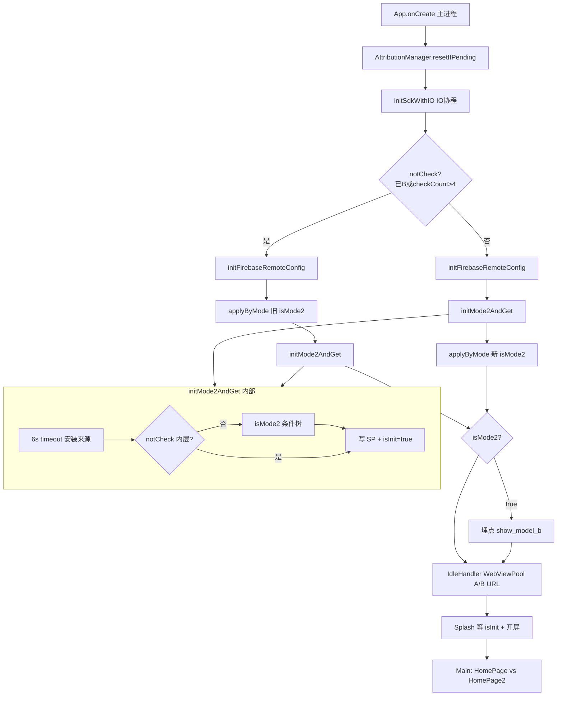

# xvdownloader（video）AB 面功能解读

> 镜像备份 · 工程路径：`/Users/MacLuo/Desktop/xvdownloader` · app 名：`video`（来自 `local.properties` 的 `AN=video`）

---

## 2.0 目录

**一句话**：冷启动时在 IO 协程里先拉 Firebase 远程配置，再按总开关 + 投放归因 + Google Play 安装来源等条件判定是否进入 B 面（`isMode2`），结果持久化后驱动首页形态、视频接口类型、WebView 初始 URL 与 A/B 两套广告 JSON 方案。

### 快速阅读（按角色）

| 角色 | 建议跳转 |
|------|----------|
| 产品 | [2.1 作用](#21-功能身份与作用) → [2.3 分支](#23-分支与判断逻辑) → [2.4 流程图](#24-流程图) → [2.7 重点场景](#27-全场景逐项说明) |
| 开发 | [2.2 时序](#22-实现步骤与时序) → [2.11 分阶段](#211-分阶段详细说明) → [2.3.1 远程配置](#231-远程配置专表) → [2.6 走读](#26-关键实现走读) |
| 测试 | [2.5 场景矩阵](#25-全场景矩阵) → [2.7 逐场景](#27-全场景逐项说明) → [2.10 自检](#210-输出前自检) |

### 全文目录

- [1. 解读范围](#1-解读范围)
- [2.0 目录](#20-目录)
- [2.1 功能身份与作用](#21-功能身份与作用)
- [2.2 实现步骤与时序](#22-实现步骤与时序)
- [2.3 分支与判断逻辑](#23-分支与判断逻辑)
- [2.3.1 远程配置专表](#231-远程配置专表)
- [2.4 流程图](#24-流程图)
- [2.5 全场景矩阵](#25-全场景矩阵)
- [2.6 关键实现走读](#26-关键实现走读)
- [2.7 全场景逐项说明](#27-全场景逐项说明)
- [2.8 递归子功能](#28-递归子功能)
- [2.9 异步续作与结论修订](#29-异步续作与结论修订)
- [2.11 分阶段详细说明](#211-分阶段详细说明)
- [2.12 AB 面与广告方案衔接](#212-ab-面与广告方案衔接)
- [3. 双视角](#3-双视角)
- [2.10 输出前自检](#210-输出前自检)

### 场景速查

| 分类 | 跳转 |
|------|------|
| 正常 | [S01 买量用户进 B 面](#s01-买量用户首次冷启动进-b-面) · [S02 自然用户进 A 面](#s02-自然用户进-a-面) · [S03 已缓存 B 面跳过复检](#s03-已缓存-b-面热启动跳过复检) |
| 远程配置 | [S04 总开关未建 key](#s04-总开关-key-后台未建) · [S05 总开关=0](#s05-总开关0-强制-a) · [S06 子项 key 未建](#s06-子项-key-未建时的默认语义) |
| 超时 | [S07 Referrer 6s 超时](#s07-referrer-检测-6s-超时) · [S08 安装来源轮询超时](#s08-installationsourcechecker-轮询超时) · [S09 FC fetch 失败](#s09-firebase-fetch-失败或断网) |
| 竞态 | [S10 notCheck 分支广告方案先用旧 isMode2](#s10-notcheck-分支广告方案可能先用旧-ismode2) |
| DEBUG | [S11 DEBUG 包跳过来源/GP 检查](#s11-debug-包跳过来源与-gp-检查) |

---

## 1. 解读范围

| 项 | 内容 |
|----|------|
| 功能名称 | AB 面（Mode2 / B 面买量包 vs A 面审核包）判定与落地 |
| 代码锚点 | `App.kt`（`initSdkWithIO`、`isMode2`）· `Mode2Utils.kt` · `AttributionManager.kt` · `InstallationSourceChecker.kt` · `AdRemoteConfigBridge.kt` · `Splash.kt` · `Main.kt` · `WebViewPool.kt` · `VideoSourceViewModel.kt` |
| 边界 | **包含**：判面条件、归因状态机、FC 拉取顺序、持久化、UI/广告方案切换。**不包含**：PDF 式 `AbSettlementCoordinator` 双轨、阶段2 延长 referrer、UMP 闸门（见同目录《广告功能》解读）、13 广告位逐位预加载细节 |
| 关联子功能 | Firebase Remote Config · Install Referrer 归因 · 广告方案 `applyByMode` · 闪屏等待 `Mode2Utils.isInit` · 首页 `HomePage`/`HomePage2` |

---

## 2.1 功能身份与作用

| 项 | 内容 |
|----|------|
| 业务作用 | 区分「审核向 A 面」与「买量向 B 面」：A 面展示简化首页与有限广告；B 面展示视频 Feed、全量广告与 B 侧 H5 入口 |
| 用户可感知效果 | 首次打开闪屏多等归因（最长约 15s 进度条）；进入主界面后首页布局不同；B 面用户看到 richer 内容与更多广告 |
| 后台职责 | `SharedPreferences` 持久化 `KEY_IS_MODE2_CHECKED`、`KEY_MODE2_CHECK_COUNT`、归因 `KEY_ATTRIBUTION_*`、`KEY_INSTALL_FROM_AD` |
| 上游 | `App.onCreate` → `initSdkWithIO`；闪屏 `Splash` 等待 `Mode2Utils.isInit` |
| 下游 | `AdRemoteConfigBridge.applyByMode` · `Main` 选 HomePage · `VideoSourceViewModel` 请求 type 0/1 · `WebViewPool` 加载 A_URL/B_URL · 埋点 `show_model_b` |
| 是否阻塞关键路径 | **部分阻塞**：闪屏进度条在 `loadCompleted && Mode2Utils.isInit` 前不会提前结束；判面本身在 IO 协程，不阻塞主线程绘制 |

---

## 2.2 实现步骤与时序

### 主路径（阻塞 / 首次结论）

| 步骤 | 代码锚点 | 业务含义 | 串行/并行 | 线程 | 前置 | 完成后状态 |
|------|----------|----------|-----------|------|------|------------|
| T0 | `App.onCreate` | 主进程启动，重置未完成归因 | 串行 | Main | 主进程 | `AttributionManager` PENDING→INIT（若适用） |
| T1 | `initSdkWithIO` launch#1 | 初始化 DB、YoutubeDL 等 | 与 T2 并行 | IO | T0 | DB 就绪 |
| T2 | `initSdkWithIO` launch#2 | AB 面主链路 | 与 T1 并行 | IO | T0 | 见 T3–T8 |
| T3 | `Mode2Utils.notCheck()` | 是否跳过重新判面 | 串行 | IO | T2 | 分支 |
| T3a | `notCheck()==true` | 已有 B 或已检满 4 次：先 FC+applyByMode(**旧** isMode2) | 串行 | IO | T3 | 可能方案与最终面不一致（见 S10） |
| T3b | `notCheck()==false` | 需判面：必须先 FC | 串行 | IO | T3 | FC 激活完成/失败 |
| T4 | `initFirebaseRemoteConfig` | fetchAndActivate 拉远程开关 | 串行 | IO | T3 | RC 内存+缓存 |
| T5 | `Mode2Utils.initMode2AndGet` | 6s 内跑安装来源 + 条件树 | 串行 | IO | T4（需检时）/ 任意（不检时） | `isInit=true`，SP 写入 |
| T5.1 | `InstallationSourceChecker.checkInstallSource` | 等归因 FINAL | 串行在 T5 内 | IO | — | `KEY_INSTALL_FROM_AD` 等 |
| T5.2 | `isMode2(context)` | FC 开关 + 来源 + GP | 串行在 T5 内 | IO | T5.1 | 布尔 B 面 |
| T6 | `App.isMode2 = result` | 内存态供 Compose 读 | 串行 | IO | T5 | `mutableStateOf` 更新 |
| T7 | `AdRemoteConfigBridge.applyByMode` | 选 ad_config_a/b | 串行 | IO | T6（需检分支）或 T3a 顺序 | `AdRemoteConfigManager` 生效 |
| T8 | `Events.show_model_b` | B 面埋点 | 串行 | IO | T6 且 true | 上报 |
| T9 | `initWebView` IdleHandler | 预热 WebView，按 isMode2 选 URL | 并行于 UI | Main 空闲 | T6 | `WebViewPool` |
| T10 | `Splash` 进度循环 | 等 UMP deferred + 开屏 load + **isInit** | 串行 | Main | 闪屏显示 | 可 show 开屏 / 进主页 |

### 续作路径（非阻塞 / 可能修订）

| 步骤 | 说明 |
|------|------|
| — | **本工程无 PDF 式阶段2 referrer 续作**，`AttributionManager` 一旦 `FINAL` 不再改判面；`Mode2Utils` 仅在 `checkCount≤4` 且缓存非 B 时**下次冷启动**重跑完整条件树（非进程内修订） |

---

## 2.3 分支与判断逻辑

### 2.3.0 启动分叉（`App.initSdkWithIO`）

| 条件（业务） | 代码 | 结果 |
|--------------|------|------|
| 上次已是 B 面，或累计完整检测 >4 次 | `Mode2Utils.notCheck()` | 跳过 `isMode2(context)`，用 SP 缓存；**先** `applyByMode(当前 App.isMode2)` **再** `initMode2AndGet` |
| 否则（可能漏判的 A 面用户） | `!notCheck()` | **先** FC → **再** 完整判面 → **再** `applyByMode` |

### 2.3.1 Mode2 条件树（`Mode2Utils.isMode2`，Release 才跑子项）

| 顺序 | 条件（业务） | 代码等价 | 结果 | 用户感知 |
|------|--------------|----------|------|----------|
| 1 | 总开关 key **后台未建** | `!exists(enable_mode2_with_video)` | **B 面 true** | 直接买量包（与 skill V3.1.0「未建=强制 A」**相反**） |
| 2 | 总开关值 ≠ 1 | `getLong!=1` | **A 面 false** | 审核包 |
| 3 | DEBUG 包 | `BuildConfig.DEBUG` | 跳过 4–7，若 1–2 通过则 **B** | 开发机易进 B |
| 4 | 投放来源子开关 key 未建 | `!exists(enable_installation_source_condition)` | **B true** | 不校验 referrer |
| 5 | 子开关=1 且非广告安装 | `isEnable… && !isInstallFromAd()` | **A false** | 自然量 |
| 6 | GP 安装子开关 key 未建 | `!exists(enable_installed_from_google_play_condition)` | **B true** | 不校验 installer |
| 7 | 子开关=1 且非 GP 安装 | `isEnable… && !isInstalledFromGooglePlay` | **A false** | 侧载等 |
| 8 | 以上均未拦截 | 默认 | **B true** | 买量包 |

**已注释未启用**：强制 A 24h、SecurityIp、模拟器、Debug 连接、中国地区判定。

### 2.3.2 复检策略（`Mode2Utils`）

| 条件 | 行为 |
|------|------|
| SP 中已是 B（`isMode2==true`） | 不再跑条件树 |
| `checkCount > 4` | 不再跑条件树，锁定上次结果 |
| 否则 | 每次冷启动完整检测，`checkCount++` |

---

## 2.3.1 远程配置专表

判定使用 `FirebaseRemoteConfig.getValue(key).source != STATIC` 区分「key 是否存在」。

| Key | 类型 | 未建 key（STATIC） | =0 / 非 1 | =1 | FC fetch 失败 |
|-----|------|-------------------|-----------|-----|---------------|
| `enable_mode2_with_video` | Long 总开关 | **视为 B 面**（直接 true） | A 面 | 继续子项检查 | 用本地缓存/默认；若仍 STATIC 则同「未建」 |
| `enable_installation_source_condition` | Long 子开关 | **跳过来源检查→B** | 跳过检查→B | 必须 `KEY_INSTALL_FROM_AD` | 同上 |
| `enable_installed_from_google_play_condition` | Long 子开关 | **跳过 GP 检查→B** | 跳过检查→B | 必须 installer=GP | 同上 |
| `ad_config_a` / `ad_config_b` | JSON | apply 时走 assets 兜底 | — | 远程 JSON 生效 | 缓存或 assets |
| `enable_subscription_entry` | Long | 订阅入口隐藏（见 SubscriptionGate） | 隐藏 | 显示 | 非 AB 面核心 |

**注意**：Mode2 判面读 FC **不依赖** `applyByMode` 已执行的 `AdRemoteConfigManager`；referrer 超时用 **内置默认 6000ms**（`DEFAULT_LIMIT`），因判面在 T7 之前。

---

## 2.4 流程图

---

## 2.5 全场景矩阵

| 编号 | 场景 | 关键输入 | 判面结果 | 广告方案 | 首页 |
|------|------|----------|----------|----------|------|
| S01 | 买量用户首次冷启动进 B 面 | 总开关=1，referrer 含 gclid，GP 安装 | B | ad_config_b | HomePage |
| S02 | 自然用户进 A 面 | 总开关=1，organic referrer | A | ad_config_a | HomePage2 |
| S03 | 已缓存 B 面热启动跳过复检 | SP isMode2=true | B（缓存） | apply 可能先用内存旧值再确认 | HomePage |
| S04 | 总开关 key 后台未建 | exists=false | **B** | B 方案 | HomePage |
| S05 | 总开关=0 强制 A | getLong=0 | A | A 方案 | HomePage2 |
| S06 | 子项 key 未建 | 来源/GP key STATIC | **B**（跳过该项） | 依 isMode2 | B 首页 |
| S07 | Referrer 6s 超时 | AttributionManager timeout | organic→通常 A（若子开关要求来源） | 依最终面 | A |
| S08 | InstallationSourceChecker 轮询超时 | state 非 FINAL 过 deadline | 可能仍非 FINAL，来源标志未更新 | 依 isMode2 树 | 不确定 |
| S09 | Firebase fetch 失败/断网 | catch，isSuccessful=false | 用缓存/STATIC 语义 | assets 兜底 | 依 exists 规则 |
| S10 | notCheck 分支广告方案可能先用旧 isMode2 | 已 A 缓存但 notCheck 因 count>4 | 不再改面；apply 顺序见 T3a | 可能短暂 A 配置 | 缓存面 |
| S11 | DEBUG 包 | DEBUG=true | 仅总开关，易 B | B | HomePage |

---

## 2.6 关键实现走读

1. **`App.isMode2`**（`mutableStateOf`）：Compose 可读；判面在 IO 写入，UI 可能在首帧仍为 false 直至协程完成。
2. **`Mode2Utils.isInit`**：闪屏 **`Splash`** 用它判断「安装来源检查是否走完」，与 UMP、开屏 load 一起决定进度条能否跑满前提前结束。
3. **`AttributionManager`**：V1.2.0 状态机；`FINAL` 后 **`InstallationSourceChecker` 不再重拉 referrer**（与 PDF 延长复检不同）。
4. **`exists()`**：VALUE_SOURCE_STATIC = 后台与本地默认都没有 → 本工程对总开关/子项采用 **「未建=倾向 B」** 策略。

---

## 2.7 全场景逐项说明

#### S01：买量用户首次冷启动进 B 面

FC 成功且 `enable_mode2_with_video=1`；`AttributionManager` 识别 gclid → `KEY_INSTALL_FROM_AD=true`；GP 检查通过 → `isMode2=true`；`applyByMode(B)`；用户见 B 首页与全量广告配置。

#### S02：自然用户进 A 面

Referrer 为 organic 或未命中广告 → 若 `enable_installation_source_condition=1` 则 `isInstallFromAd=false` → A 面；仅 loading 开屏类广告位启用。

#### S03：已缓存 B 面热启动跳过复检

`notCheck()` 为 true；不进入 `isMode2(context)`；直接读 SP；闪屏仍等 `isInit`（快速返回）。

#### S04：总开关 key 后台未建

`exists(enable_mode2_with_video)==false` → **立即 B**；产品需知：未配置等价于全开 B，非审核安全默认。

#### S05：总开关=0 强制 A

`getLong==0` → 不展示 B；后续子项不执行。

#### S06：子项 key 未建时的默认语义

子项 STATIC → **跳过该检查并继续**，倾向 B；与 ab面 skill「子项未配=开启检查」文档不一致，测试需按代码为准。

#### S07：Referrer 检测 6s 超时

`AttributionManager` `withTimeoutOrNull(6000)` → fallback `organic`；不写 `KEY_INSTALL_FROM_AD`；若来源子开关开启 → A 面。

#### S08：InstallationSourceChecker 轮询超时

最多等 `referrerTimeoutMs+500`；若仍未 FINAL，轮询结束；`isMode2` 树仍读 SP 中可能未更新的标志 → 可能判自然量。

#### S09：Firebase fetch 失败或断网

`initFirebaseRemoteConfig` catch 异常，`isSuccessful=false` 仍 resume；Mode2 读 **已有缓存或 STATIC**；断网注释提到可能崩溃风险（TODO）。

#### S10：notCheck 分支广告方案可能先用旧 isMode2

当 `checkCount>4` 且 SP 为 A：`applyByMode(false)` 先于 `initMode2AndGet`；因不再复检，结果一致。若 SP 为 B 则先 B 配置，逻辑正确。

#### S11：DEBUG 包跳过来源与 GP 检查

Release 才执行安装来源与 GP 分支；Debug 仅受总开关约束，便于联调 B 面。

---

## 2.8 递归子功能

| 子功能 | 职责 | 与 AB 面关系 |
|--------|------|--------------|
| `AttributionManager` | Referrer 状态机、渠道分类、写 SP | 供给 `isInstallFromAd` |
| `InstallationSourceChecker` | suspend 等待 FINAL | `initMode2AndGet` 第一步 |
| `AdRemoteConfigBridge.applyByMode` | 选 JSON 方案 | isMode2 下游 |
| `SubscriptionGate` | 订阅入口 FC | 独立开关，非判面 |
| `WebViewPool` | A_URL / B_URL | B 面 H5 差异 |

---

## 2.9 异步续作与结论修订

| 机制 | 是否存在 | 说明 |
|------|----------|------|
| 阶段2 延长 referrer | **否** | 无 `applyModeUpdateAfterExtended` |
| FINAL 后改判面 | **否** | organic 永久不再重试 referrer |
| PENDING 进程被杀 | **是** | 下次启动 `resetIfPending`→INIT，可重试一次 |
| 前 4 次冷启动复检 | **是** | 仅当 SP 非 B 且 count≤4；每次完整树，非进程内升级 |
| FC 监听后续改面 | **否** | 无 listener 升/降级 |

---

## 2.11 分阶段详细说明

### 阶段 A：Application 启动与归因重置

- **触发**：`App.onCreate` 主进程。
- **`AttributionManager.resetIfPending()`**：若上次进程归因停在 PENDING，置 INIT，使本次可重新 `startIfNeeded`。
- **不阻塞 UI**：与 DB 初始化并行。

### 阶段 B：Firebase Remote Config 拉取

- **触发**：`initFirebaseRemoteConfig`，在需判面分支 **先于** Mode2；在 notCheck 分支与 applyByMode 同批。
- **行为**：`fetchAndActivate().await()`，Debug 最小间隔 0s，Release 3600s。
- **超时**：无 `withTimeoutOrNull` 包裹；失败/异常 → `isSuccessful=false`，继续用缓存。
- **产出**：Mode2 `exists()` / `getLong` 可读。

### 阶段 C：Install Referrer 归因（`AttributionManager`）

- **触发**：`Mode2Utils.initMode2AndGet` 内 `InstallationSourceChecker.checkInstallSource`，外层 **6s** `withTimeoutOrNull`。
- **状态机**：INIT → PENDING → FINAL。
- **超时**：`referrerTimeoutMs` 默认 **6000ms**（判面时 Ad 配置常未 apply，用 DEFAULT_LIMIT）。
- **成功**：gclid→Google Ads；facebook+data+nonce→Facebook；其余/空→organic。
- **失败/超时**：commit organic，**不设** `KEY_INSTALL_FROM_AD`。
- **兼容**：写 `KEY_IS_REFERRER_CHECKED`、渠道事件埋点。

### 阶段 D：Mode2 条件树与持久化

- **输入**：FC 开关 + SP 归因标志 + GP installer（Release）。
- **输出**：写 `KEY_IS_MODE2_CHECKED`、`checkCount++`、`isInit=true`。
- **复检**：`notCheck()` 跳过后仍设 `isInit=true`。

### 阶段 E：广告方案与 UI 落地

- **`applyByMode(isMode2)`**：远程 `ad_config_a/b` 或 assets。
- **`Main`**：`isMode2` → `HomePage` else `HomePage2`。
- **`VideoSourceViewModel.updateVideoList(..., isMode2)`**：API type 1/0。
- **`WebViewPool`**：IdleHandler 后加载 B_URL/A_URL。

### 阶段 F：闪屏等待衔接

- **首次启动**：进度上限 **1500** 步×10ms ≈ **15s** 注释意图；每步检查 `Mode2Utils.isInit`。
- **非首次**：上限 1000 步 ≈ 10s。
- **与 UMP**：`AdConsentManager.deferred?.await()` 同循环。

---

## 2.12 AB 面与广告方案衔接

| 面 | Firebase Key | 方案语义 | 与判面关系 |
|----|--------------|----------|------------|
| A（isMode2=false） | `ad_config_a` | 审核包，主要 loading 开屏 | 自然量/开关关 |
| B（isMode2=true） | `ad_config_b` | 买量包，13 广告位 | 买量+开关开 |

各广告位预加载/展示/失败分支见同目录 **`广告功能_2026-6-17_15-8.md`**；本 AB 解读只负责 **选哪套 JSON**。

---

## 3. 双视角

**产品**：AB 面决定用户看到「简单工具首页」还是「视频 Feed +  heavy 广告」；Firebase 总开关与子开关是运营杠杆；注意 **key 未建默认偏 B** 的风险。

**开发**：单轨 `initSdkWithIO`，非 PDF 双协程 settlement；判面先于（或并行于）广告 apply 的顺序要记清；`AttributionManager` 无二阶段；与 `skill/ab面配置` 金样存在 **exists 语义、复检次数、无 MMKV 锁** 等差异。

---

## 2.10 输出前自检

- [x] 已扫描超时：referrer 6s、InstallationSourceChecker deadline、Splash 15s/10s、FC 无显式超时
- [x] FC 三层：fetch 中/成功/失败用缓存
- [x] 并行竞态：notCheck 分支 apply 顺序已写 S10
- [x] §2.11 分阶段 A–F 齐全
- [x] 远程 key exists 与取值维度已列表
- [x] 无阶段2 续作已在 §2.9 明确
- [x] 广告仅方案切换，详表指向广告解读

---

*生成时间：2026-6-17 15:18*
