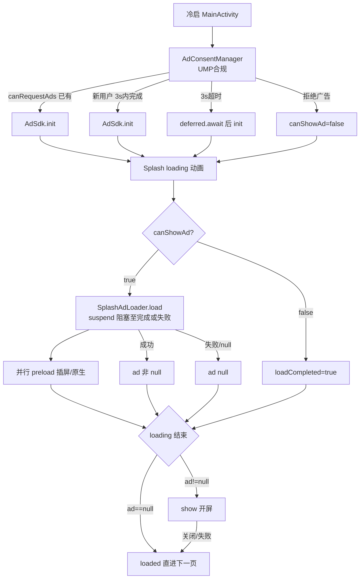

<!-- cursor-feature-interpret
generated: 2026-6-22 14:00:00
appName: video
topic: 查看广告功能，排查广告有没有兜底机制
outputDir: /Users/MacLuo/Desktop/D/working/shenzhen/skill/约束/.cursor/video/
filename: 广告兜底机制排查_2026-6-22_14-0.md
anchors: Ad/src/main/java/com/cpyad/loader/, app/.../attribution/AdGate.kt, AdIdsCache.kt, Splash.kt, Common.kt
rule: .cursor/rules/cursor-function_description.mdc
role: backup（镜像备份，主交付在对话正文）
-->

> 📌 已启用约束：`功能解读约束`  
> 📌 已启用约束：广告预加载阻塞分析（§1.11.8）  
> 📌 已启用约束：广告请求全链路确认清单（§1.11.9）  
> 📌 已启用约束：AB面中途切换与广告展示（§1.11.10）  
> 📌 已启用约束：开屏UMP预加载与loading查缓存（§1.11.11）  
> 📌 已启用约束：广告load重试与补货（§1.11.12/§1.11.13）

## 2.0 目录

**一句话**：工程**有**多层用户路径兜底（无广告直进、订阅/闸门/频率节流），但开屏标准缓存链路、展示后补货、主动 load 重试与原生失败 UI **存在缺口**。

### 快速阅读（按角色）

| 角色 | 建议跳转 |
|------|----------|
| 产品 | [2.1 作用](#21-功能身份与作用) → [兜底总览](#兜底机制总览结论) → [2.4 流程图](#24-流程图) |
| 开发 | [2.11 分阶段](#211-分阶段详细说明) → [2.12 广告位专表](#212-广告位专表) → [2.13 请求清单](#213-广告请求全链路确认清单) |
| 测试 | [2.5 场景矩阵](#25-全场景矩阵) → [2.12 展示失败分支](#212-广告位专表) |

### 全文目录

- [1. 解读范围](#1-解读范围)
- [兜底机制总览（结论）](#兜底机制总览结论)
- [2.1～2.13](#21-功能身份与作用)
- [2.10 自检](#210-输出前自检)

---

## 1. 解读范围

| 项 | 内容 |
|----|------|
| 功能名称 | 广告变现全链路兜底 / 降级 / 重试 / 补货 |
| 代码锚点 | `AdLoader.kt`、`InterAdLoader.kt`、`SplashAdLoader.kt`、`NativeAdLoader.kt`、`AdSdk.kt`、`AdConsentManager.kt`、`AdIdsCache.kt`、`AdGate.kt`、`Splash.kt`、`Common.kt`（NativeAdCompose）、各页 `InterAdLoader.load` 调用点 |
| 边界 | 含开屏/插屏/原生；**不含** Banner（工程未接入）；**不含** 中介瀑布流多 unit 切换 |
| 关联子功能 | UMP 合规（`AdConsentManager`）、Firebase 广告 ID（`AdIdsCache` + `Configs.kt`）、AB 面闸门（`AdGate` + `AbMode`）、插屏频率（`AdShowUtils`）、订阅开关（`AdSdk.isSubs`） |

### 阶段清点（解读前）

| 序号 | 阶段/子轨 | 代码锚点 | 阻塞用户 | 可能修订结论 | §2.11 |
|------|-----------|----------|----------|--------------|-------|
| P0 | UMP + AdSdk 初始化 | `AdConsentManager.requestGatherConsentAndInitAdSdk` | 是（闪屏等待 canShowAd） | 否 | P0 |
| P1 | 开屏 loading + 开屏 load/show | `Splash.kt` + `SplashAdLoader` | 是 | 否 | P1 |
| P2 | 开屏后插屏/原生 preload | `Splash.kt` LaunchedEffect | 否 | 否 | P2 |
| P3 | 各页插屏 show | `InterAdLoader` + 业务页 | 部分阻塞 | AB 升 B 后闸门变 | P3 |
| P4 | 各页原生 load/show | `NativeAdCompose` | 否（占位不阻塞导航） | AB 闸门 | P4 |
| P5 | Firebase 广告 ID 注入 | `App.initFirebaseRemoteConfig` + `AdIdsCache` | 否 | 可更新 unitId | P5 |
| P6 | AB 面归因结算 | `AttributionManager` + `AbMode` | 否（Splash 等 attributionInited 加速进度） | A→B 修订闸门 | P6 |

### 广告位清点（解读前）

| Slot | adType | A/B | 预加载锚点 | 展示锚点 | load重试 | 补货 | Loader |
|------|--------|-----|------------|----------|----------|------|--------|
| SplashOpen | 开屏 | A 白名单 | UMP 后 `SplashAdLoader.load` | loading 结束 `ad?.show` | `AdLoader.loadFailed` 被动退避 | **缺失**（展示回调无 preload） | SplashAdLoader maxCache=0 |
| 各 Inter Slot×13 | 插屏 | B 专属 | Splash preload + load 时 preloadInner | 各页 `load`/`loadAndShow` | 同上 | load 成功时 preloadInner | InterAdLoader maxCache=1 |
| 各 Native Slot×8 | 原生 | B 专属 | Splash preload + 可见时 load | `NativeAdCompose` | 同上 | load 取缓存后 preloadInner | NativeAdLoader maxCache=1 |

### 预加载阻塞清点

| # | 触发点 | 位 | 调用方式 | 阻塞 | 阻塞对象 | 超时 | 超时后 |
|---|--------|-----|----------|------|----------|------|--------|
| L1 | UMP 后 Splash | 开屏 | `suspend SplashAdLoader.load` | **半阻塞** | Splash 协程至 load 完成 | 无专用（Long.MAX_VALUE） | loadCompleted=true，loading 结束 show 或 skip |
| L2 | 同上协程内 | 插屏 | `InterAdLoader.preload`（GlobalScope） | 否 | — | — | 火忘 |
| L3 | 同上协程内 | 原生 | `NativeAdLoader.preload`（GlobalScope） | 否 | — | — | 火忘 |
| L4 | 插屏展示前 | 插屏 | `suspend InterAdLoader.load` | **是** | 用户跳转/点击协程 | **5000ms** | null → 直跳 `goMain`/`show(false)` |
| L5 | 原生可见 | 原生 | `suspend NativeAdLoader.load` | 否 | — | 无 | null → 永久 Loading 占位 |

---

## 兜底机制总览（结论）

**有没有兜底？——有，但不完整。**

| 类别 | 状态 | 说明 |
|------|------|------|
| **用户路径不卡死** | ✅ 有 | 开屏无广告 → `loaded()` 直进；插屏 `loadAndShow` / `load?.show ?: goNext`；UMP 3s 超时仍 init |
| **配置/ID 兜底** | ✅ 有 | 开屏 `BuildConfig.AD_SPLASH_ID`；inter/native 用 SP 上次 Firebase 缓存；空 ID 跳过请求 |
| **合规/订阅/AB 闸门** | ✅ 有 | UMP、`AdSdk.enable`（订阅关广告）、`AdGate`（A 面仅开屏） |
| **频率节流** | ✅ 有 | `AdShowUtils` 日计数 + Firebase 远程阈值 |
| **load 失败退避** | ⚠️ 半有 | `loadFailed()` 指数退避 5s→60s，**仅拦截下次 load**；**无定时主动重试** |
| **插屏/原生缓存补货** | ✅ 有 | `maxCacheCount=1`，取缓存后 `preloadInner` |
| **开屏标准链路** | ❌ 偏差 | `maxCacheCount=0` 无持久缓存；loading 结束用 `remember ad` 非纯 `takeCached`；晚到不入缓存供本次 show |
| **开屏展示后补货** | ❌ 缺失 | `SplashAd.onImpression` 无 preload 下一条 |
| **原生 load 失败 UI** | ⚠️ 弱 | 一直显示「Loading ad」占位，无隐藏/重试 UI |
| **瀑布流/多源** | ❌ 无 | 每类型单一 AdMob unitId |
| **Banner** | 不涉及 | 工程无 Banner |

---

## 2.1 功能身份与作用

| 项 | 内容 |
|----|------|
| 业务作用 | 在合规、订阅、AB 面约束下展示 AdMob 广告；失败时**不阻塞**主流程 |
| 用户可感知 | 有货则全屏/原生展示；无货则跳过或占位；订阅用户无广告 |
| 后台职责 | Loader 缓存队列、退避计时、Firebase ID 注入、埋点 |
| 上游 | `MainActivity` UMP → `Splash` → 各业务页 |
| 下游 | 导航继续、Taichi 收入、AppsFlyer ad_impression |
| 阻塞关键路径 | 开屏 loading **会等** UMP +（尽量）开屏 load；插屏 **最多阻塞 5s** |

---

## 2.2 实现步骤与时序

| 步骤 | 代码锚点 | 业务含义 | 串并行 | 完成后状态 |
|------|----------|----------|--------|------------|
| T0 | `MainActivity.onCreate` → `AdConsentManager` | 请求 UMP，决定是否 init AdMob | 串行 | `canShowAd` 三态 |
| T1 | `AdConsentManager` | 已可请求则立即 init；否则 3s 超时或等用户点 UMP | 并行 loading | `AdSdk.isInit` |
| T2 | `Splash` DisposableEffect | 启动 progress + `goNext` 循环 | 并行 | loading 动画 |
| T3 | `LaunchedEffect(canShowAd==true)` | **阻塞式** `SplashAdLoader.load` + 火忘 preload 插屏/原生 | 与 T2 并行 | `ad`、`loadCompleted` |
| T4 | `goNext` 循环 | 等 `loadCompleted && attributionInited` 后加速到 100% | 并行 | progress=1 |
| T5 | loading 结束 | `ad?.show` 或 `loaded()` | 串行 | 进语言/主页 |
| T6+ | 各页 | 插屏 `load`(5s 超时) / 原生可见 `load` | 事件驱动 | 展示或 skip |

---

## 2.3 分支与判断逻辑

| 条件（业务） | 代码等价 | 结果 | 用户感知 |
|--------------|----------|------|----------|
| 已订阅 | `!AdSdk.enable` | 所有 load 返回 null | 无广告 |
| 插屏/原生 ID 空 | `adUnitId.isBlank()` | skip 请求 | 直跳/无原生 |
| A 面非开屏位 | `!AdGate.allow(slot)` | 不 load/不渲染 | 与无广告相同 |
| 插屏 load 超时 | `withTimeout(5000)` | null + TIMEOUT 埋点 | 直跳 |
| 开屏 load 失败 | `ad==null` | `loaded()` | 无开屏直进 |
| 退避期 | `isRetreat()` | 抛异常→null | 同无货 |
| UMP 拒绝且未 init | `canShowAd=false` | 不 load 开屏 | 更快进下一页 |

### 2.3.1 远程配置专表

**表 A：广告 ID**

| RC key | 含义 | ①未配置 | ②有值 | ③空字符串 | 锚点 |
|--------|------|---------|-------|-----------|------|
| `ad_splash_id` | 开屏 unit | SP 无则 **BuildConfig 默认** | 覆盖 | setter 保留 BuildConfig | `AdSdk.setAdIds` |
| `ad_inter_id` | 插屏 | SP 无则 `""` 跳过 | 正常请求 | 跳过请求 | 同上 |
| `ad_native_id` | 原生 | 同上 | 同上 | 同上 | 同上 |

**表 B：拉取**

| 阶段 | 锚点 | 超时 | 失败后 |
|------|------|------|--------|
| fetch | `initFirebaseRemoteConfig` | **无 withTimeout** | catch 打日志；**不** saveAndApply；靠启动 `readAndApply` SP |
| 启动 SP | `AdIdsCache.readAndApply` | — | 用上次成功值 |

---

## 2.4 流程图

### 流程图名词说明

| 代码锚点 | 业务含义 | 触发 |
|----------|----------|------|
| `AdConsentManager` | UMP 合规 + 初始化 AdMob | MainActivity 启动 |
| `SplashAdLoader.load` | 请求开屏（suspend） | canShowAd=true |
| `InterAdLoader.preload` | 后台补插屏缓存 | Splash UMP 后 |
| `AdGate.allow` | AB 面广告位闸门 | load/show 前 |
| `loadFailed` | load 失败指数退避 | onAdFailedToLoad |

---

## 2.5 全场景矩阵

| 编号 | 标签 | 场景 | 路径摘要 | 用户感知 |
|------|------|------|----------|----------|
| S01 | 正常 | UMP 通过 + 开屏 load 成功 | T3 load → T5 show | 看开屏后进首页 |
| S02 | 正常 | 插屏有缓存 | getCache → show | 全屏插屏后进下一页 |
| S03 | 无数据 | inter/native ID 空 | blank skip | 无广告直跳 |
| S04 | 远程配置 | Firebase fetch 异常 | SP 缓存 ID | 用上次 unit |
| S05 | 超时 | 插屏 load 5s 超时 | TIMEOUT 埋点 → null | 直跳 |
| S06 | 异常 | 开屏 NO_FILL | loadFailed 退避 → ad null | 无开屏 |
| S07 | 边界 | 热启动 Splash | `isHotStart` popBackStack | 无开屏无 loading 流程 |
| S08 | 边界 | 已订阅 | AdSdk.enable=false | 全无广告 |
| S09 | 边界 | A 面点插屏位 | AdGate false | 直跳 |
| S10 | 竞态 | preload@A 后升 B | 缓存仍在 InterLoader | 升 B 后可 show 已缓存插屏 |
| S11 | 开屏 | loading 结束 ad 仍 null | skip loaded() | 无开屏（即使 load 稍晚成功也不 show） |
| S12 | 开屏 | 标准 takeCached 偏差 | 用 remember ad 非队列 | 与 S11 类似 |
| S13 | 原生 | load 失败 | nativeAd 仍 null | **永久 Loading 文案** |
| S14 | 重试 | load 失败后退避 | isRetreat 拦截下次 | 无自动重试直到再次触发 load |
| S15 | 补货 | 插屏 dismiss | destroy 无 preload | 依赖上次 load 时 preloadInner |
| S16 | 补货 | 开屏 impression | 无 preload | **缺失** |

**场景计数**：共 16 场（正常 2 / 无数据 1 / 远程 1 / 超时 1 / 异常 1 / 边界 3 / 竞态 1 / 开屏 2 / 原生 1 / 重试 1 / 补货 2）

---

## 2.11 分阶段详细说明

#### P0：UMP 与 AdSdk 初始化（AdConsentManager）

1. **身份**：合规 gate，决定能否请求 AdMob  
2. **启动**：MainActivity onCreate  
3. **条件**：始终启动  
4. **步骤**：`canRequestAds()` 为 true 则立即 init；否则 `gatherConsent` + **3s** `withTimeoutOrNull`  
5. **超时**：3s 未回调 → `deferred?.await()` 后仍 init + `canShowAd(true)`  
6. **失败**：用户拒绝 → `canShowAd(false)`，不 load  
7. **用户感知**：阻塞 Splash 直到 canShowAd 非 null（或 false 分支 loadCompleted）

#### P1：开屏 loading + load/show（Splash.kt）

1. **身份**：冷启开屏展示  
2. **偏差 vs 标准（§1.11.11）**：

| 步骤 | 标准 | 实际 | 一致？ |
|------|------|------|--------|
| UMP 后 preload | 是 | `SplashAdLoader.load`（suspend 现场 load） | ⚠️ 非纯 preload |
| loading 结束查缓存 | 仅 takeCached | `ad?.show`（remember 变量） | ❌ |
| 无缓存 skip | 不现场 load | skip 但不入缓存队列 | ⚠️ |
| maxCacheCount | ≥1 | **0** | ❌ |
| 展示回调补货 | onImpression → preload | **无** | ❌ |
| destroy 后缓存 | 保留 Loader 缓存 | `onDispose ad?.destroy()` 销毁实例 | ❌ |

3. **兜底**：`ad==null` → `loaded()` **不阻塞**用户  
4. **风险**：load 慢于 loading 结束时已 skip，成功 load 的实例可能被 dispose 丢弃

#### P2：Splash 后 preload 插屏/原生

- **非阻塞** GlobalScope preload  
- **A 面仍 preload inter/native**（无 AdGate）→ 请求可能浪费但不展示  
- 补货：preloadInner 在 cacheQueue.size < 1 时 load

#### P3：插屏展示链路

- **阻塞式** load 最多 5s  
- `loadAndShow`：null → `show(false)` → 回调继续导航  
- **hasCache 优化**：SearchPage、HomeCategory 先 `hasCache()` 再 load  
- **频率**：`AdShowUtils` 不满足则根本不调用 load

#### P4：原生 NativeAdCompose

- `AdGate` 不过 → 早 return，零高度  
- 可见 + 非快滑 → `NativeAdLoader.load`  
- **失败兜底弱**：load null 仍显示 Loading 占位

#### P5/P6：Firebase ID 与 AB 面

- 启动 `readAndApply` 立即生效  
- fetch 成功/失败未变均可能在 try 内 saveAndApply  
- fetch **异常**不 save → 靠 SP  
- `AbMode.isBSide()` 变化 → `AdGate` 实时生效；**已缓存插屏不 invalidate**

---

## 2.12 广告位专表

### 共性：load 失败重试（§1.11.12）

**三位 Loader 共用** `AdLoader.loadFailed()`：

- **触发**：`onAdFailedToLoad`  
- **策略**：`retryDelay = min(60000, 2^retryCount * 5000)` ms，`isRetreat()` 拦截新 load  
- **主动重试**：**缺失** — 无 Handler/协程 schedule，仅下次业务触发 load 时再试  
- **耗尽**：无上限 retryCount，间隔封顶 60s  

### 共性：插屏/原生补货（§1.11.13）

- **触发**：`loadWithInner` 取到缓存后 `preload(context)`；或 load 成功后 `preloadInner`  
- **非触发**：`InterAd.onAdDismissedFullScreenContent` **仅 destroy**，不在此 preload（依赖之前 preloadInner）

---

#### AdGate.Slot.SplashOpen（开屏）

| 维度 | 内容 |
|------|------|
| 预加载 | UMP 后 **suspend load**（L1 半阻塞） |
| 展示 | loading 结束 `ad?.show` |
| 成功 | 埋点 → dismiss → `loaded()` |
| 失败/skip | null → `loaded()`；show 失败 → `ad_no_show` + 仍导航 |
| 重试 | loadFailed 退避；**无展示后补货** |
| 标准链路 | **多项不一致**（见 P1 表） |

---

#### 插屏类（GuideFinishInter、LanguageDoneInter、MainTabSwitchInter、HomeCategoryDoneInter、BrowserUrlChangedInter、SearchPageInter、PlayerVideoChangeInter、DirSelectInter、SubscriptionCloseInter、DownloadInter、AiGenerateInter）

| 维度 | 内容 |
|------|------|
| 预加载 | Splash `InterAdLoader.preload`（火忘）；consume 时 preloadInner |
| 展示 | 各页 `AdGate.allow` + 部分 `AdShowUtils` + `load`/`loadAndShow` |
| 成功 | dismiss → finish 回调 → 导航 |
| 失败 | null / 超时 → **直跳**；show 失败 → destroy + 仍回调 |
| 重试 | 被动退避 |
| 补货 | load 路径 preloadInner ✅；dismiss **不**直接补货 |

---

#### 原生类（GuideNative、GuideLargeNative、LanguageNative、HomeListNative、BrowserNative、PlayerNative、SaveDialogNative、DownloadNative、DirSelectNative、GenerateNative）

| 维度 | 内容 |
|------|------|
| 预加载 | Splash preload + 可见时 load |
| 展示 | `NativeAdCompose` bind |
| 成功 | AdListener onAdImpression |
| 失败 | **Loading 占位常驻**；dispose 时 destroy |
| 重试 | 被动退避；**无 UI 侧重试** |
| 补货 | 取缓存后 preloadInner ✅ |

---

## 2.13 广告请求全链路确认清单

| R# | 类型 | 时机 | 位置 | 位 | 预加载 | 阻塞 | 隐患 |
|----|------|------|------|-----|--------|------|------|
| R1 | 现场 load | UMP 后 | Splash.kt:156 | 开屏 | 意图是 | 半阻塞 | 中：非标准 preload；晚到不入缓存 |
| R2 | preload | UMP 后 | Splash.kt:163 | 插屏 | 是 | 否 | 中：A 面无效请求 |
| R3 | preload | UMP 后 | Splash.kt:162 | 原生 | 是 | 否 | 中：同上 |
| R4 | load+show | 引导结束 | Guide.kt:77 | GuideFinishInter | 否 | 是≤5s | 低 |
| R5 | load+show | 语言 Continue | Language.kt:138 | LanguageDoneInter | 否 | 是≤5s | 低 |
| R6 | load | Tab 切换 | Main.kt:181 | MainTabSwitchInter | 否 | 是≤5s | 低 |
| R7 | load | 分类确认 | HomePager.kt:738 | HomeCategoryDoneInter | 否 | 是≤5s | 低：需 hasCache |
| R8 | load | URL 变化 | BrowserPager.kt:130 | BrowserUrlChangedInter | 否 | 是≤5s | 低 |
| R9 | load | 搜索 | BrowserPager.kt:358 | SearchPageInter | 否 | 是≤5s | 低：需 hasCache |
| R10 | load | 视频切换 | PlayerPager.kt:290 | PlayerVideoChangeInter | 否 | 是≤5s | 低 |
| R11 | load | 目录选择 | Filter.kt:414/464 | DirSelectInter | 否 | 是≤5s | 低 |
| R12 | load | 订阅关闭 | Subscription.kt:330 | SubscriptionCloseInter | 否 | 是≤5s | 低 |
| R13 | load | 下载 | YtDlpViewModel.kt:172 | DownloadInter | 否 | 是≤5s | 低 |
| R14 | load | AI 生成 | AiGenViewModel.kt:75 | AiGenerateInter | 否 | 是≤5s | 低 |
| R15 | load | 原生可见 | Common.kt:539/608 | 各 Native slot | 混合 | 否 | 中：失败永久占位 |
| R16 | preloadInner | 缓存消耗后 | Inter/Native Loader | 插屏/原生 | 补货 | 否 | 低 |
| R17 | preloadInner | Splash preloadInner | SplashAdLoader | 开屏 | 是 | 否 | **高**：maxCache=0 永不入队 |

### 收益隐患汇总

| R# | 类型 | 说明 |
|----|------|------|
| H1 | 开屏跨页丢缓存 | maxCache=0 + onDispose destroy |
| H2 | consume 无补货 | 开屏 impression 无 preload |
| H3 | 重试缺失 | 无主动 schedule，仅退避 |
| H4 | 无效请求 | A 面 preload inter/native |
| H5 | 原生失败 UX | 永久 Loading |

### 请你确认

1. 上表是否穷尽？  
2. 预加载/阻塞判断是否准确？  
3. 隐患等级是否认可？  
4. 回复「**清单确认**」或逐条修正。

---

## 3. 双视角

| 用户看到的 | 后台发生的 |
|-----------|-----------|
| 多数无广告也能正常进 App | null 分支直跳 |
| 订阅后全无广告 | AdSdk.enable=false |
| 原生偶尔一直「Loading ad」 | load 失败未隐藏占位 |
| A 面（审核）几乎只有开屏 | AdGate 白名单 |

---

## 2.10 输出前自检

- [x] §1.6 全场景枚举  
- [x] §2.3.1 RC 表  
- [x] §2.11 分阶段专节  
- [x] §2.12 广告位四维 + 开屏标准对照  
- [x] §2.13 R# 清单  
- [x] 开屏偏差已标待修复  
- [x] 重试/补货缺失已标  

---

## 建议修复优先级（方案，未改代码）

1. **高**：开屏 `maxCacheCount≥1` + loading 结束 **仅 getCache/show** + 展示回调 preload + onDispose **不 destroy 未 consume 缓存**  
2. **高**：`loadFailed` 后增加 **协程 delay 重试 preload**（或统一 ReplenishCoordinator）  
3. **中**：Splash preload inter/native 前加 `AdGate` / B 面判断  
4. **中**：原生 load 失败隐藏占位或有限重试  
5. **低**：Firebase fetch 加 timeout + 失败仍尝试 read 激活值  
