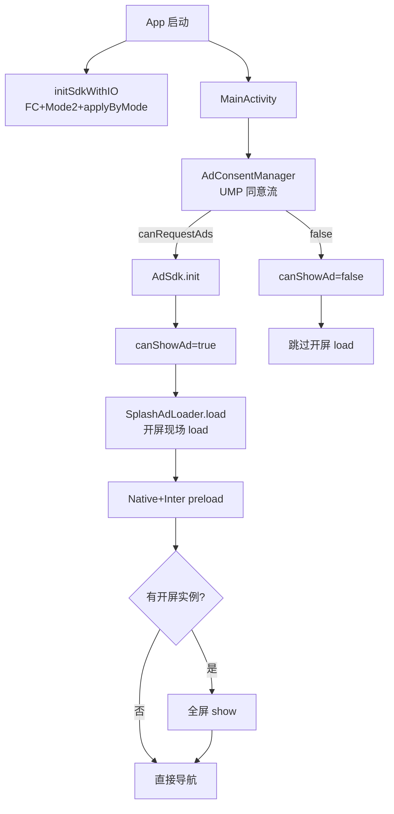

<!-- cursor-feature-interpret
generated: 2026-6-17 15:08:00
appName: video
topic: 查看广告功能
filename: 广告功能_2026-6-17_15-8.md
outputDir: /Users/MacLuo/Desktop/D/working/shenzhen/skill/约束/.cursor/video/
anchors: xvdownloader/Ad/, xvdownloader/app/.../ui/Splash.kt
rule: skill/约束/.cursor/rules/cursor-function_description.mdc
role: backup（镜像备份，主交付在对话正文）
-->

> 📌 已启用约束：`功能解读约束`

## 2.0 目录

**一句话**：xvdownloader（桌面名 **video**）通过 `:Ad` 模块 + 13 个 `AdSense` 位实现开屏/插屏/原生变现；UMP 同意后才 `AdSdk.init`；A/B 面决定远程 JSON（A 仅开屏、B 全 13 位）；插屏走缓存队列，原生 Compose 懒加载。

### 快速阅读（按角色）

| 角色 | 建议跳转 |
|------|----------|
| 产品 | [2.1 作用](#21-功能身份与作用) → [2.3 分支](#23-分支与判断逻辑) → [2.12 广告位专表](#212-广告位专表) → [3. 双视角](#3-双视角) |
| 开发 | [2.2 时序](#22-实现步骤与时序) → [2.11 分阶段](#211-分阶段详细说明) → [2.6 走读](#26-关键实现走读) → [2.12](#212-广告位专表) |
| 测试 | [2.5 场景矩阵](#25-全场景矩阵) → [2.12](#212-广告位专表) → [2.10 自检](#210-输出前自检) |

### 全文目录

- [1. 解读范围](#1-解读范围)
- [2.0 目录](#20-目录)
- [2.1 功能身份与作用](#21-功能身份与作用)
- [2.2 实现步骤与时序](#22-实现步骤与时序)
- [2.3 分支与判断逻辑](#23-分支与判断逻辑)
- [2.3.1 远程配置专表](#231-远程配置专表)
- [2.4 流程图](#24-流程图)
- [2.5 全场景矩阵](#25-全场景矩阵)
- [2.6 关键实现走读](#26-关键实现走读)
- [2.11 分阶段详细说明](#211-分阶段详细说明)
- [2.12 广告位专表](#212-广告位专表)
- [2.9 异步续作](#29-异步续作与结论修订)
- [3. 双视角](#3-双视角)
- [2.10 输出前自检](#210-输出前自检)

---

## 1. 解读范围

| 项 | 内容 |
|----|------|
| 功能名称 | 广告变现（AdMob 开屏 / 插屏 / 原生，13 广告位） |
| 代码锚点 | `Ad/AdSdk.kt`、`AdSense.kt`、`AdLoader` 三 Loader、`AdConsentManager`、`App.kt`（AB 配置）、`Splash.kt`、`Common.kt`（`NativeAdCompose`）、各页面插屏调用 |
| 边界 | **包含**：闸门、UMP、远程 JSON、13 位预加载/展示/失败；**不包含**：订阅页 UI 细节、Mode2 判面完整栈（仅写与广告 JSON 衔接） |
| 关联子功能 | UMP 同意流、AB 面 `applyByMode`、日配额、Loader 退避、Premium 短路 |

### 阶段清点（解读前）

| 序号 | 阶段/子轨 | 代码锚点 | 阻塞用户 | 可能修订结论 | §2.11 |
|------|-----------|----------|----------|--------------|-------|
| P0 | Application AB+FC | `App.initSdkWithIO` | 否 | 是（A→B 改 JSON） | P0 |
| P1 | UMP + SDK init | `AdConsentManager.requestGatherConsentAndInitAdSdk` | 是（闪屏） | 否 | P1 |
| P2 | 闪屏 load/show | `Splash.kt` + `SplashAdLoader` | 是 | 否 | P2 |
| P3 | 开屏后预加载 | `NativeAdLoader.preload` / `InterAdLoader.preload` | 否 | 否 | P3 |
| P4 | 各页展示 | 各 UI + Loader | 部分 | 否 | —（见 §2.12） |

### 广告位清点

| AdSense | adType | A/B | 预加载锚点 | 展示锚点 |
|---------|--------|-----|------------|----------|
| 1 LOADING_SPLASH | 开屏 | A/B | 无（现场 load） | `Splash.kt` |
| 2 LANGUAGE_NATIVE | 原生 | B | 闪屏后 preload 默认位 | `Language.kt` |
| 3 LANGUAGE_INTERSTITIAL | 插屏 | B | 同上 | 语言确认 |
| 4 TYPE_DIALOG_INTERSTITIAL | 插屏 | B | 同上 | `Filter`/`HomePager` |
| 5 HOME_NATIVE | 原生 | B | 同上 | `HomePager`/`PlayerPager` |
| 6 BOTTOM_NAV_INTERSTITIAL | 插屏 | B | 同上 | `Main.kt` 底栏 |
| 7 FAVORITE_DIALOG_NATIVE | 原生 | B | 懒 load | `SaveVideoDialog` |
| 8 SEARCH_NATIVE | 原生 | B | 懒 load | `BrowserPager` |
| 9 SEARCH_INTERSTITIAL | 插屏 | B | preload | 搜索提交 |
| 10 DOWNLOAD_DIALOG_NATIVE | 原生 | B | 懒 load | `Download`/`BrowserPager` |
| 11 DOWNLOAD_DIALOG_INTERSTITIAL | 插屏 | B | preload | `YtDlpViewModel` 下载 |
| 12 AI_GENERATE_NATIVE | 原生 | B | 懒 load | `GeneratePage` |
| 13 CLICK_INTERSTITIAL | 插屏 | B | preload | 多页点击 |

---

## 2.1 功能身份与作用

| 项 | 内容 |
|----|------|
| 业务作用 | 非 Premium 用户通过 AdMob 展示开屏、插屏、原生广告；A 面审核包仅开屏，B 面买量包开放 13 位 |
| 用户可感知 | 闪屏可能全屏广告；语言/主页/搜索等页底部或弹窗内广告；切 Tab、下载、点击等时机插屏 |
| 后台职责 | 远程 JSON 决定每位 id/开关；日曝光/点击配额；Loader 缓存与退避 |
| 上游 | `MainActivity` UMP → `canShowAd`；`App.isMode2` → `applyByMode` |
| 下游 | 埋点 `AdTracker`/`Events`；Premium 购买后 `AdSdk.isSubs=true` 全关 |
| 是否阻塞 | 闪屏阻塞至进度条满 + UMP +（可选）开屏 show；其它位不阻塞主流程（无缓存直跳） |

---

## 2.2 实现步骤与时序

| 步骤 | 代码锚点 | 业务含义 | 串并行 | 完成后状态 |
|------|----------|----------|--------|------------|
| T0 | `App.initSdkWithIO` | 后台拉 FC、判 Mode2、apply 广告 JSON | 与 Activity 并行 | `AdRemoteConfigManager.config` 有值 |
| T1 | `AdConsentManager.requestGatherConsentAndInitAdSdk` | UMP 同意/超时 | 阻塞闪屏广告 | `canShowAd` true/false |
| T2 | `AdSdk.init` | MobileAds 初始化 | T1 回调内 | `isInit=true` |
| T3 | `Splash` `LaunchedEffect(canShowAd)` | 开屏 load + 预加载 | 等 T1 | `loadCompleted` |
| T4 | `goNext` 进度循环 | 等 UMP deferred + Mode2 + load | 串行 | 进度 100% |
| T5 | `ad?.show` | 全屏开屏 | 可选 | 导航语言/主页 |
| T6+ | 各页 `InterAdLoader.load` / `NativeAdCompose` | 插屏/原生 | 并行 | 消耗缓存或现场 load |

**主路径**：T0→T1→T2→T3→T4→T5→T6  
**续作路径**：T0 中 Mode2 判定可能晚于闪屏 load，JSON 可能在 show 前/后切换（见 §1.6.5）

### 超时点清单

| 超时点 | 阈值 | 超时后 | 阻塞闪屏 |
|--------|------|--------|----------|
| UMP gather | **3000ms**（无缓存时） | `deferred.await` 后仍 init | 是 |
| 插屏 load | **5000ms** 默认 | null，直跳 | 否 |
| 插屏 loading UI | 最少 **1000ms** | 延迟关 loading | 感知延迟 |
| 闪屏进度 | 首次 **1500**×10ms，老用户 **1000**×10ms | 强制进 show/跳页 | 是 |

---

## 2.3 分支与判断逻辑

| 条件（业务） | 代码 | 结果 |
|-------------|------|------|
| Premium | `AdSdk.isSubs` / `appSubsState` | 全部不请求 |
| SDK 未 init | `!AdSdk.isInit` | `enableFor=false` |
| 该位无 ad_id / enable=false | `getAdId` 空 | A 面原生位跳过 |
| 日配额满 | `!canRequest()` | 全部跳过 |
| UMP 不可请求 | `canShowAd=false` | 不 init、不开屏 |
| UMP 已有缓存可请求 | 先 init 再 gather | 可并行开屏 |
| A 面 | `isMode2=false` | JSON 仅开屏位 |
| B 面 | `isMode2=true` | JSON 13 位 |
| 插屏无缓存 | `load` 现场请求或 null | 不 show，业务继续 |
| 原生未可见/快滑 | `NativeAdCompose` | 不 load |

---

## 2.3.1 远程配置专表

**表 A：广告 JSON key**

| RC key | 含义 | 未配置/空 | A 面 | B 面 |
|--------|------|-----------|------|------|
| `ad_config_a` | A 方案 JSON | 回退 assets A | 仅开屏等 A 位 | — |
| `ad_config_b` | B 方案 JSON | 回退 assets B | — | 13 位 |

**表 B：拉取**

| 阶段 | 锚点 | 超时 | 失败后 |
|------|------|------|--------|
| FC fetch | `App.initFirebaseRemoteConfig` | SDK 默认 | assets 兜底 |
| apply | `AdRemoteConfigBridge.applyByMode` | — | 解析失败→assets |

---

## 2.4 流程图

### 名词说明

| 代码锚点 | 业务含义 |
|----------|----------|
| `AdConsentManager` | UMP 同意与 SDK 初始化 |
| `AdSdk.enableFor` | 该广告位是否允许请求 |
| `SplashAdLoader.load` | 冷启动开屏现场加载 |
| `applyByMode` | 按 A/B 面写入广告 JSON |



---

## 2.5 全场景矩阵

| 编号 | 标签 | 场景 | 结果 | 用户感知 |
|------|------|------|------|----------|
| S01 | 正常 | B 面+UMP 通过+有填充 | 开屏+各位正常 | 见广告 |
| S02 | 正常 | A 面+UMP 通过 | 仅开屏位 enable | 仅闪屏可能广告 |
| S03 | 远程配置 | 远程 JSON 空 | assets 兜底 | 取决于 assets |
| S04 | 远程配置 | JSON 解析失败 | config 可能 null，全无广告 | 无广告 |
| S05 | 超时 | UMP 3s 超时 | await 后仍 init | 闪屏略长 |
| S06 | 边界 | UMP canRequestAds=false | 不 init | 无广告 |
| S07 | 边界 | Premium 用户 | isSubs 短路 | 无广告 |
| S08 | 边界 | 日配额满 | enableFor false | 无广告 |
| S09 | 竞态 | 开屏 load 时仍 A JSON，后升 B | 开屏用当时 config | 可能 A 方案 id |
| S10 | 无数据 | 插屏无缓存 | load null→直跳 | 不阻塞 |
| S11 | 超时 | 插屏 load 5s 超时 | null+埋点 TIMEOUT | 不阻塞 |
| S12 | 异常 | SDK NO_FILL | loadFailed+退避 | 无广告 |
| S13 | 正常 | 原生列表可见 | NativeAdCompose load | 底部原生 |
| S14 | 边界 | 原生快滑 | 不 load | 无占位（默认） |
| S15 | 正常 | 底栏每 2 次切换 | BOTTOM_NAV 插屏 | 可能挡 Tab |

场景计数：共 15 场（正常 5 / 远程 2 / 超时 2 / 边界 5 / 竞态 1）

---

## 2.6 关键实现走读

```
【摘录】Ad/AdSdk.kt → enableFor
【解读】全局 isInit 且非订阅；该 sense 有 ad_unit_id；未超日限额
【读完后应知道】无 isUmpResolved 闸门；UMP 通过 canShowAd 间接控制 init
```

```
【摘录】Ad/utils/AdConsentManager.kt → requestGatherConsentAndInitAdSdk
【解读】已有 canRequestAds 则立即 init；否则 gather 且 3s 硬超时
【读完后应知道】与 PDF 金样 UMP skill 不同：用 canRequestAds 阻断 init
```

```
【摘录】app/ui/Splash.kt → LaunchedEffect(canShowAd)
【解读】true 才 SplashAdLoader.load；成功后 preload 原生+插屏默认位
【读完后应知道】开屏是唯一现场 load 的全屏位
```

---

## 2.11 分阶段详细说明

#### P0：Application 广告 JSON 生效（App.initSdkWithIO）

**1. 阶段身份**：冷启确定 A/B 面并写入 `AdRemoteConfigManager`  
**2. 启动时机**：`Application.onCreate` IO 协程  
**3. 启动条件**：主进程  
**5. 执行步骤**：`initFirebaseRemoteConfig` → `Mode2Utils.initMode2AndGet` → `AdRemoteConfigBridge.applyByMode(isMode2)`  
**8. 失败**：远程空→assets；全失败→config null，全部 `enableFor=false`  
**10. 用户感知**：无感；影响后续所有广告位 id  

#### P1：UMP + AdSdk 初始化（AdConsentManager）

**3. 启动条件**：`MainActivity.onCreate`  
**6. 超时**：gather **3000ms**；超时后 `deferred?.await()` 再 init  
**7. 成功**：`canShowAd(true)` + `AdSdk.init`  
**8. 失败**：`canRequestAds=false` → `canShowAd(false)`，**不 init**  
**10. 用户感知**：欧盟可能弹同意窗；拒绝则全程无广告  

#### P2：闪屏 load 与展示（Splash.kt）

**5. 步骤**：等 `canShowAd==true` → `SplashAdLoader.load` → 进度条循环等 `Mode2Utils.isInit` → `show`  
**8. 失败**：ad null → 直接 `loaded()` 导航  
**10. 用户感知**：全屏开屏或纯品牌页  

#### P3：开屏后预加载（Splash.kt）

**5. 步骤**：`NativeAdLoader.preload`（默认 HOME_NATIVE）、`InterAdLoader.preload`（默认 TYPE_DIALOG）  
**10. 用户感知**：无感；为后续插屏/原生备缓存  

---

## 2.12 广告位专表

> 以下每位：**预加载时机 | 展示时机 | 成功处理 | 失败处理**（闸门未过统一：`enableFor=false` 静默跳过，见 `logSkipLoad`）

#### 1 LOADING_SPLASH（开屏）

| 维度 | 内容 |
|------|------|
| 预加载 | 无；`SplashAdLoader.load` 现场请求 |
| 展示 | 闪屏进度结束后 `ad.show` |
| 成功 | 全屏展示 → 500ms 后导航 |
| 失败 | null → 直接导航；load 失败退避 |

#### 2 LANGUAGE_NATIVE / 3 LANGUAGE_INTERSTITIAL

| 维度 | 内容 |
|------|------|
| 预加载 | 闪屏后 `NativeAdLoader.preload`；插屏默认 preload |
| 展示 | 语言页 `NativeAdCompose`；点 Continue 前 `InterAdLoader.load(LANGUAGE_INTERSTITIAL)?.show` |
| 成功 | 原生 bind；插屏关后 `ce()` 进主页 |
| 失败 | 插屏 null → 直接 `ce()` |

#### 4 TYPE_DIALOG_INTERSTITIAL

| 维度 | 内容 |
|------|------|
| 展示 | `Filter.kt` 类型选择、`HomePager.kt`（有缓存时） |
| 失败 | 无缓存 → 不 show，对话框继续 |

#### 5 HOME_NATIVE

| 维度 | 内容 |
|------|------|
| 展示 | `HomePager`/`PlayerPager` `NativeAdCompose(HOME_NATIVE)`；可见且非快滑才 load |
| 失败 | ad null → 不占位（`placeholderEnabled=false`） |

#### 6 BOTTOM_NAV_INTERSTITIAL

| 维度 | 内容 |
|------|------|
| 展示 | `Main.kt` 底栏每 **2 次**切换且 `AdShowUtils.isShowNavInterAd()` |
| 成功 | show 成功 `incShowNavInterAdCount` |
| 失败 | 无缓存 load 可能 null，Tab 仍切换 |

#### 7 FAVORITE_DIALOG_NATIVE / 10 DOWNLOAD_DIALOG_NATIVE / 12 AI_GENERATE_NATIVE

| 维度 | 内容 |
|------|------|
| 展示 | 各弹窗/页 `NativeAdCompose(sense=对应位)` |
| 失败 | 同 HOME_NATIVE |

#### 8 SEARCH_NATIVE / 9 SEARCH_INTERSTITIAL

| 维度 | 内容 |
|------|------|
| 展示 | `BrowserPager` 搜索原生 + 提交搜索插屏（有缓存优先） |
| 失败 | 插屏 null → 搜索仍执行 |

#### 11 DOWNLOAD_DIALOG_INTERSTITIAL

| 维度 | 内容 |
|------|------|
| 展示 | `YtDlpViewModel` 开始下载前 `load(DOWNLOAD_DIALOG_INTERSTITIAL)?.show` |
| 失败 | 无 show 仍下载 |

#### 13 CLICK_INTERSTITIAL

| 维度 | 内容 |
|------|------|
| 展示 | `PlayerPager`/`AiGenViewModel` 等点击路径 |
| 失败 | 无阻塞 |

**插屏共性**：`InterAdLoader.load` 先取缓存；无缓存现场 load **5s** 超时；loading 最少 1s；`show` 后 `preload` 补货。  
**原生共性**：`NativeAdLoader.load` 消费/填充缓存；曝光 `recordImpression`；点击 `recordClick`。

---

## 2.9 异步续作与结论修订

| 首次结论 | 续作 | 触发 | 修订 |
|----------|------|------|------|
| 闪屏 load 用 A JSON | Mode2 判 B 后 `applyByMode(true)` | referrer/GP 判定 | 后续位用 B id；**已 load 开屏不变** |
| config=null | FC 成功后 apply | 远程到达 | 从全无广告→有位 |

经扫描：无 PDF 式阶段2 AB 修订监听；Mode2 在 `App` 单轨完成。

---

## 3. 双视角

| 用户看到的 | 后台发生的 |
|-----------|-----------|
| 闪屏进度条后可能全屏广告 | UMP→init→SplashAdLoader→show |
| 语言页底部原生、点继续可能插屏 | enableFor(2)(3)；缓存或 load |
| 切 Tab 偶尔插屏 | BOTTOM_NAV + 频控 |
| 下载/搜索/点击有时插屏 | 对应 InterAdLoader |
| Premium 无广告 | isSubs 全局 false |

---

## 2.10 输出前自检

```
- [x] §1.6 全场景枚举
- [x] §2.3.1 远程配置（ad_config_a/b）
- [x] §2.5 ≥15 场景
- [x] §2.11 四阶段专节
- [x] §2.12 13 位专表
- [x] 涉广告四类策略已区分
- [x] UMP 3s 超时已写
- [x] 镜像备份目录 skill/约束/.cursor/video/
```
