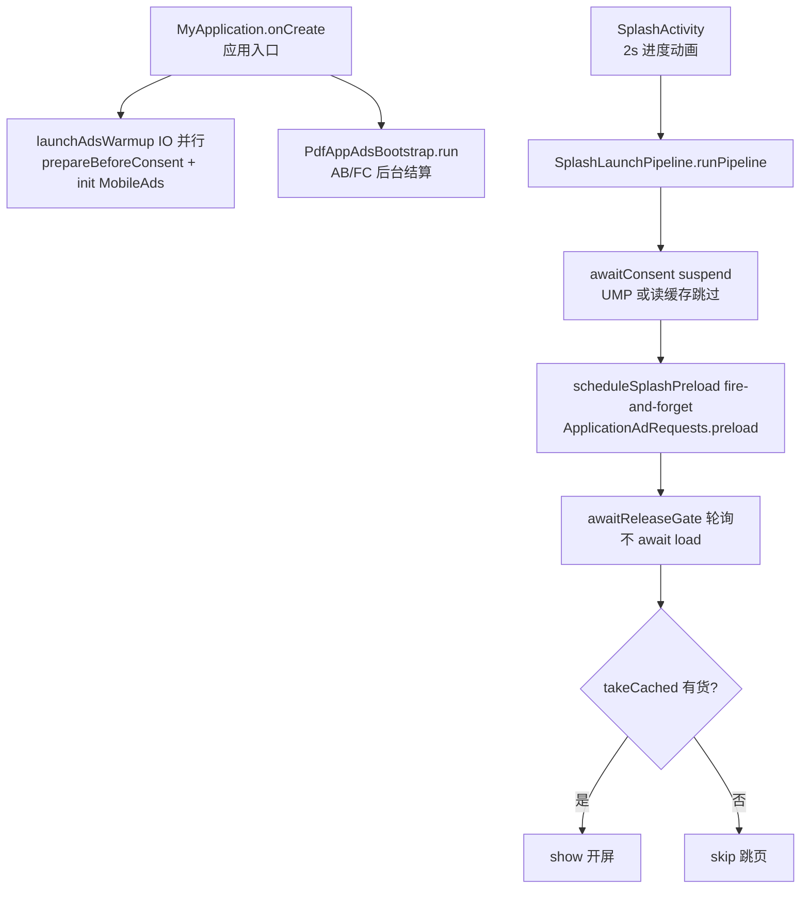
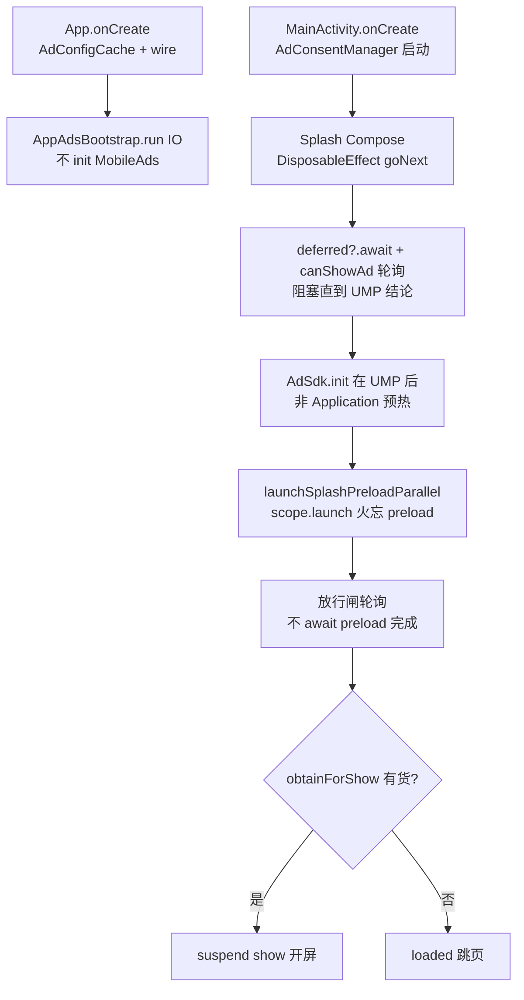

<!-- cursor-feature-interpret
generated: 2026-6-24 16:00:00
appName: xvdownloader
topic: 对比正常包 pdf 启动流程 Application→开屏，串行阻塞与流程一致性
outputDir: /Users/MacLuo/Desktop/D/working/shenzhen/skill/约束/.cursor/xvdownloader/
filename: 启动流程对比正常包_2026-6-24_16-0.md
anchors: MyApplication.kt, SplashLaunchPipeline.kt, App.kt, Splash.kt, AdConsentManager.kt
rule: .cursor/rules/cursor-function_description.mdc
role: backup（镜像备份，主交付在对话正文）
-->

# 启动流程对比：xvdownloader vs 正常包（Nitro PDF Pro / pdf）

## 1. 解读范围

| 项 | 内容 |
|----|------|
| 功能名称 | 冷启动 Application → 开屏 Loading → 开屏广告/跳页 |
| 代码锚点（正常包） | `MyApplication.kt`、`SplashLaunchPipeline.kt`、`SplashActivity.kt`、`AdConsentManager.kt`、`ApplicationAdRequests.kt` |
| 代码锚点（当前工程） | `App.kt`、`MainActivity.kt`、`Splash.kt`、`AdConsentManager.kt`、`ApplicationAdRequests.kt`、`SplashAdLoader.kt` |
| 边界 | 仅启动页开屏链路；不含 AB 结算细节、语言页/主页广告 |
| 对比基准 | `/Users/MacLuo/Desktop/D/working/shenzhen/tools/browser/new_pdf_refer/pdf` |

---

## 2.0 目录

**一句话**：正常包把 SDK 预热放 Application、开屏 preload 火忘 + 放行闸只轮询缓存；当前工程 UMP 后才 init SDK，开屏主路径已对齐「不 await preload」，但仍有几处串行阻塞与 Scope 差异。

### 快速阅读

| 角色 | 建议 |
|------|------|
| 产品 | §3 双视角 + §2.4 流程图 |
| 开发 | §2.6 阻塞清点 + §2.12 开屏对照表 |
| 测试 | §2.5 场景矩阵 S01–S08 |

---

## 2.4 流程图对比

### 正常包（SplashLaunchPipeline）

### 当前工程（Splash.kt + MainActivity）

---

## 2.6 串行阻塞清点（§1.11.8）

| 序号 | 工程 | 步骤 | 是否阻塞 | 阻塞对象 | 正常包做法 |
|------|------|------|----------|----------|------------|
| L1 | 正常包 | Application `MonetizationKit.init` | 否（IO 火忘） | — | ✅ |
| L2 | 当前 | Application **无** MobileAds init | — | UMP 后才开始 init | ❌ 不一致 |
| L3 | 正常包 | `awaitConsent` | **是** suspend | 开屏管线协程 | UMP 结束才 preload |
| L4 | 当前 | `canShowAd==null` while | **是**（无超时） | goNext 协程 | 正常包 UMP 有明确 finish |
| L5 | 正常包 | 开屏 preload | **否** | `ApplicationAdRequests.preload` | ✅ |
| L6 | 当前 | 开屏 preload | **否**（相对放行闸） | 但用 **Compose scope.launch** | 正常包用 **applicationScope** |
| L7 | 两者 | 放行闸 `awaitReleaseGate` | **否**（仅 poll） | — | ✅ 一致 |
| L8 | 两者 | loading 结束 show | **否** live load | 仅 takeCached | ✅ 一致 |
| L9 | 两者 | `ad.show` suspend | **是** | 直到关广告 | ✅ 一致 |

### §1.11.15 多广告编排结论

- **并行**：UMP 后开屏 preload 与 Loading 放行闸 **并行**（两工程一致，均不 await load 完成）。
- **串行**：UMP 完成 → 才能 preload/show 闸门；当前工程另串行 **AdSdk.init（UMP 后）**；正常包 init 已在 Application 完成，Splash 只等 UMP 流程结束。

---

## 2.12 开屏标准链路对照（§1.11.11.3）

| 步骤 | 标准预期 | 正常包 | xvdownloader 当前 | 一致？ |
|------|----------|--------|-------------------|--------|
| Application 广告配置 | 有 | applyDefaultLocalAssetsA + init | AdConfigCache + wire | 部分 |
| Application MobileAds.init | 可预热 | ✅ launchAdsWarmup | ❌ 仅 UMP 后 init | **否** |
| UMP 后 preload | 是 | fire-and-forget | fire-and-forget | ✅ |
| 放行闸不 await load | 是 | awaitReleaseGate poll | tryPassReleaseGate poll | ✅ |
| loading 结束仅 takeCached | 是 | obtainForShow | obtainForShow | ✅ |
| 无缓存 skip | 是 | onNavigateNext | loaded() | ✅ |
| preload 应用级 Scope | 建议 | ApplicationAdRequests | Compose scope.launch | **否** |
| 10s 从 UMP 结束计 | 是 | adPhaseStartElapsed | umpEndMs | ✅ |
| 最少 2s Loading | 是 | startElapsed | loadingStartMs | 类似 |

---

## 2.5 场景矩阵（节选）

| 编号 | 场景 | 正常包 | xvdownloader |
|------|------|--------|--------------|
| S01 | 首次安装 + UMP 同意 | 2s 动画→UMP→preload 并行→有货 show | UMP 中进度 0–25%→preload 并行→show |
| S02 | UMP 拒绝 | 闸门 skip preload/show | canShowAd=false 跳过 preload |
| S03 | 10s 无填充 | 截止放行 skip | umpEnd+10s skip | ✅ |
| S04 | 开屏提前 load 完 | isReady 提前放行 | isReady 提前放行 | ✅ |
| S05 | MobileAds init 慢 | SDK 已 App 预热 | 等 UMP 后 init，canShowAd 可能长期 null | **风险** |
| S06 | Splash 页 destroy | preload 继续（appScope） | compose Job 可能 cancel | **风险** |
| S07 | 进度条 UX | 2s 动画与管线分离 | 分阶段进度（已修单调递增） | 体验不同 |
| S08 | 热启动 | isHotStart 跳过 UMP | isHotStart popBackStack | 策略不同 |

---

## 3. 双视角

| 用户看到的 | 后台发生的 |
|-----------|-----------|
| Loading 进度条 + 可能 UMP 弹窗 | AB/FC 后台结算（两者均不阻塞放行闸） |
| 进度到顶后开屏或进语言页 | UMP 后 preload 与 10s 闸并行；结束只查缓存 |
| 正常包先看到 2s 纯 Loading 再 UMP | 当前工程 UMP 与 Loading 进度交织 |

---

## 4. 结论与对齐建议（不改代码，仅方案）

### 已一致（核心开屏金样）

1. UMP 后 **fire-and-forget preload**，放行闸 **只轮询** `isReady()` / 10s 超时。
2. Loading 结束 **仅** `obtainForShow`，无现场 load。
3. 10s 窗口从 **UMP 结束**起算；最少约 2s Loading。

### 仍不一致 / 潜在阻塞

1. **Application 未预热 MobileAds**（正常包 `launchAdsWarmup`）→ UMP 后 init 更晚，开屏 load 窗口更短。
2. **`canShowAd==null` 无超时** → 可能永久卡在 Loading（正常包 UMP 有 finish 回调链）。
3. **开屏 preload 走 Compose `scope.launch`** → 非 `ApplicationAdRequests.preload` 应用级 Scope，页面销毁可能 cancel（正常包统一 ApplicationAdRequests）。
4. **Loading UX**：正常包 2s 动画结束再跑管线；当前单协程串联 UMP+闸，进度逻辑更复杂（虽已修回跳）。

### 若要对齐正常包（待你确认后再改）

| 优先级 | 改动 |
|--------|------|
| P0 | `App.onCreate` 增加 IO 预热：`AdConfigCache` 后 `AdSdk.init`（或 prepareBeforeConsent 等价） |
| P0 | 开屏 preload 改为 `ApplicationAdRequests.preload(LOADING_SPLASH)` |
| P1 | `canShowAd` 等待加总超时（如 15s）→ 按 false 放行 |
| P2 | 抽离 `SplashLaunchPipeline` 类，与 Compose UI 分离（对标正常包结构） |

---

## 2.10 自检

- [x] 超时点：10s 开屏闸、FC/AB 不阻塞 Splash
- [x] 开屏不 await preload（当前已对齐）
- [x] 串行阻塞显式列出
- [x] 与正常包差异表
