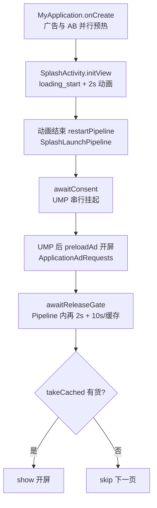
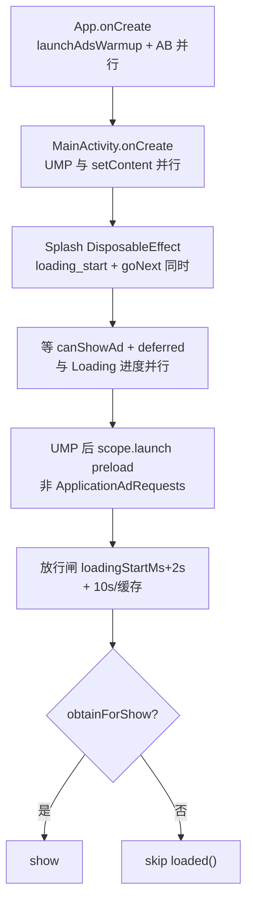

<!-- cursor-feature-interpret
generated: 2026-6-24 18:30:00
appName: xvdownloader
topic: 对比正常包 pdf 启动流程 Application→开屏，串行阻塞与 UMP/Loading 计时对齐
outputDir: /Users/MacLuo/Desktop/D/working/shenzhen/skill/约束/.cursor/xvdownloader/
filename: 启动流程对比正常包_2026-6-24_18-30.md
anchors: App.kt, MainActivity.kt, Splash.kt, AdConsentManager.kt, ApplicationAdRequests.kt; pdf/MyApplication.kt, SplashActivity.kt, SplashLaunchPipeline.kt
rule: .cursor/rules/cursor-function_description.mdc
role: backup（镜像备份，主交付在对话正文）
-->

# Application → 开屏：xvdownloader vs Nitro PDF Pro（pdf 参考包）

## 2.0 目录

**一句话**：Application 层 MobileAds 预热已对齐；Splash 层 UMP 与 Loading **并行**（非 pdf 的「先 2s 动画再 UMP」）；开屏 preload 仍走 **页面 scope** 而非 `ApplicationAdRequests`；`canShowAd` 已必达但类型与 SDK 闸门仍与 pdf 的 `ConsentFacade.isResolved` 有差。

### 快速阅读（按角色）

| 角色 | 建议跳转 |
|------|----------|
| 产品 | [2.1 作用](#21-功能身份与作用) → [3. 双视角](#3-双视角) → [未对齐清单](#未对齐项汇总请确认) |
| 开发 | [2.2 时序](#22-实现步骤与时序) → [2.4 流程图](#24-流程图) → [2.12 开屏专表](#212-广告位专表-loading_splash) |
| 测试 | [2.5 场景矩阵](#25-全场景矩阵) → [开屏标准链路对照](#开屏标准链路对照表-11111) |

### 全文目录

- [1. 解读范围](#1-解读范围)
- [阶段清点](#阶段清点解读前)
- [2.1～2.13](#21-功能身份与作用)
- [未对齐项汇总](#未对齐项汇总请确认)
- [3. 双视角](#3-双视角)

---

## 1. 解读范围

| 项 | 内容 |
|----|------|
| 功能名称 | 冷启动：Application 初始化 → 启动页 Loading → UMP → 开屏 preload/show → 下一页 |
| 代码锚点 | **xvdownloader**：`App.kt`、`MainActivity.kt`、`ui/Splash.kt`、`AdConsentManager.kt`、`ApplicationAdRequests.kt`、`AdPreloadCoordinator.kt`；**pdf**：`MyApplication.kt`、`SplashActivity.kt`、`SplashLaunchPipeline.kt`、`ConsentFacade.kt`、`ApplicationAdRequests.kt` |
| 边界 | 含 Application 广告预热、UMP、Loading 放行闸、开屏 LOADING_SPLASH；不含主页各 Tab 广告细节 |
| 关联子功能 | AB 结算（并行不阻塞 Splash）、语言页 preload 批、热启动 Splash |

### 阶段清点（解读前）

| 序号 | 阶段/子轨 | 代码锚点 | 阻塞用户 | 可能修订结论 | §2.11 |
|------|-----------|----------|----------|--------------|-------|
| P0 | Application 同步 init | `App.onCreate` | 是（主线程） | 否 | P0 |
| P1 | MobileAds 预热 | `App.launchAdsWarmup` | 否 | 否 | P1 |
| P2 | AB+FC 结算 | `AppAdsBootstrap.run` | 否 | 是（A→B） | P2 |
| P3 | MainActivity UMP | `AdConsentManager.requestGatherConsentAndInitAdSdk` | 部分（表单） | 否 | P3 |
| P4 | Splash Loading + 闸 | `Splash.goNext` | 是 | 否 | P4 |
| P5 | 开屏 preload/show | `launchSplashPreloadParallel` / `obtainForShow` | show 时 | 否 | P5 |

---

## 2.1 功能身份与作用

| 项 | 内容 |
|----|------|
| 业务作用 | 合规（UMP）+ 最短 Loading 体验 + 尽量展示开屏变现 |
| 用户感知 | 看到进度条 → 可能弹 UMP → 可能全屏开屏 → 语言页或主页 |
| 是否阻塞关键路径 | Splash **阻塞**在 UMP 结论、2s 最短 Loading、开屏 10s 窗；AB commit **不阻塞** Splash |

---

## 2.2 实现步骤与时序

### 流程图名词说明

| 代码锚点 | 业务含义 | 何时触发 |
|----------|----------|----------|
| `launchAdsWarmup` | Application IO 预热 MobileAds | `App.onCreate` |
| `requestGatherConsentAndInitAdSdk` | 启动 UMP gather，结束必设 canShowAd | `MainActivity.onCreate` |
| `goNext` | Splash 协程：等 UMP → preload → 放行闸 → show/skip | Splash `DisposableEffect` |
| `SplashLaunchPipeline.runPipeline` | pdf 专用：UMP → preload → 闸 → show | pdf 动画结束后 |
| `ConsentFacade.isResolved` | pdf UMP 已结束（Boolean，非 null） | gather 完成 / 热启 |
| `tryPassReleaseGate` | Loading 最短 2s + 开屏缓存/10s | 两工程均有 |

### 主路径对比表

| 步骤 | pdf（正常包） | xvdownloader（当前） | 串/并 | 一致？ |
|------|---------------|----------------------|-------|--------|
| T0 | `ApplicationAdRequests.wire` | 同 | 串行 Main | ✅ |
| T1 | `launchAdsWarmup` → `MonetizationKit.init` | `launchAdsWarmup` → `AdSdk.init` | **并行** IO，不阻塞 onCreate | ✅ |
| T2 | `PdfAppAdsBootstrap.run` 并行 | `AppAdsBootstrap.run` 并行 | 并行 | ✅ |
| T3 | 进入 `SplashActivity` | `MainActivity` + Nav → `Splash` Composable | — | 结构不同 |
| T4 | **`loading_start` + 2s 动画** | **`loading_start` + 进度条**（`loadingStartMs`） | Main/UI | ⚠️ 起点语义不同 |
| T5 | **动画结束后**才 `SplashLaunchPipeline` | **与 T4 同时** `MainActivity` 已启动 UMP | pdf：**UMP 在动画后**；xv：**UMP 与 Loading 并行** | ❌ |
| T6 | `awaitConsent()` 串行 suspend | 轮询 `canShowAd != null`（已 60s 兜底） | 均阻塞 Splash 协程 | ⚠️ 机制不同 |
| T7 | UMP 后 `runWhenSdkInitializedOnce` → **`activity.preloadAd`** | UMP 后 `runWhenSdkInitializedOnce` → **`scope.launch { SplashAdLoader.preload }`** | 均 fire-and-forget | ❌ Scope |
| T8 | 放行闸：`startElapsed`+2s 且 UMP 后 10s/缓存 | 放行闸：`loadingStartMs`+2s 且 UMP 后 10s/缓存 | 轮询 40ms | ⚠️ 2s 起算点 |
| T9 | `obtainForShow` 仅缓存 | 同 | — | ✅ |
| T10 | 无缓存 skip，不现场 load | 同 | — | ✅ |

**冷启动最短停留（无开屏缓存、UMP 通过）**  
- **pdf**：SplashActivity 动画 **2s** + Pipeline 内 `startElapsed` 再 **2s** ≈ **4s + UMP 耗时**（`SplashActivity` + `SplashLaunchPipeline:135-137`）  
- **xvdownloader**：自 Splash compose 起 **仅 2s** + UMP 并行（`Splash.kt:74,94`）

---

## 2.4 流程图

### pdf 正常包（冷启）

### xvdownloader（当前）

---

## 2.5 全场景矩阵

| 编号 | 标签 | 场景 | pdf | xvdownloader | 差异 |
|------|------|------|-----|--------------|------|
| S01 | 正常 | 冷启 UMP 通过 + 开屏有缓存 | 动画2s→UMP→preload→闸→show | Loading与UMP并行→preload→闸→show | 起算与总时长 |
| S02 | 正常 | UMP 拒绝 | Pipeline 后闸仅 2s（Pipeline 内） | 2s 即放行，不 preload | xv 总 2s vs pdf ~4s |
| S03 | 超时 | 开屏 10s 无货 | skip | skip | ✅ |
| S04 | 竞态 | SDK init 早于 UMP 结束 | Application 预热常见 | 同（已 launchAdsWarmup） | ✅ |
| S05 | 竞态 | AB commit 在 show 前升 B | §1.11.10 | 开屏非 B 专属，闸门看 JSON | 均不阻塞 Splash |
| S06 | 热启 | 回前台 Splash | 跳过 2s 动画 + markResolved | 仍走 goNext 全流程 | ❌ |
| S07 | 异常 | UMP 永不回调 | ConsentFacade 必 markResolved | 60s 超时 notifyCanShowAd | ✅ 已修 |
| S08 | 远程配置 | FC 8s 超时 | 缓存继续 | 同 AbSettlement | 不阻塞 Splash |

场景计数：共 8 场，正常 2 / 超时 1 / 竞态 2 / 热启 1 / 异常 1 / 远程配置 1

---

## 2.12 广告位专表 LOADING_SPLASH

### 开屏标准链路对照表（§1.11.11）

| 步骤 | 标准预期 | pdf | xvdownloader | 一致？ |
|------|----------|-----|--------------|--------|
| UMP 后 preload | 是 | ✅ `preloadAd` | ✅ `launchSplashPreloadParallel` | ✅ |
| loading 结束查缓存 | 仅 takeCached | ✅ | ✅ `obtainForShow` | ✅ |
| 无缓存 | skip，不现场 load | ✅ | ✅ | ✅ |
| skip 后 preload 继续 | 是 | ✅ | ✅（Job 在 scope） | ⚠️ scope |
| 页 destroy 后缓存保留 | Loader 保留 | ✅ | ✅ SplashAdLoader 单例 | ✅ |
| 展示回调补货 | replenish | ✅ | ✅ `SplashAdLoader.replenish` | ✅ |
| preload 应用级 Scope | ApplicationAdRequests | ✅ | ❌ `scope.launch` | ❌ |
| Loading 计时 vs UMP | 产品约定 | **先 2s 动画再 UMP** | **Loading 与 UMP 同时开始** | ❌ |

### 预加载阻塞清点 L1

| 触发点 | 位 | 调用方式 | 阻塞？ | 阻塞对象 |
|--------|-----|----------|--------|----------|
| L1 pdf | LOADING_SPLASH | `ApplicationAdRequests.preload` launch | 否 | — |
| L1 xv | LOADING_SPLASH | `scope.launch { SplashAdLoader.preload }` | 否 | 页面 destroy 可能 cancel Job |

---

## 2.13 广告请求全链路（摘要 · 请确认）

| R# | 时机 | xvdownloader 位置 | 预加载 | 阻塞 | 与 pdf 一致 |
|----|------|-------------------|--------|------|-------------|
| R1 | UMP 后开屏 | `Splash.kt:184-192` | 是 | 否 | ❌ Scope |
| R2 | UMP 后语言批 | `AdPreloadCoordinator.preloadAfterUmpConsent` | 是 | 否 | ✅ ApplicationAdRequests |
| R3 | Application init | `App.launchAdsWarmup` | 否（仅 SDK init） | 否 | ✅ |

## 多广告请求编排结论（§1.11.15）

- **并行**：开屏 preload 与语言 UMP 批、Banner（条件）各 `launch`，互不 await ✅  
- **串行**：Splash `goNext` 内先 UMP/canShowAd，再 preload，再闸 — **串行阶段** ✅（与 pdf 一致）

---

## 未对齐项汇总（请确认）

| 优先级 | 项 | pdf 行为 | xvdownloader 现状 | 建议 |
|--------|-----|----------|-------------------|------|
| **P1** | 开屏 preload Scope | `ApplicationAdRequests.preload(LOADING_SPLASH)` | `scope.launch { SplashAdLoader.preload(context) }` | 改为 `ApplicationAdRequests.preload` |
| **P1** | Loading 与 UMP 顺序 | 冷启：**2s 纯 Loading 后再进 Pipeline/UMP** | Loading 与 UMP **同时**开始 | 可选：拆「先 2s 再 awaitConsent」对齐 pdf |
| **P2** | 最短停留总时长 | ~**4s**（动画 2s + Pipeline 2s）+ UMP | **2s** + UMP 并行 | 若要对齐 pdf，闸的 `MIN_ANIM` 应从 UMP 后再计 2s |
| **P2** | UMP 欧盟 UI | 隐藏进度条，显示 `splashUmpWait` | 进度条 UMP 段 0–25% | 可选 UI 对齐 |
| **P2** | UMP 闸门进 enableFor | `MonetizationKit.enableFor` 含 `isUmpResolved` | `AdSdk.enableFor` **不含** UMP；靠 `canShowAd` 前置 | 可加 `AdConsentManager.canRequestAds` 进 enableFor |
| **P2** | canShowAd 类型 | `ConsentFacade.isResolved: Boolean` | `Boolean?`（逻辑已必达） | 可改 Boolean + 独立 UMP resolved 标志 |
| **P3** | 热启动 UMP | `ConsentFacade.markResolved()` 跳过 gather | 仍完整 goNext | 热启 fast path |
| **P3** | prepareBeforeConsent | `MonetizationKit.prepareBeforeConsent` 在 init 前 | 无对等 | 评估 RC/前台监听是否需前置 |
| **P3** | Pipeline 结构 | `SplashLaunchPipeline` 类 | 逻辑在 Composable | 可重构，非功能必须 |
| ✅ | Application MobileAds.init | IO 预热 | 已 `launchAdsWarmup` | 已对齐 |
| ✅ | canShowAd 永久 null | 必 markResolved | `notifyCanShowAd` 同步赋值 + 60s 超时 | 已对齐 |
| ✅ | loading 结束仅查缓存 | takeCached | obtainForShow | 已对齐 |
| ✅ | AB 不阻塞 Splash | 不 await commit | 不 await | 已对齐 |

---

## 3. 双视角

| 用户看到的 | 后台发生的 |
|-----------|-----------|
| 打开 App 即见 Loading 进度 | Application 已在 IO 线程 init AdMob；AB 结算并行 |
| 可能弹 UMP（与进度条同时或之后） | pdf：UMP 在首段 2s 动画**之后**；xv：UMP 在 MainActivity 即开始 |
| 进度条慢涨到 99%，偶尔停 | UMP 段封顶 25%；UMP 后 10s 窗涨到 99% |
| 开屏或直接进入语言/主页 | preload 非阻塞；闸到点或缓存就绪；仅缓存 show |

---

## 2.10 输出前自检（节选）

- [x] Application MobileAds 单次 init + 防重
- [x] 开屏 loading 结束不现场 load
- [x] UMP 超时/canShowAd 必达
- [ ] 开屏 preload 应用级 Scope — **未对齐 pdf**
- [ ] Loading/UMP 冷启时序 — **与 pdf 不同（xv 更并行）**
- [ ] 冷启最短 4s — **xv 仅 2s**
