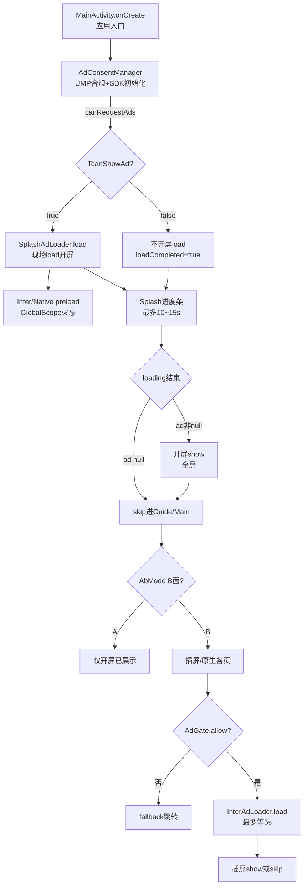

<!-- cursor-feature-interpret
generated: 2026-6-22 14:00:00
appName: xvdownloader
topic: 查看一下广告功能
outputDir: /Users/MacLuo/Desktop/D/working/shenzhen/skill/约束/.cursor/xvdownloader/
filename: 广告功能_2026-6-22_14-0.md
anchors: Ad/, app/.../attribution/AdGate.kt, app/.../ui/Splash.kt, app/.../MainActivity.kt
rule: .cursor/rules/cursor-function_description.mdc
role: backup（镜像备份，主交付在对话正文）
-->

# 广告功能解读（xvdownloader）

## 2.0 目录

**一句话**：本 App 基于 AdMob（开屏 App Open + 插屏 + 原生），经 UMP 合规初始化后，在启动页并行 load 开屏；A/B 面由 `AdGate` 控制——A 面仅开屏，B 面全量广告位；插屏走缓存队列 + 展示时 load，原生在 Compose 可见时 load。

### 快速阅读（按角色）

| 角色 | 建议跳转 |
|------|----------|
| 产品 | [2.1 作用](#21-功能身份与作用) → [2.4 流程图](#24-流程图) → [2.12 广告位专表](#212-广告位专表) → [2.13 请求全链路清单](#213-广告请求全链路确认清单) |
| 开发 | [2.2 时序](#22-实现步骤与时序) → [2.11 分阶段](#211-分阶段详细说明) → [2.6 走读](#26-关键实现走读) |
| 测试 | [2.5 场景矩阵](#25-全场景矩阵) → [2.12 广告位专表](#212-广告位专表) → [2.13 清单](#213-广告请求全链路确认清单) |

### 全文目录

- [1. 解读范围](#1-解读范围)
- [2.1 功能身份与作用](#21-功能身份与作用)
- [2.2 实现步骤与时序](#22-实现步骤与时序)
- [2.3 分支与判断逻辑](#23-分支与判断逻辑)
- [2.3.1 远程配置专表](#231-远程配置专表)
- [2.4 流程图](#24-流程图)
- [2.5 全场景矩阵](#25-全场景矩阵)
- [2.11 分阶段详细说明](#211-分阶段详细说明)
- [2.12 广告位专表](#212-广告位专表)
- [2.13 广告请求全链路确认清单](#213-广告请求全链路确认清单)
- [3. 双视角](#3-双视角)
- [2.10 输出前自检](#210-输出前自检)

---

## 1. 解读范围

| 项 | 内容 |
|----|------|
| 功能名称 | 广告变现（开屏 / 插屏 / 原生）、UMP 合规、A/B 面广告闸门、频次控制 |
| 代码锚点 | `Ad/` 模块（`AdSdk`、`AdLoader`、`SplashAdLoader`、`InterAdLoader`、`NativeAdLoader`）；`app/.../attribution/AdGate.kt`；`app/.../ui/Splash.kt`；`app/.../MainActivity.kt`；`app/.../utils/AdShowUtils.kt` |
| 边界 | **包含**：SDK 初始化、load/show、缓存、重试退避、埋点、AB 闸门、Firebase 广告 ID；**不包含**：Banner（未接入）、MonetizationKit/AdSense 枚举体系（本项目用 `AdGate.Slot`） |
| 关联子功能 | UMP（`AdConsentManager`）、归因/AB 面（`AbMode`/`AttributionManager`）、订阅免广告（`AdSdk.isSubs`）、Firebase RC 广告 ID（`AdIdsCache`）、插屏频次（`AdShowUtils`+`FirebaseUtils`） |

### 阶段清点（解读前）

| 序号 | 阶段/子轨 | 代码锚点 | 阻塞用户 | 可能修订结论 | §2.11 专节 |
|------|-----------|----------|---------|-------------|-----------|
| P0 | UMP + AdMob SDK 初始化 | `AdConsentManager.requestGatherConsentAndInitAdSdk` | 间接（决定 canShowAd） | 否 | P0 |
| P1 | 启动页并行 load 开屏 | `Splash` → `SplashAdLoader.load` | 是（与进度条并行） | 否 | P1 |
| P2 | loading 结束 show/skip | `Splash.goNext` → `ad?.show` | 是（全屏开屏） | 否 | P2 |
| P3 | 启动后 preload 插屏/原生 | `NativeAdLoader.preload` / `InterAdLoader.preload` | 否 | 否 | P3 |
| P4 | 业务插屏 show 路径 | 各页 `InterAdLoader.load` | 部分阻塞跳转 | AB 升 B 后闸门变化 | P4 |
| P5 | 原生 Compose load/show | `NativeAdCompose` | 否（占位 loading） | AB 升 B 后可请求 | P5 |
| P6 | AB 面闸门 | `AdGate.allow` / `AbMode.isBSide` | 否 | **是**（A→B） | P6 |
| P7 | Firebase 广告 ID 刷新 | `AdIdsCache.saveAndApply` | 否 | 影响后续 load | P7 |

### 广告位清点（解读前）

| Slot（AdGate） | adType | A/B | 预加载锚点 | 展示锚点 | load 重试 | 补货锚点 | Loader |
|----------------|--------|-----|-----------|---------|----------|---------|--------|
| SplashOpen | 开屏 | A 白名单 | 无独立 preload（load 内 preload 失效） | `Splash.goNext` | `AdLoader.loadFailed` | **缺失**（maxCacheCount=0） | SplashAdLoader |
| 各 Inter* | 插屏 | B | `Splash` preload + consume 后 preloadInner | 各页点击/动作 | `AdLoader.loadFailed` | `loadWithInner` 内 `preload` | InterAdLoader |
| 各 *Native | 原生 | B | `Splash` preload + consume 后 preloadInner | `NativeAdCompose` 可见 | `AdLoader.loadFailed` | consume 时 preloadInner；Compose dispose **destroy 无补货** | NativeAdLoader |

### 预加载阻塞清点

| L# | 触发点 | 位 | 调用方式 | 是否阻塞 | 阻塞对象 | 超时 ms | 超时后 | 收益影响 |
|----|--------|-----|---------|---------|---------|---------|--------|---------|
| L1 | Splash `LaunchedEffect(canShowAd)` | 开屏 | `suspend SplashAdLoader.load` | **半阻塞** | 进度条协程等 `loadCompleted` | 无上限 | load 失败则 ad=null skip | 弱网拖长启动 |
| L2 | Splash 同上末尾 | 插屏/原生 | `preload`→GlobalScope | 否 | — | — | — | A 面仍 preload（浪费） |
| L3 | 各页插屏 | 插屏 | `InterAdLoader.load` suspend | **是**（跳转前） | 用户点击协程 | **5000** | null→直跳 | 无缓存时阻塞最多 5s |
| L4 | NativeAdCompose | 原生 | `NativeAdLoader.load` suspend | 否 | — | MAX | 占位文案 | show 时可能仍 loading |

---

## 2.1 功能身份与作用

| 项 | 内容 |
|----|------|
| 业务作用 | 通过 AdMob 变现；A 面（自然量/GP 审核）仅开屏保过审；B 面（买量）全量广告 |
| 用户可感知 | 冷/热启动开屏；B 面各页原生卡片、插屏全屏 |
| 后台职责 | 缓存队列、指数退避重试、ad_request/ impression 埋点、Adjust/AF 广告收入 |
| 上游 | `MainActivity.onCreate` UMP；`Splash` 首屏；各业务页用户动作 |
| 下游 | 导航跳转、订阅页、归因面别刷新 |
| 阻塞关键路径 | 开屏 load 与进度条并行；插屏 load 阻塞部分跳转（最多 5s） |

---

## 2.2 实现步骤与时序

| 步骤 | 代码锚点 | 业务含义 | 串/并 | 前置 | 完成后 |
|------|----------|---------|------|------|--------|
| T0 | `MainActivity.onCreate` | Activity 创建 | — | — | Compose NavHost |
| T1 | `AdConsentManager.requestGatherConsentAndInitAdSdk` | UMP 同意 + 初始化 AdMob | 与 Splash UI **并行** | — | `canShowAd` true/false |
| T2 | `Splash` DisposableEffect | 进度条 + loading 埋点 | 与 T1/T3 并行 | — | `goNext` 循环 |
| T3 | `SplashAdLoader.load` | **现场**请求开屏 | 与 T2 并行 | `canShowAd==true` | `ad` 实例或 null |
| T4 | `Native/InterAdLoader.preload` | 后台预加载 B 面常用类型 | **并行** fire-forget | T3 后 | 缓存可能入队 |
| T5 | `goNext` 结束 | loading 动画完成 | 串行 | 进度满 | `ad.show` 或 skip |
| T6 | 业务页 | 插屏/原生 show | 按需 | `AdGate`+频次 | 导航/渲染 |

**主路径**：T0→T1∥T2→(T3→T4)→T5→进 Guide/Main  
**续作路径**：归因/Firebase 完成后 `refreshIsMode2` → `AdGate` 对 B 位从 false→true（不 retroactive 补已跳过的 preload）

---

## 2.3 分支与判断逻辑

| 条件（业务） | 代码 | 结果 |
|-------------|------|------|
| 未订阅且 SDK 已初始化 | `AdSdk.enable` | 允许 load/show |
| 已订阅 | `AdSdk.isSubs` | 全局 disable；原生 UI 隐藏 |
| UMP 不可请求广告 | `canShowAd==false` | 不开屏 load，直接 skip |
| A 面非开屏位 | `!AdGate.allow(slot)` | 不渲染/不 load |
| B 面 | `AbMode.isBSide()` | 全部 allow |
| 插屏 unitId 空 | `AdSdk.interAdId.isBlank()` | Loader 跳过请求 |
| 退避期 | `AdLoader.isRetreat()` | 拒绝 load，抛 retreat |
| 插屏超时 | `withTimeout(5000)` | 上报 TIMEOUT，返回 null |

---

## 2.3.1 远程配置专表

**表 A：RC key**

| RC key | 业务 | ①未配置 | ②约定值 | ③其它值样板 | 锚点 |
|--------|------|--------|--------|------------|------|
| `ad_splash_id` | 开屏 unit | SP/BuildConfig 兜底 | 非空字符串 | 空串→保留 BuildConfig splash | `getFirebaseRemoteAdSplashId` |
| `ad_inter_id` | 插屏 unit | 空→不请求 | 非空 | 空串→跳过 | `getFirebaseRemoteAdInterId` |
| `ad_native_id` | 原生 unit | 空→不请求 | 非空 | 空串→跳过 | `getFirebaseRemoteAdNativeId` |
| `loading_show_befad` | 插屏 load 前强制 loading | 默认 false | `=1` 开启 | 非 1→关 | `getFirebaseRemoteConfigOfAdLoadingShow` |
| `enable_gp_check` | GP 安装叠加 B 面 | **false** | true/false | — | `getFirebaseRemoteEnableGpCheck` |
| `nav_click_show_inter_ad_count` 等 | 插屏日频次上限 | 用代码默认 2/5/1/5 | `>0` 用 RC | `<=0` 用默认 | `FirebaseUtils` |

**表 B：Firebase fetch**

| 阶段 | 锚点 | 超时 | 失败后 | 用户感知 |
|------|------|------|--------|---------|
| fetchAndActivate | `App.initFirebaseRemoteConfig` | 无专用 withTimeout | catch 打日志；仍尝试 `AdIdsCache` | 否 |
| 启动 SP 缓存 | `AdIdsCache.readAndApply` | — | 用 BuildConfig splash | 否 |

---

## 2.4 流程图

### 流程图名词说明

| 代码锚点 | 业务含义 | 触发 |
|----------|---------|------|
| `AdConsentManager` | UMP 用户同意 + 初始化 AdMob | MainActivity.onCreate |
| `SplashAdLoader.load` | 向 AdMob 请求开屏并 suspend 等待 | canShowAd=true |
| `AdGate.allow` | A/B 面广告位是否可展示/请求 | 各业务位 |
| `InterAdLoader.load` | 取缓存或现场 load 插屏 | 用户动作 |
| `NativeAdCompose` | 原生广告 Compose 容器 | 列表/页内可见 |

---

## 2.5 全场景矩阵

| 编号 | 标签 | 场景 | 触发 | 路径 | 用户感知 | 续作 |
|------|------|------|------|------|---------|------|
| S01 | 正常 | UMP 通过+开屏 fill | 冷启 | UMP→load→show | 开屏 | — |
| S02 | 正常 | UMP 通过+开屏 NO_FILL | 冷启 | load 失败→skip | 无开屏 | 退避重试 |
| S03 | 超时 | 开屏 load 极慢 | 弱网 | 进度条等 loadCompleted | 进度条久 | 仍可能 show |
| S04 | 远程配置 | inter id 未配 | B 面点插屏 | unit 空 skip | 直跳 | FC 后到 id 才可 load |
| S05 | 无数据 | canShowAd=false | UMP 拒绝 | 不 load | 无广告 | — |
| S06 | 边界 | 已订阅 | 任意 | AdSdk.enable=false | 无广告 | — |
| S07 | 正常 | B 面插屏有缓存 | 点击 | take cache→show | 全屏 | preload 补货 |
| S08 | 超时 | B 面插屏无缓存 | 点击 | load 5s 超时 | loading≤5s | null 直跳 |
| S09 | 远程配置 | A 面语言插屏 | A 面 | AdGate false | 无广告 | — |
| S10 | 续作修订 | preload@A→升B | 归因晚到 B | 之前 skip 的位不自动补 | 后续点击才 load | refreshIsMode2 |
| S11 | 竞态 | UMP 3s 超时 | 新用户 | deferred.await 后仍 init | 可能晚 show | — |
| S12 | 正常 | 原生可见 load | 列表停滚 | NativeAdLoader.load | 占位→原生 | — |
| S13 | 异常 | 开屏 show 失败 | SDK | ad_no_show→skip | 无开屏 | destroy |
| S14 | 边界 | 热启动 Splash | 回前台 | 同 S01/S02 | 开屏或 skip | popBackStack |
| S15 | 开屏·偏差 | loading 结束 | — | **非** takeCached，用 load 返回值 | — | 与标准链路不一致 |
| S16 | 开屏·偏差 | onDispose | 离开 Splash | **ad.destroy()** | — | 未 consume 实例销毁 |
| S17 | load失败·重试 | 任意位 fail | NO_FILL | loadFailed 退避 5s×2^n max60s | 无感 | isRetreat 拦截 |
| S18 | 预加载阻塞 | 语言页插屏 | Continue | load+show 串行 | 阻塞进主页 | — |
| S19 | 无效请求 | A 面 Splash 后 preload inter/native | A 面 | 仍 GlobalScope preload | 无感 | 请求无展示隐患 |
| S20 | 概率/频次 | Tab 切换插屏 | 每2次点击+日配额 | AdShowUtils | 有时无插屏 | — |

**场景计数**：共 20；正常 6 / 弱网 1 / 超时 2 / 远程配置 2 / 续作 1 / 竞态 1 / 边界 3 / 开屏偏差 2 / 其它 2

---

## 2.11 分阶段详细说明

#### P0：UMP + SDK 初始化（AdConsentManager）

1. **身份**：合规收集同意并初始化 AdMob  
2. **时机**：`MainActivity.onCreate` 立即 `lifecycleScope.launch`  
3. **条件**：每次冷/热进 MainActivity  
4. **步骤**：`canRequestAds()` 已为 true → 立即 `AdSdk.init`；否则 `gatherConsent` + **3s** `withTimeoutOrNull`  
5. **超时**：3s 超时 → `deferred?.await()` 再等用户点 UMP 按钮 → 仍 `AdSdk.init`+`canShowAd(true)`  
6. **成功**：`canShowAd=true/false` 写入 MainActivity 状态  
7. **用户感知**：UMP 弹窗可能阻塞；已有缓存则无感 init  

#### P1：启动页 load 开屏（Splash + SplashAdLoader）

- **与标准链路偏差（§1.11.11）**：在 loading 期间 **现场 `SplashAdLoader.load`**，非「UMP 后 preload + loading 结束仅 takeCached」  
- `maxCacheCount=0` → `preloadInner` 条件 `size<0` 永不成立 → **开屏补货 preload 失效**  
- load 无 `withTimeout`（Long.MAX_VALUE）  
- 阻塞：`loadCompleted` 标志影响进度条是否提前跑完（与 `attributionInited` 一起）  

#### P2：loading 结束 show/skip

- `ad?.show(context){ delay 500; loaded() }` 或 `loaded()`  
- `onImpression` 埋点但 **无** 展示回调触发下一条 preload  
- `DisposableEffect.onDispose` → `ad?.destroy()` → **跨页不保留开屏实例**  

#### P6：AB 面闸门（AdGate + AbMode）

- A 面：`A_SIDE_WHITELIST` 仅 `SplashOpen`；开屏调用点**故意不加 gate**  
- B 面：`AbMode.isBSide()`= referrer B + 可选 GP 校验  
- **中途 A→B**：`AttributionManager.onSideChanged` → `refreshIsMode2` → 之后 `AdGate.allow` 对 B 位变 true；**已跳过 preload 不会自动补**；已 load 的 inter/native 缓存可 show（若之前 A 面 preload 已发起则可能有货）  

---

## 2.12 广告位专表

#### SplashOpen（开屏）

**类型**：开屏｜**偏差**：loading 期间现场 load，非标准 takeCached  

| 维度 | 内容 |
|------|------|
| 预加载 | **无有效 preload**（maxCacheCount=0）；L1 半阻塞 load |
| 展示 | loading 进度结束 → `ad?.show` |
| 成功 | onImpression 埋点 → delay 500ms → 导航 |
| 失败/skip | ad=null / show fail → 直接导航 |
| 重试 | `loadFailed` 指数退避 |
| 补货 | **缺失/待接入**（preloadInner 永不执行） |

**标准链路对照**

| 步骤 | 标准 | 源码 | 一致？ |
|------|------|------|--------|
| UMP 后 preload | 是 | load 在 canShowAd 后，非独立 preload | ❌ |
| loading 结束仅 takeCached | 是 | 用 load 返回值 | ❌ |
| skip 不现场 load | — | loading 期间已 load | ❌ |
| 展示回调补货 | 是 | 无 | ❌ |
| destroy 保留缓存 | 是 | onDispose destroy | ❌ |

#### 插屏类（InterAdLoader + 各 Slot）

| 维度 | 内容 |
|------|------|
| 预加载 | Splash 末尾 `InterAdLoader.preload`（非阻塞）；consume 后再 `preloadInner` |
| 展示 | 各页 `load`→`show`；Search 需 `hasCache()`；HomeCategory 需 `hasCache()` |
| 成功 | onDismiss → finish 回调 → 导航/计数+1 |
| 失败 | null→直跳；5s timeout；ad_no_show |
| 重试 | 同 AdLoader 退避 |
| 补货 | cache 取出或 load 成功后 `preload(context)` |

#### 原生类（NativeAdLoader + NativeAdCompose）

| 维度 | 内容 |
|------|------|
| 预加载 | Splash preload；load 路径内 preloadInner |
| 展示 | 停止快滚且 fullyVisible → load → bind show |
| 成功 | onAdImpression 埋点 |
| 失败 | 占位「Loading ad」；gate false 不渲染 |
| 重试 | 退避 |
| 补货 | Loader 内 partial；**Compose onDispose destroy 无补货** |

---

## 2.13 广告请求全链路确认清单

> 请逐项确认。**回复「清单确认」前不视为验收通过。**

| R# | 类型 | 时机 | 位置 | 位 | 预加载 | 阻塞 | 闸门 | 隐患 | 说明 |
|----|------|------|------|-----|--------|------|------|------|------|
| R1 | 现场 load | Splash canShowAd=true | Splash.kt:157 | 开屏 | 否 | 半阻塞 | enable | 中 | 弱网拖启动；非标准 preload 链路 |
| R2 | 预加载 | Splash load 完成后 | Splash.kt:163-164 | 原生/插屏 | 是 | 否 | 无 AdGate | **高** | A 面仍 preload B 位→无效请求 |
| R3 | preloadInner | Inter consume 后 | InterAdLoader:44,63 | 插屏 | 补货 | 否 | enable | 低 | 正常补货 |
| R4 | preloadInner | Native consume 后 | NativeAdLoader:47,66 | 原生 | 补货 | 否 | enable | 低 | |
| R5 | load+show | 引导完成 | Guide.kt:74 | GuideFinishInter | 否 | **是** | AdGate | 中 | 阻塞进语言页≤5s |
| R6 | load+show | 语言 Continue | Language.kt:131 | LanguageDoneInter | 否 | **是** | AdGate | 中 | |
| R7 | load+show | Tab 双数点击 | Main.kt:186 | MainTabSwitchInter | 否 | 部分 | AdGate+频次 | 低 | |
| R8 | load+show | 分类确认 | HomePager.kt:686 | HomeCategoryDoneInter | 否 | 部分 | hasCache | 中 | 无缓存不 show 不 load |
| R9 | load+show | 浏览器 URL 变 | BrowserPager.kt:130 | BrowserUrlChangedInter | 否 | 部分 | 频次 | 低 | |
| R10 | load+show | 搜索按钮 | BrowserPager.kt:358 | SearchPageInter | 否 | 部分 | hasCache | 中 | 无缓存跳过 |
| R11 | load+show | 视频切换 | PlayerPager.kt:290 | PlayerVideoChangeInter | 否 | 部分 | 频次 | 低 | |
| R12 | load+show | 目录选择 | Filter.kt:414 | DirSelectInter | 否 | 部分 | 频次 | 低 | |
| R13 | load+show | 订阅关闭 | Subscription.kt:334 | SubscriptionCloseInter | 否 | **是** | AdGate | 低 | |
| R14 | load+show | 下载视频 | YtDlpViewModel.kt:172 | DownloadInter | 否 | 否 | 频次 | 低 | |
| R15 | load+show | AI 生成成功 | AiGenViewModel.kt:75 | AiGenerateInter | 否 | 否 | AdGate | 低 | |
| R16 | load | 原生可见 | Common.kt:539 | 各 Native slot | 否 | 否 | AdGate | 低 | 快滚跳过 |
| R17 | preloadInner | SplashAdLoader.load 末尾 | SplashAdLoader:58 | 开屏 | 是 | 否 | — | **高** | maxCacheCount=0 永不执行 |

### 预加载点汇总

R2、R3、R4、R17（R17 无效）

### 阻塞式请求汇总

R1 半阻塞；R5/R6/R13 等 load+show 阻塞跳转最多 5s

### 收益隐患汇总

| R# | 类型 | 说明 |
|----|------|------|
| H1 | 开屏链路偏差 | 非 UMP→preload→takeCached；影响展示率统计口径 |
| H2 | A 面无效 preload | R2 不判 AdGate |
| H3 | 开屏无补货 | R17 失效 + 无 onImpression preload |
| H4 | 面别切换 | A→B 后不自动补 preload |
| H5 | 原生 dispose 无补货 | 列表滑出 destroy |

### 请你确认

1. 上表是否穷尽所有 load/preload 路径？  
2. 预加载点与阻塞判断是否准确？  
3. 隐患等级是否认可？  
4. 回复「**清单确认**」或逐条修正。

---

## 3. 双视角

| 用户看到的 | 后台发生的 |
|-----------|-----------|
| 启动进度条后可能全屏开屏 | UMP→AdMob init→App Open load |
| B 面列表里原生广告卡片 | NativeAdLoader 缓存+Compose bind |
| 点 Continue 可能先全屏插屏 | InterAdLoader 5s 内 load+show |
| A 面除开屏外无广告 | AdGate 拦截请求 |
| 订阅后无广告 | AdSdk.isSubs=true |

---

## 2.10 输出前自检

- [x] §1.6 全场景枚举
- [x] §2.3.1 RC 表
- [x] §2.5 ≥20 场景
- [x] §2.11 分阶段专节
- [x] §2.12 广告位四维+开屏对照表
- [x] §2.13 R# 清单
- [x] AB 面 §1.11.10
- [x] 阻塞清点 L#
- [x] 开屏偏差已标注
